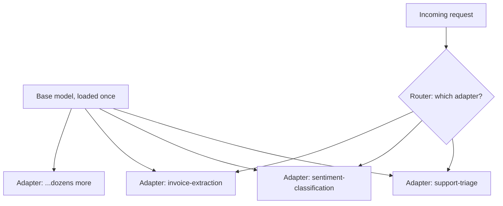

May's fine-tuning series introduced multi-adapter serving with vLLM briefly. This post covers running it at real production scale — dozens of task-specific adapters, high request volume, and the operational discipline that requires beyond a single code example.

## The Scale Problem



At small scale, loading every adapter into memory alongside the base model works fine. At dozens of adapters — particularly higher-rank ones — total adapter memory becomes a real constraint, and the router needs to handle adapter selection at request-routing scale, not just as a manual configuration choice.

## Dynamic Adapter Loading and Eviction

```python
class AdapterCache:
    def __init__(self, max_loaded: int = 20):
        self.loaded = {}  # adapter_name -> last_used_timestamp
        self.max_loaded = max_loaded

    def get_or_load(self, adapter_name: str, llm_engine):
        if adapter_name not in self.loaded:
            if len(self.loaded) >= self.max_loaded:
                self._evict_least_recently_used(llm_engine)
            llm_engine.add_lora(LoRARequest(adapter_name, generate_id(), f"adapters/{adapter_name}"))
        self.loaded[adapter_name] = time.monotonic()

    def _evict_least_recently_used(self, llm_engine):
        lru_adapter = min(self.loaded, key=self.loaded.get)
        llm_engine.remove_lora(lru_adapter)
        del self.loaded[lru_adapter]
```

An LRU cache over loaded adapters — rather than trying to keep every adapter resident permanently — lets a deployment support far more total adapters than fit in memory simultaneously, at the cost of a load latency hit for adapters not recently used, a real tradeoff worth measuring against your actual access pattern.

## Adapter Selection at the Gateway Layer

```python
def route_to_adapter(request: dict) -> str:
    task_type = classify_task_type(request)  # cheap classification, from August's model routing post
    return ADAPTER_REGISTRY.get(task_type, "default")
```

This connects directly to the gateway from earlier this month — adapter selection is a specialized case of the model routing problem, where the "model" choice is actually "base model + which adapter" rather than choosing between fundamentally different models.

## Batching Requests Across Different Adapters

A subtlety worth understanding: vLLM's multi-LoRA serving can batch requests using *different* adapters together in the same forward pass — the base model computation is shared, only the small adapter-specific computation differs per request. This is what makes multi-adapter serving genuinely efficient rather than requiring separate GPU capacity per adapter.

```python
# Requests for different adapters can share a batch — vLLM handles this transparently
outputs = llm.generate(
    prompts=["classify this ticket", "extract invoice fields"],
    lora_request=[LoRARequest("support-triage", 1, path_a), LoRARequest("invoice-extraction", 2, path_b)],
)
```

## Versioning Adapters in Production

```python
adapter_registry = {
    "support-triage": {"active_version": "v3", "versions": {"v2": "adapters/support-triage-v2", "v3": "adapters/support-triage-v3"}},
}

def get_active_adapter_path(task: str) -> str:
    config = adapter_registry[task]
    return config["versions"][config["active_version"]]
```

Following the canary and rollback discipline from earlier this month, per adapter — a new adapter version should roll out gradually with quality guardrails from June's evaluation series, not switch atomically for every task simultaneously.

## Monitoring Per-Adapter Health

Extend June's dashboard with per-adapter breakdowns — quality score, latency, and cost sliced by which adapter served each request — since a regression in one specific adapter (from a bad retrain) can hide inside an aggregate "model quality" metric that's dominated by higher-volume adapters.

---

*Part of the [AI Infrastructure series]({{ site.baseurl }}/tags/ai-infra-series/) — next: [edge deployment]({{ site.baseurl }}/posts/edge-deployment-small-models-device/), running models with no server round-trip at all.*
