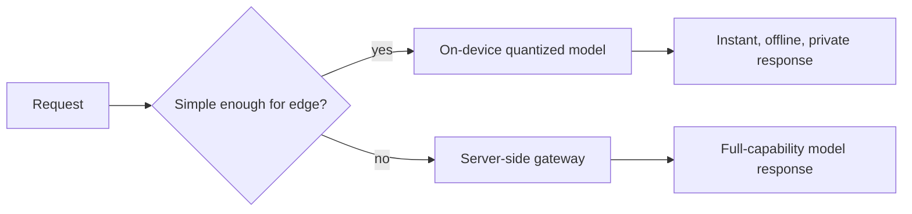

Every serving pattern this month assumed a server the client talks to over a network. Edge deployment removes that entirely — running a model directly on a user's device, trading capability for zero network latency, offline availability, and stronger data privacy.



This hybrid split is the practical pattern this post lands on — a small, aggressively quantized on-device model handles common simple cases instantly and offline, while genuinely complex requests fall back across the network to the full-capability server-side gateway from earlier this month.

## Why Run On-Device At All

- **Latency** — zero network round-trip, relevant for the real-time constraints from July's voice pipeline series when a server round-trip isn't acceptable
- **Offline availability** — functionality that keeps working without connectivity
- **Privacy** — sensitive data (the PII concerns from March's guardrails posts) never leaves the device, sidestepping a whole category of data-handling risk
- **Cost** — no per-request inference cost to a provider, though at the expense of the device's own compute and battery budget

## The Fundamental Constraint: Model Size

```python
def edge_feasibility_check(model_params_billions: float, device_ram_gb: float, quantization_bits: int) -> bool:
    estimated_size_gb = model_params_billions * (quantization_bits / 8)
    return estimated_size_gb < device_ram_gb * 0.5  # leave headroom for OS and app
```

This is May and August's quantization content applied at its most extreme — edge deployment typically requires aggressive quantization (4-bit or lower) and small model sizes (1-3B parameters is common for mobile), a much tighter constraint than server-side deployment where a 70B model in 4-bit is still a reasonable option.

## On-Device Inference Frameworks

```python
# Conceptual — actual APIs vary by framework (llama.cpp, MLC-LLM, Core ML, ONNX Runtime Mobile)
model = load_quantized_model("model-q4.gguf", backend="llama.cpp")
response = model.generate(prompt, max_tokens=200, threads=4)
```

`llama.cpp` and its derivatives (widely used for edge/local LLM inference), MLC-LLM (broad cross-platform including mobile GPUs), and platform-specific frameworks (Core ML for Apple devices, ONNX Runtime for cross-platform) each optimize for different hardware targets — the right choice depends heavily on your target device's specific chip and OS.

## Hybrid Architecture: Edge for Simple, Server for Complex

```python
def hybrid_inference(request: dict) -> dict:
    if is_simple_enough_for_edge(request):
        return edge_model.generate(request)  # instant, offline, private
    return call_gateway_api(request)  # fall back to a capable server-side model
```

This mirrors the complexity-based routing pattern from earlier this month, applied across the network boundary rather than between models — a small on-device model handles simple, common cases instantly, while genuinely complex requests fall back to the full-capability server-side gateway.

## Model Update Distribution

```python
def check_and_update_edge_model(current_version: str, device_capabilities: dict) -> str | None:
    latest = get_latest_compatible_version(device_capabilities)
    if latest != current_version:
        return download_url_for_version(latest)
    return None
```

Distributing model updates to edge devices needs its own rollout discipline — bandwidth-conscious (don't force a multi-gigabyte download over cellular without explicit consent), staged (canary a new edge model version to a subset of devices before full rollout, mirroring this month's canary patterns), and resilient to devices that stay offline for extended periods.

## Evaluating an Edge Model's Quality Gap

Apply June's evaluation framework to explicitly measure the quality gap between the edge model and its full-capability server-side counterpart on your specific task distribution — an edge model's reduced capability is an acceptable, deliberate tradeoff only when you've measured exactly how much quality it costs and confirmed it's still acceptable for the use cases you're routing to it.

## Security Considerations Specific to Edge Deployment

A model shipped inside a mobile app is extractable by a sufficiently motivated party — don't rely on an on-device model to enforce something a server-side check should own (content policy enforcement, licensing restrictions), and treat anything shipped to the edge as effectively public.

---

*Part of the [AI Infrastructure series]({{ site.baseurl }}/tags/ai-infra-series/) — next, back to server-side concerns: [containerizing LLM applications for production]({{ site.baseurl }}/posts/containerizing-llm-applications-production/).*
