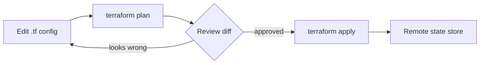

Every piece of infrastructure this month — GPU node pools, load balancers, multi-region deployments, the gateway service — needs to be reproducible, reviewable, and recoverable, which is exactly what infrastructure-as-code provides over manually clicking through a cloud console.



Every change to GPU node pools or multi-region deployments flows through this plan-review-apply loop before touching real infrastructure. The remote state store at the end is what lets a team collaborate on the same infrastructure without conflicting, undocumented changes.

## Why This Matters More for AI Infrastructure

GPU infrastructure is expensive enough that manual provisioning mistakes (an oversized instance left running, a forgotten multi-region deployment) carry real cost — and complex enough (autoscaling policies, multi-region routing, specialized node pools) that manual configuration drift between environments becomes a genuine reliability risk, not just an inconvenience.

## A GPU Node Pool in Terraform

```hcl
resource "google_container_node_pool" "gpu_inference_pool" {
  name       = "gpu-inference-pool"
  cluster    = google_container_cluster.main.name
  node_count = 1

  autoscaling {
    min_node_count = 1
    max_node_count = 10
  }

  node_config {
    machine_type = "g2-standard-16"
    guest_accelerator {
      type  = "nvidia-l4"
      count = 1
    }
    labels = { workload = "llm-inference" }
    taint {
      key    = "nvidia.com/gpu"
      value  = "present"
      effect = "NO_SCHEDULE"
    }
  }
}
```

The taint ensures only pods explicitly tolerating GPU scheduling land on these (expensive) nodes — preventing accidental scheduling of unrelated CPU-only workloads onto GPU capacity, a subtle but costly misconfiguration without it.

## Modularizing Repeated Patterns

```hcl
module "inference_deployment" {
  source        = "./modules/llm-inference-service"
  region        = "us-central1"
  model_name    = "support-agent-model"
  min_replicas  = 2
  max_replicas  = 20
  gpu_type      = "nvidia-l4"
}

module "inference_deployment_eu" {
  source        = "./modules/llm-inference-service"
  region        = "europe-west1"
  model_name    = "support-agent-model"
  min_replicas  = 2
  max_replicas  = 15
  gpu_type      = "nvidia-l4"
}
```

A reusable module for "an LLM inference deployment" turns the multi-region deployment pattern from earlier this month into a parameterized, consistent configuration applied per region — rather than hand-maintaining nearly-identical but subtly drifting configuration across regions.

## Managing Secrets and API Keys

```hcl
resource "google_secret_manager_secret" "anthropic_api_key" {
  secret_id = "anthropic-api-key"
  replication { auto {} }
}

data "google_secret_manager_secret_version" "anthropic_api_key" {
  secret = google_secret_manager_secret.anthropic_api_key.id
}
```

Never commit API keys or credentials directly into Terraform configuration files — reference a secrets manager, keeping the actual secret values out of version control while still declaratively managing which services have access to which secrets.

## State Management and Team Collaboration

```hcl
terraform {
  backend "gcs" {
    bucket = "company-terraform-state"
    prefix = "ai-platform/production"
  }
}
```

Remote state storage with locking is essential the moment more than one person manages this infrastructure — local state files create exactly the kind of configuration drift and conflicting-change risk that infrastructure-as-code is meant to eliminate in the first place.

## Applying Changes Safely

```bash
terraform plan -out=tfplan   # review exactly what will change before applying
terraform apply tfplan       # apply only the reviewed plan, not a fresh unreviewed one
```

Always reviewing a `plan` output before `apply` — especially for GPU infrastructure changes, where an unexpected node pool resize or region change carries real cost and availability implications — is the infrastructure-as-code equivalent of the code review discipline applied to application changes throughout this roadmap.

## Disaster Recovery Through Infrastructure as Code

This connects directly back to this month's disaster recovery post — infrastructure defined as code can be redeployed from scratch in a new region or account in a genuine disaster scenario, which is a meaningfully stronger recovery guarantee than infrastructure that only exists as accumulated manual configuration nobody has fully documented.

---

*Part of the [AI Infrastructure series]({{ site.baseurl }}/tags/ai-infra-series/) — next: [monitoring GPU utilization and memory fragmentation]({{ site.baseurl }}/posts/monitoring-gpu-utilization-fragmentation/), the operational layer on top of this provisioned infrastructure.*
