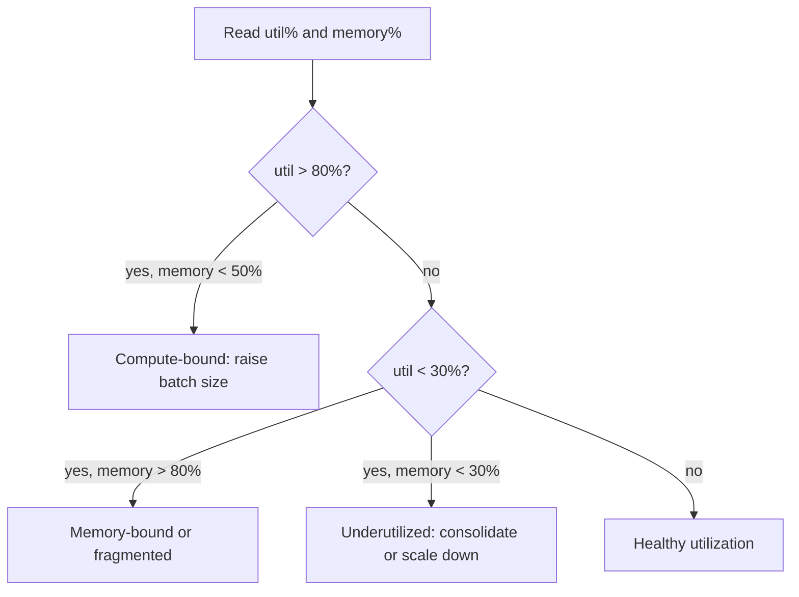

June's observability series covered application-level metrics. GPU infrastructure needs its own dedicated monitoring layer — utilization and memory behave in ways that are easy to misread without understanding what's actually happening at the hardware level.



This mirrors the `interpret_gpu_utilization` logic below — the same raw percentage can mean opposite things depending on what memory is doing alongside it, which is why utilization alone is an unreliable health signal on its own.

## GPU Utilization Can Mislead

```python
def interpret_gpu_utilization(util_pct: float, memory_used_pct: float) -> str:
    if util_pct > 80 and memory_used_pct < 50:
        return "compute-bound — consider a larger batch size to use spare memory"
    if util_pct < 30 and memory_used_pct > 80:
        return "memory-bound or fragmented — investigate memory allocation patterns"
    if util_pct < 30 and memory_used_pct < 30:
        return "underutilized — consider consolidating workloads or scaling down"
    return "healthy utilization"
```

High GPU utilization percentage doesn't necessarily mean the GPU is doing useful work efficiently — it can mean the GPU is busy but poorly batched (small batches keeping the GPU "busy" without high throughput). Cross-reference utilization against actual throughput (tokens/second) rather than trusting utilization alone as a health signal.

## Memory Fragmentation: A Specific, Sneaky Problem

```python
def detect_fragmentation(allocated_gb: float, reserved_gb: float, total_gb: float) -> dict:
    fragmentation_pct = (reserved_gb - allocated_gb) / total_gb * 100
    return {"fragmented": fragmentation_pct > 15, "fragmentation_pct": fragmentation_pct}
```

Over time, repeated allocation and deallocation of variable-sized memory blocks (from varying request sizes, especially before adopting PagedAttention-style memory management from the vLLM post) can leave GPU memory fragmented — enough total free memory exists, but not in large enough contiguous blocks to serve a new large request, leading to out-of-memory errors that look confusing given the reported free memory.

## Monitoring Stack for GPU Metrics

```python
# Using DCGM (NVIDIA Data Center GPU Manager) exporter feeding Prometheus
gpu_metrics_to_track = {
    "DCGM_FI_DEV_GPU_UTIL": "compute utilization percentage",
    "DCGM_FI_DEV_FB_USED": "framebuffer (memory) used",
    "DCGM_FI_DEV_FB_FREE": "framebuffer free",
    "DCGM_FI_DEV_MEM_COPY_UTIL": "memory bandwidth utilization — often more informative than compute util alone",
    "DCGM_FI_DEV_XID_ERRORS": "hardware error codes — a leading indicator of failing GPU hardware",
}
```

`DCGM_FI_DEV_MEM_COPY_UTIL` deserves particular attention given the memory-bandwidth-bound nature of LLM decode established earlier this month — for many LLM workloads, this metric is a more accurate picture of "is the GPU actually the bottleneck" than raw compute utilization.

## Alerting on GPU Health, Not Just Application Metrics

```python
def check_gpu_health_alerts(metrics: dict) -> list[str]:
    alerts = []
    if metrics["xid_errors"] > 0:
        alerts.append("GPU hardware error detected — consider draining this node")
    if metrics["memory_used_pct"] > 95:
        alerts.append("GPU memory near capacity — risk of OOM on next large request")
    if metrics["temperature_c"] > 85:
        alerts.append("GPU running hot — check cooling or reduce sustained load")
    return alerts
```

XID errors specifically are worth a dedicated alert — they're NVIDIA's hardware-level error reporting, and a pattern of XID errors on a specific node is often an early signal of failing hardware, well before it manifests as a confusing application-level failure that's much harder to diagnose after the fact.

## Correlating GPU Metrics with Application-Level Observability

```python
def correlated_dashboard_view(gpu_metrics: dict, app_metrics: dict) -> dict:
    return {
        "requests_per_gpu_second": app_metrics["throughput"] / gpu_metrics["gpu_count"],
        "cost_per_gpu_hour_actual": app_metrics["gpu_hours_cost"] / gpu_metrics["gpu_hours_used"],
        "quality_vs_utilization": correlate(app_metrics["quality_scores"], gpu_metrics["utilization_over_time"]),
    }
```

Bringing GPU-layer metrics into the same dashboard as the application-layer metrics from June closes an important gap — a quality or latency regression that correlates with a GPU utilization or memory pattern change points investigation toward infrastructure, while one that doesn't points toward application code or prompt changes.

## Capacity Signals This Feeds Into

Sustained high GPU utilization with growing queue depth is the direct input to tomorrow's capacity planning post — this monitoring layer isn't just for incident response, it's the data source for proactive scaling decisions before capacity actually becomes a bottleneck.

---

*Part of the [AI Infrastructure series]({{ site.baseurl }}/tags/ai-infra-series/) — next: [capacity planning for LLM traffic growth]({{ site.baseurl }}/posts/capacity-planning-llm-traffic-growth/), acting on this monitoring data proactively.*
