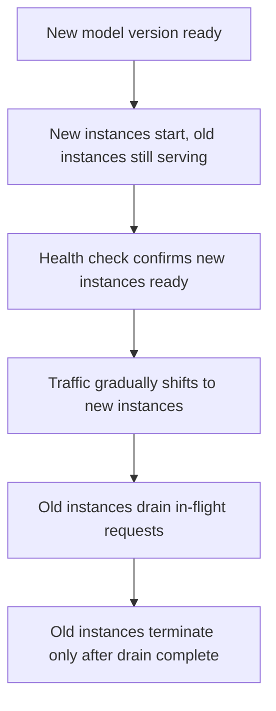

Blue-green and canary deployments (earlier this month) cover the rollout mechanics. This post focuses specifically on the zero-downtime guarantee itself — the operational details that determine whether a model upgrade is genuinely invisible to users or causes a brief but real disruption.

## What "Zero Downtime" Actually Requires



The critical detail most naive rolling deployments get wrong is the final step — terminating an old instance immediately when new capacity is ready, rather than waiting for its in-flight requests to complete, cuts off requests mid-generation.

## Graceful Draining

```python
class GracefulShutdown:
    def __init__(self):
        self.accepting_new_requests = True
        self.in_flight_requests = 0

    async def handle_shutdown_signal(self):
        self.accepting_new_requests = False  # stop accepting new work immediately
        while self.in_flight_requests > 0:
            await asyncio.sleep(1)  # wait for existing requests to complete
        await self.terminate()

    async def wrap_request(self, request_fn):
        if not self.accepting_new_requests:
            raise HTTPException(503, "Instance draining, retry against another instance")
        self.in_flight_requests += 1
        try:
            return await request_fn()
        finally:
            self.in_flight_requests -= 1
```

For long-running LLM generations (a multi-minute agent run, a long streaming response), the drain timeout needs to be generous enough to let realistic in-flight requests finish — a drain timeout tuned for a typical web service's millisecond-scale requests will forcibly cut off a legitimate multi-minute agent generation mid-stream.

## Coordinating with the Load Balancer

```python
async def deregister_before_drain(instance_id: str, load_balancer):
    await load_balancer.deregister(instance_id)  # stop routing NEW traffic here
    await wait_for_load_balancer_propagation()    # ensure the deregistration has taken effect everywhere
    await initiate_graceful_shutdown(instance_id)  # now safe to drain existing requests
```

Deregistering from the load balancer *before* starting the drain — and waiting for that deregistration to actually propagate — prevents a race condition where the load balancer routes a fresh request to an instance that's already draining and about to terminate.

## Stateful Session Handling During Upgrades

For the LangGraph checkpointed workflows from April, a mid-upgrade instance switch needs the checkpoint state to be externalized (Postgres/Redis, not in-process memory) so a paused workflow can resume on whichever instance picks it back up after the upgrade — an in-memory-only checkpoint store makes zero-downtime upgrades for stateful workflows effectively impossible.

## Testing Zero-Downtime Claims, Not Just Assuming Them

```python
def verify_zero_downtime_upgrade(upgrade_fn) -> dict:
    continuous_traffic_generator.start()  # constant low-rate traffic throughout the test
    errors_before = continuous_traffic_generator.error_count
    upgrade_fn()
    errors_during_and_after = continuous_traffic_generator.error_count
    return {"zero_downtime_confirmed": errors_during_and_after == errors_before}
```

Running continuous synthetic traffic through an upgrade in a staging environment, and confirming zero errors, is the only reliable way to validate a zero-downtime claim — "the deployment succeeded" in your CI/CD pipeline says nothing about whether real in-flight requests were disrupted during the transition.

## Rollback Must Also Be Zero-Downtime

Everything above applies symmetrically to rollback — a rollback triggered by a canary guardrail violation (June, August) needs the same graceful drain discipline, not an emergency hard-kill of the bad version that disrupts whatever requests were in flight against it at the moment of rollback.

---

*Part of the [AI Infrastructure series]({{ site.baseurl }}/tags/ai-infra-series/) — next: [building an internal model catalog and registry]({{ site.baseurl }}/posts/internal-model-catalog-registry/), tracking every version this upgrade discipline manages.*
