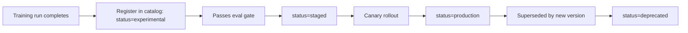

Across this month — fine-tuned adapters, quantized variants, edge models, multi-region deployments — an organization accumulates many model versions serving many purposes. A model registry is the source of truth that keeps track of what exists, where it's deployed, and how it got there.

## What a Model Registry Tracks

```python
@dataclass
class ModelEntry:
    name: str
    version: str
    base_model: str
    type: Literal["base", "fine-tuned-lora", "quantized", "distilled"]
    training_dataset_version: str | None  # from May's dataset versioning
    evaluation_results: dict              # from June's golden-set scores
    deployed_regions: list[str]
    deployed_environments: list[str]      # staging, canary, production
    owner_team: str
    created_at: datetime
    status: Literal["experimental", "staged", "production", "deprecated"]
```

## Registering a New Model Version

```python
def register_model(model_artifact_path: str, metadata: ModelEntry) -> str:
    validate_evaluation_results_present(metadata)  # don't register without eval data attached
    model_id = f"{metadata.name}-{metadata.version}"
    store_artifact(model_artifact_path, model_id)
    registry_db.insert(model_id, asdict(metadata))
    return model_id
```

Requiring evaluation results as part of registration — not an optional afterthought — enforces the June evaluation discipline structurally: a model can't enter the registry, and therefore can't be considered for deployment through the standard pipeline, without having been evaluated first.

## Querying the Registry

```python
def find_production_models(team: str | None = None) -> list[ModelEntry]:
    query = {"status": "production"}
    if team:
        query["owner_team"] = team
    return registry_db.query(query)

def find_models_using_dataset_version(dataset_version: str) -> list[ModelEntry]:
    return registry_db.query({"training_dataset_version": dataset_version})
```

That second query answers a question that becomes critical during an incident — "we found a data quality issue in dataset version X, which deployed models were trained on it" — directly connecting the June postmortem process to concrete, queryable impact analysis rather than manual archaeology through deployment history.

## Model Lineage Tracking

```python
@dataclass
class ModelLineage:
    model_id: str
    parent_model_id: str | None  # what base model or prior version this was derived from
    training_run_id: str          # links to the Weights & Biases experiment from May
    dataset_version: str
    code_commit: str
```

Full lineage tracking — from base model through every fine-tuning or distillation step to the currently deployed version — is what makes "why does this model behave this way" answerable months after the fact, tracing back through every transformation rather than treating a deployed model as an opaque artifact with no history.

## Integration with the Deployment Pipeline



Wiring registry status transitions directly into the deployment pipeline (rather than manually updating a spreadsheet) keeps the registry accurate automatically — a model's status field reflects its actual deployment state because the deployment automation is what updates it, not a separate manual process prone to drifting out of sync.

## Deprecation and Cleanup

```python
def find_deprecation_candidates(unused_threshold_days: int = 90) -> list[ModelEntry]:
    return [m for m in registry_db.query({"status": "production"})
            if days_since_last_traffic(m.name) > unused_threshold_days]
```

A registry with clear lineage and usage data makes safe cleanup possible — deprecating and eventually deleting old model artifacts (freeing storage cost) with confidence that nothing currently in production still depends on them, rather than accumulating artifacts indefinitely out of uncertainty about what's still needed.

## Access Control and Governance

For organizations in regulated industries (echoing May's domain adaptation post), the registry is also the natural enforcement point for governance policy — which teams can promote a model to production, required approvals for models trained on sensitive data, and audit trail requirements from September's security series all attach naturally to registry state transitions.

---

*Part of the [AI Infrastructure series]({{ site.baseurl }}/tags/ai-infra-series/) — next: [scaling RAG infrastructure to millions of documents]({{ site.baseurl }}/posts/scaling-rag-millions-documents/), a specific large-scale infrastructure challenge.*
