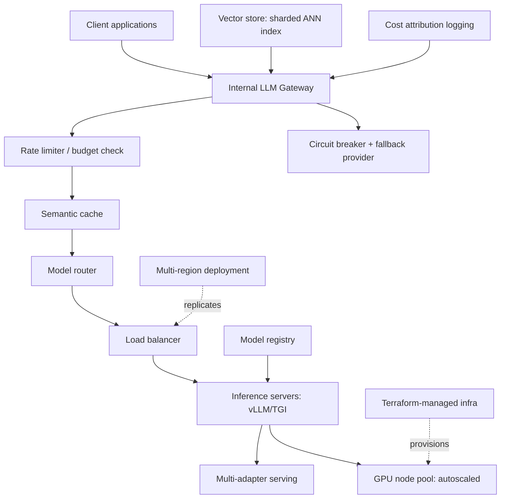

This closes out August by assembling the entire month into one reference architecture — every layer, from client request to GPU, with the specific post covering each piece.

## The Complete Stack



## Layer-by-Layer Summary

1. **Gateway** (Aug 17) — the single entry point composing routing, caching, rate limiting, and fallback
2. **Model routing** (Aug 15) — sending each request to the right model/adapter based on complexity and task type
3. **Caching** (Aug 9) — semantic caching to avoid redundant inference entirely
4. **Rate limiting and backpressure** (Aug 10) — protecting the system when demand exceeds capacity
5. **Inference serving** (Aug 1-6) — vLLM/TGI/Triton with continuous batching and PagedAttention
6. **Adapter serving** (Aug 22, extending May) — multiple fine-tuned capabilities from shared base model capacity
7. **Autoscaling and multi-region** (Aug 11-12) — capacity that adapts to load and stays close to users
8. **Deployment safety** (Aug 13, 28) — blue-green/canary rollouts and zero-downtime upgrades
9. **Resilience** (Aug 14, 16) — disaster recovery planning and provider fallback
10. **Cost governance** (Aug 18-19) — budget management and attribution across teams
11. **Observability** (Aug 26, extending June) — GPU-layer metrics feeding the same dashboards as application metrics
12. **Governance** (Aug 25, 29) — infrastructure as code and a model registry tracking every deployed version
13. **RAG at scale** (Aug 30, extending March) — sharded ANN indexes for retrieval infrastructure specifically

## A Minimal Starting Point

Not every team needs the full stack on day one. A pragmatic build order:

```python
build_order = [
    "1. Direct provider API calls with basic error handling",
    "2. Add a thin gateway: logging, basic rate limiting",
    "3. Add semantic caching once cost data justifies it",
    "4. Add model routing once you have more than one model/task type",
    "5. Self-host inference (vLLM/TGI) once volume justifies the operational cost",
    "6. Add multi-region, advanced deployment safety, and full IaC as scale demands it",
]
```

This mirrors the minimal-viable-observability-stack progression from June's closing post — build incrementally, adding each layer when the pain it solves becomes real, not preemptively for scale you don't have yet.

## The Principle Underlying the Whole Month

Every technique in this series exists to answer one question well: how do you serve AI-powered features reliably, affordably, and safely at whatever scale your product actually reaches — without either over-engineering infrastructure for traffic you don't have, or hitting a wall when traffic arrives faster than under-provisioned infrastructure can handle.

## What's Next

September turns from infrastructure to security and governance — prompt injection, guardrail frameworks, compliance, and red-teaming — the safety layer that has to wrap around every piece of infrastructure this month built, before any of it is trustworthy to run unattended at scale.

---

*Part of the [AI Infrastructure series]({{ site.baseurl }}/tags/ai-infra-series/) — the final post in this series, leading into the [AI Security, Safety & Governance series]({{ site.baseurl }}/tags/ai-security-series/) starting tomorrow.*
