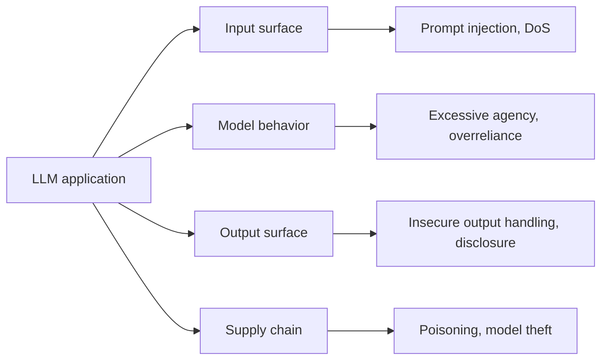

Every system built across this roadmap — agents, RAG pipelines, fine-tuned models, multimodal applications — has a security surface traditional web application security frameworks don't fully cover. The OWASP Top 10 for LLM Applications is the closest thing to an industry-standard checklist for what to defend against, and it's the right starting point for September.



The OWASP Top 10 splits cleanly across four surfaces of an LLM application — this is the map September's posts fill in one category at a time, starting with prompt injection tomorrow.

## The List, and Where This Roadmap Already Touched Each

```python
owasp_llm_top_10 = {
    "LLM01: Prompt Injection": "covered in depth tomorrow — the most fundamental LLM-specific risk",
    "LLM02: Insecure Output Handling": "treating model output as trusted without validation — echoes structured-output posts",
    "LLM03: Training Data Poisoning": "covered in this month's model poisoning post",
    "LLM04: Model Denial of Service": "connects to April's budget/circuit-breaker guardrails",
    "LLM05: Supply Chain Vulnerabilities": "covered later this month — models, weights, datasets",
    "LLM06: Sensitive Information Disclosure": "PII and data exfiltration — two dedicated posts this month",
    "LLM07: Insecure Plugin Design": "directly maps to April's tool-schema design post, security-focused",
    "LLM08: Excessive Agency": "March/April's guardrails — agents doing more than they should",
    "LLM09: Overreliance": "trusting model output without verification — a recurring theme since March",
    "LLM10: Model Theft": "protecting proprietary fine-tuned weights (May's series) from extraction",
}
```

## Why This List Differs From Traditional AppSec

Most items on a traditional OWASP Top 10 (SQL injection, XSS, broken authentication) still apply to an LLM application's surrounding infrastructure — nothing about building an AI feature exempts you from standard web security practice. What's new is the *model itself* as an attack surface: its behavior can be manipulated through natural language input in ways no traditional input validation was designed to catch.

## Insecure Output Handling: The Most Underestimated Risk

```python
# Dangerous: treating LLM output as safe to execute or render without validation
def unsafe_render(llm_response: str):
    return HTMLResponse(llm_response)  # if the model was manipulated to output a script tag, this executes it

# Safer: treat LLM output the same as any other untrusted user input
def safe_render(llm_response: str):
    sanitized = html_escape(llm_response)
    return HTMLResponse(sanitized)
```

An LLM's output is, functionally, attacker-influenceable content the moment any part of its input (including retrieved documents or tool results) is attacker-influenceable — treating it as trusted because "the model generated it, not the user" is the single most common category of vulnerability across the applications this roadmap has built.

## Excessive Agency: Revisiting March's Guardrails Through a Security Lens

The action-tier guardrails from March's agent guardrails post (confirm before irreversible actions, least-privilege tool access) are, in OWASP terms, mitigations for "Excessive Agency" — worth re-reading with the explicit security framing this month adds, since a guardrail gap here isn't just a reliability risk, it's an exploitable one.

## Building This Into Your Development Process

```python
def security_review_checklist(feature: dict) -> list[str]:
    gaps = []
    if feature.get("processes_untrusted_input") and not feature.get("has_injection_defenses"):
        gaps.append("LLM01: no documented prompt injection mitigation")
    if feature.get("output_rendered_as_html_or_executed") and not feature.get("output_sanitized"):
        gaps.append("LLM02: unsanitized output handling")
    if feature.get("has_tool_access") and not feature.get("least_privilege_enforced"):
        gaps.append("LLM08: excessive agency risk")
    return gaps
```

Running a check like this as part of the design review for any new AI feature — before it ships, not after an incident — is what this whole month builds toward: making security a design-time consideration, not a bolt-on response to a discovered vulnerability.

## Where September Goes From Here

The rest of this month works through each of these categories in depth, plus the compliance and governance frameworks (GDPR, HIPAA, the EU AI Act, SOC 2) that formalize many of these same concerns into regulatory requirements.

---

*Part of the [AI Security series]({{ site.baseurl }}/tags/ai-security-series/) — following August's [AI Infrastructure series]({{ site.baseurl }}/tags/ai-infra-series/).*
