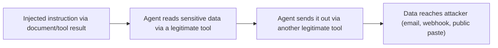

An agent with both access to sensitive data and the ability to make outbound requests (send an email, post to a webhook, write to a public location) has, by construction, everything needed for data exfiltration — and a successful prompt injection is exactly what turns that latent capability into an actual attack.

## The Attack Pattern



Critically, every individual step in this chain uses a legitimate, intended tool — the agent isn't exploiting a bug, it's using its normal capabilities in a sequence its designer didn't anticipate an attacker could induce. This is exactly what OWASP's "Excessive Agency" category (from this month's opening post) describes.

## The "Read + Send" Combination Is the Core Risk

```python
def audit_tool_combination_risk(agent_tools: list[str]) -> list[str]:
    read_sensitive_tools = {"read_customer_records", "search_internal_docs", "get_account_details"}
    send_external_tools = {"send_email", "post_to_webhook", "create_public_gist", "post_to_slack_channel"}

    risky_combos = []
    if any(t in agent_tools for t in read_sensitive_tools) and any(t in agent_tools for t in send_external_tools):
        risky_combos.append("agent can both read sensitive data and send data externally in the same session")
    return risky_combos
```

Any agent with both a data-reading tool and an outbound-communication tool available in the *same* session is a potential exfiltration path if either tool's inputs can be influenced by untrusted content — this combination deserves explicit design-time scrutiny, not implicit trust that it'll be fine.

## Mitigation 1: Separate Sessions for Sensitive Read and External Send

```python
def require_separate_sessions(read_result: dict) -> dict:
    if read_result.get("contains_sensitive_data"):
        return {"can_chain_to_external_send_in_same_session": False,
                "requires_new_session_with_human_review": True}
    return {"can_chain_to_external_send_in_same_session": True}
```

Breaking the read-then-send chain into separate, human-reviewed steps whenever sensitive data is involved directly limits the blast radius of a successful injection — the agent can still read sensitive data and still send external communications, but not chain them automatically in one uninterrupted flow.

## Mitigation 2: Output Destination Allowlisting

```python
ALLOWED_EMAIL_DOMAINS = {"acmecorp.com"}
ALLOWED_WEBHOOK_HOSTS = {"internal-service.acmecorp.com"}

def validate_outbound_destination(tool_name: str, destination: str) -> bool:
    if tool_name == "send_email":
        return destination.split("@")[-1] in ALLOWED_EMAIL_DOMAINS
    if tool_name == "post_to_webhook":
        return urlparse(destination).hostname in ALLOWED_WEBHOOK_HOSTS
    return False
```

Restricting where an agent's outbound tools can actually send data — an allowlist of known-internal destinations rather than arbitrary attacker-controlled ones — closes off the exfiltration path even if an injection successfully manipulates the agent into attempting it.

## Mitigation 3: Anomaly Detection on Data Volume and Destination

```python
def detect_exfiltration_pattern(session: dict) -> bool:
    return (
        session["sensitive_records_read"] > TYPICAL_READ_THRESHOLD
        and session["external_send_attempted"]
        and session["destination_is_new_or_unusual"]
    )
```

Behavioral monitoring — an agent session reading an unusually large volume of records followed by an attempt to send data to a destination not seen before — is a detection layer independent of preventing the injection in the first place, following the same defense-in-depth principle from earlier this week.

## Applying This to Every Agent Built in This Roadmap

Audit every agent from March and April's series against this specific risk — the research agent, the coding agent, the customer support agent all combine reading potentially-sensitive context with some form of external action, and this audit should be a standard part of shipping any of them to production, not an afterthought.

---

*Part of the [AI Security series]({{ site.baseurl }}/tags/ai-security-series/) — next: [PII detection and redaction]({{ site.baseurl }}/posts/pii-detection-redaction-llm-pipelines/), reducing what sensitive data is even exposed to exfiltrate in the first place.*
