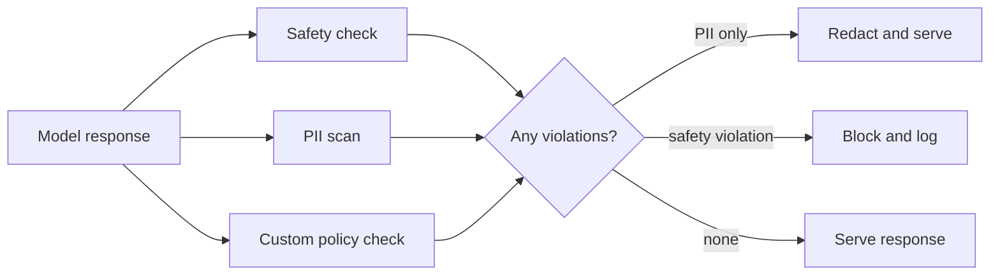

Input moderation reduces what reaches the model. Output filtering is the backstop for everything that gets through anyway — a successful jailbreak, an unexpected model behavior, or a benign input that still produces a problematic response.



Not every violation gets the same treatment — an unredacted PII leak can be fixed and served, while a genuine safety violation warrants a full block, which is why this check fans out into three parallel scans before a single decision.

## Why Output Filtering Catches What Input Moderation Misses

A perfectly benign-looking input can still produce an unsafe output — the model hallucinating harmful misinformation, generating content that violates policy despite no adversarial intent, or a jailbreak technique that slipped past input classification specifically because the input itself looked innocuous. Output filtering is checking the thing that actually reaches the user, which is ultimately what matters.

## A Layered Output Check

```python
def filter_output(response: str, policy: dict) -> dict:
    safety_check = moderation_api.check(response)
    pii_check = pattern_based_pii_scan(response)  # from earlier this month
    policy_check = check_against_custom_policy(response, policy)

    violations = []
    if any(safety_check[cat] > policy["safety_thresholds"][cat] for cat in safety_check):
        violations.append("safety_violation")
    if pii_check:
        violations.append("unredacted_pii_in_output")
    if not policy_check["compliant"]:
        violations.append(policy_check["reason"])

    return {"safe_to_show": len(violations) == 0, "violations": violations}
```

## Handling a Filtered Output Gracefully

```python
def handle_filtered_response(original_response: str, violations: list[str]) -> str:
    if "unredacted_pii_in_output" in violations:
        return redact_text(original_response, pattern_based_pii_scan(original_response))  # fix and serve, not block
    log_security_event("output_blocked", violations)
    return "I'm not able to provide that response. Let me know if I can help with something else."
```

Not every violation needs a hard block — a PII leak can often be fixed by redacting and serving a corrected response, while a genuine safety violation warrants a full block and logging for review. Treating every filter hit identically wastes the opportunity to gracefully recover from the fixable cases.

## Streaming Complicates Output Filtering

```python
async def filter_streaming_response(token_stream):
    buffer = ""
    async for token in token_stream:
        buffer += token
        if len(buffer) > CHECK_INTERVAL_CHARS:
            check = filter_output(buffer, policy)
            if not check["safe_to_show"]:
                yield "\n\n[Response interrupted for policy reasons]"
                return
            yield buffer
            buffer = ""
    if buffer:
        yield buffer
```

Streaming (from the LLM engineering series) means output filtering can't simply wait for a complete response before checking — periodic checking on accumulated chunks, with the ability to interrupt a stream mid-generation, is needed to avoid either unacceptable latency (waiting for completion) or serving unsafe content that's already streamed to the user before a check catches it.

## False Positive Cost Is Real Here Too

Aggressive output filtering that blocks legitimate responses degrades the product experience the same way over-aggressive input moderation does — tune thresholds against a test set covering both genuinely unsafe outputs and legitimate edge cases your product needs to handle correctly (medical information, security research discussion, creative content with dark themes handled appropriately).

## Filtering for Product-Specific Policy, Not Just Generic Safety

```python
def check_against_custom_policy(response: str, policy: dict) -> dict:
    if policy.get("no_competitor_mentions") and mentions_competitor(response, policy["competitor_list"]):
        return {"compliant": False, "reason": "competitor_mention"}
    if policy.get("no_financial_advice") and gives_financial_advice(response):
        return {"compliant": False, "reason": "unauthorized_financial_advice"}
    return {"compliant": True}
```

Generic safety filtering (violence, hate speech) is table stakes — the custom policy layer is where product-specific and often legally-relevant concerns (unauthorized financial or medical advice, brand policy) get enforced, and it needs to be maintained deliberately as your product's specific risk profile, not borrowed wholesale from a generic framework.

## Monitoring Filter Effectiveness Over Time

Track filter trigger rate as a production metric (June's dashboard pattern) — a sudden change in trigger rate, in either direction, is worth investigating: a spike may indicate a new jailbreak technique circulating, a drop may indicate the filter itself has started failing silently.

---

*Part of the [AI Security series]({{ site.baseurl }}/tags/ai-security-series/) — next: [securing tool use with least privilege]({{ site.baseurl }}/posts/securing-tool-use-least-privilege-agents/), the design-time defense underlying everything filtering catches after the fact.*
