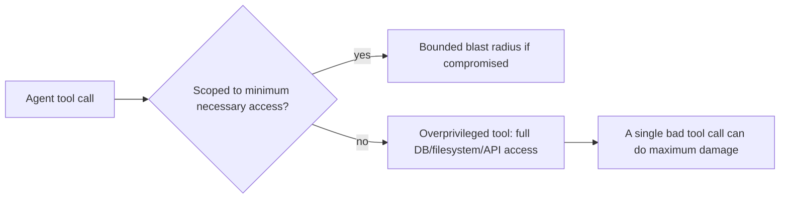

Every guardrail post this month has pointed back to the same underlying principle: limit what a compromised agent can actually do. This post makes least privilege for agentic tools explicit and concrete, as a design discipline rather than an afterthought.



The gap between these two paths is the entire subject of this post — every technique below is a different way of narrowing an agent's tools down to exactly what its legitimate task requires, nothing more.

## The Principle, Stated Plainly

An agent's tools should grant exactly the access needed for its legitimate purpose, and nothing more — the same principle underlying least-privilege access control in traditional systems, applied to what an LLM agent is capable of doing through its tool set.

## Scoping Tools to Minimum Necessary Access

```python
# Overprivileged — a single database tool with unrestricted access
def query_database(sql: str) -> list:
    return db.execute(sql)  # the agent could run ANY query, including destructive ones

# Least-privilege — narrow, purpose-specific tools
def get_customer_order_status(order_id: str, requesting_customer_id: str) -> dict:
    order = db.execute(
        "SELECT status FROM orders WHERE id = %s AND customer_id = %s",
        (order_id, requesting_customer_id),  # scoped to exactly what's needed, parameterized against injection
    )
    return order
```

The narrow version can't be manipulated into running an arbitrary query, can't access another customer's data even if an injection attempt tried to redirect it, and is trivially auditable — exactly what a general-purpose `query_database` tool can't offer, no matter how carefully its prompt instructions are worded.

## Scoping by User Context, Not Just Tool Design

```python
def build_agent_for_session(user: dict) -> Agent:
    tools = {
        "get_own_order_status": partial(get_customer_order_status, requesting_customer_id=user["id"]),
    }
    if user["role"] == "support_agent":
        tools["get_any_order_status"] = get_order_status_admin  # broader access, only for authenticated staff
    return Agent(tools=tools)
```

The same underlying capability (checking order status) should be scoped differently depending on who's actually driving the agent session — binding tool scope to the authenticated user's own permissions at session-construction time, not relying on the model to correctly self-limit based on prompt instructions alone.

## Time-Boxing and Session-Scoping Elevated Access

```python
def grant_temporary_elevated_access(agent_session: str, tool: str, duration_minutes: int = 15):
    elevated_access_registry.grant(agent_session, tool, expires_at=now() + timedelta(minutes=duration_minutes))

def check_tool_access(agent_session: str, tool: str) -> bool:
    grant = elevated_access_registry.get(agent_session, tool)
    return grant is not None and grant.expires_at > now()
```

For legitimate cases needing broader access temporarily, granting it with an explicit expiration — rather than a standing broad grant — limits the window during which a compromised session could misuse that access, echoing standard just-in-time access patterns from traditional infrastructure security.

## Auditing Tool Permission Grants Regularly

```python
def audit_overprivileged_tools(agent_configs: list[dict]) -> list[str]:
    findings = []
    for config in agent_configs:
        for tool in config["tools"]:
            if tool_grants_broader_access_than_used(tool, config["actual_usage_logs"]):
                findings.append(f"{config['name']}: {tool} grants unused broad access")
    return findings
```

Tool permissions accumulate scope creep over time as features evolve — periodic auditing (comparing what a tool *could* do against what it's actually observed doing in production logs) catches overprivileged tools that were reasonable when designed but never narrowed as usage patterns clarified what's actually needed.

## Least Privilege Doesn't Replace Other Defenses

This principle limits *impact* when other defenses (injection prevention, output filtering) fail — it doesn't prevent an injection attempt from happening in the first place. The full security posture from this month needs all these layers together: reduce the likelihood of a successful attack (input/output filtering, structural defenses) *and* limit the damage if one succeeds anyway (least privilege, this post).

## Applying This Retroactively to Existing Agents

For every agent built across March and April's series, this is worth a dedicated review pass — list every tool, its actual access scope, and whether that scope is the minimum necessary for the agent's legitimate purpose, tightening anywhere it isn't.

---

*Part of the [AI Security series]({{ site.baseurl }}/tags/ai-security-series/) — next: [sandboxing code execution]({{ site.baseurl }}/posts/sandboxing-code-execution-security/), a specific high-risk tool category deserving its own security-focused treatment.*
