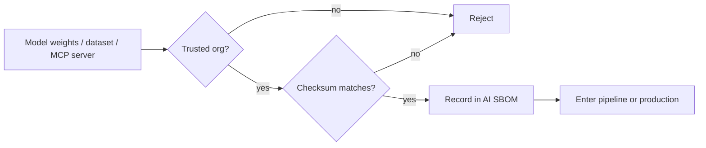

Traditional software supply chain security worries about compromised dependencies. AI systems have an additional supply chain most teams don't think about with the same rigor: the models, weights, and datasets flowing into fine-tuning pipelines and production deployments.



Every external component — weights, a fine-tuning dataset, a third-party MCP server — passes through the same two gates before it's trusted: is the source verified, and does the artifact match its expected checksum. The SBOM at the end is what makes "are we affected by this newly disclosed vulnerability" answerable quickly.

## The Expanded Attack Surface

```python
ai_supply_chain_components = {
    "base_model_weights": "downloaded from Hugging Face Hub or a provider — could be tampered with at the source or in transit",
    "fine_tuning_datasets": "third-party or scraped data — could contain poisoned examples (tomorrow's post)",
    "third_party_tools_mcp_servers": "MCP servers from external sources — could contain malicious tool implementations",
    "embedding_models_and_vector_indexes": "same weight-provenance concern as generative models",
    "python_dependencies": "the standard software supply chain risk, still fully applicable",
}
```

## Verifying Model Weight Provenance

```python
def verify_model_checksum(downloaded_path: str, expected_checksum: str) -> bool:
    actual = hashlib.sha256(open(downloaded_path, "rb").read()).hexdigest()
    if actual != expected_checksum:
        log_security_event("model_checksum_mismatch", downloaded_path)
        return False
    return True
```

Verifying a downloaded model's checksum against a known-good value from a trusted source, before loading it into any pipeline, is the same principle as verifying a software package's checksum — increasingly available through model registries and hub platforms, and worth making a hard requirement in your deployment pipeline (echoing the containerization post's mention of this in the build process) rather than an optional step.

## Sourcing Models From Trusted Registries

```python
def validate_model_source(model_id: str, trusted_orgs: set[str]) -> bool:
    org, _ = model_id.split("/", 1)
    if org not in trusted_orgs:
        log_security_event("untrusted_model_source", model_id)
        return False
    return True
```

Model hub platforms host content from many independent publishers with varying levels of vetting — restricting production deployments to models from verified, trusted organizations (official provider accounts, well-established research labs) rather than arbitrary community uploads reduces exposure to intentionally malicious or carelessly-published weights.

## Auditing Third-Party MCP Servers and Tools

Directly extending March's MCP series with a security lens: an MCP server from an untrusted source is effectively third-party code with access to whatever the agent grants it — apply the same code review scrutiny to an MCP server's implementation that you'd apply to any other third-party dependency with meaningful system access, and prefer official or well-audited community servers over obscure ones for anything beyond experimentation.

```python
def audit_mcp_server_before_adoption(server_source: str) -> dict:
    return {
        "source_reviewed": review_source_code(server_source),
        "network_calls_audited": list_all_external_endpoints(server_source),
        "permissions_requested": list_filesystem_and_system_access(server_source),
    }
```

## Dataset Provenance for Fine-Tuning

Extending May's dataset construction posts — for any dataset sourced externally (a public dataset, scraped data, or a third-party vendor dataset), document its provenance and apply the same data-cleaning scrutiny with an explicit eye toward intentional poisoning, not just quality issues, before it enters a training pipeline.

## Software Bill of Materials (SBOM) for AI Systems

```python
def generate_ai_sbom(deployment: dict) -> dict:
    return {
        "base_model": {"id": deployment["model_id"], "checksum": deployment["model_checksum"], "source": deployment["model_source"]},
        "fine_tuning_data_version": deployment.get("dataset_version"),
        "mcp_servers": deployment.get("mcp_server_sources", []),
        "python_dependencies": get_dependency_manifest(),
    }
```

An AI-specific SBOM — extending the traditional software bill of materials concept to include model weights, dataset versions, and MCP server sources — is what makes "are we affected by this newly disclosed vulnerability/poisoned dataset" answerable quickly during an incident, connecting directly to the model registry from August's infrastructure series.

## This Is an Emerging, Fast-Evolving Area

AI supply chain security tooling and standards are considerably less mature than traditional software supply chain security — treat the practices above as a reasonable current baseline, and expect this area to develop meaningfully further as the industry matures its response to a genuinely new category of risk.

---

*Part of the [AI Security series]({{ site.baseurl }}/tags/ai-security-series/) — next: [model poisoning and backdoor attacks explained]({{ site.baseurl }}/posts/model-poisoning-backdoor-attacks/), the specific threat this supply chain scrutiny defends against.*
