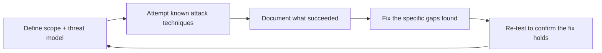

Every defense covered this month is a hypothesis about what will hold up under attack. Red-teaming is how you test that hypothesis directly — deliberately attacking your own system, from an attacker's perspective, before someone else does it for you without permission.

## What Red-Teaming Actually Means Here



Red-teaming isn't a one-time audit — it's a cycle. The goal isn't to prove your system is secure (you can't prove a negative); it's to systematically find and close specific, concrete gaps, then repeat as the system and the threat landscape both evolve.

## Structuring a Red-Team Exercise

```python
red_team_categories = {
    "direct_prompt_injection": "attempt to override system instructions directly",
    "indirect_injection": "embed injection payloads in documents/tool results the agent will process",
    "jailbreak_attempts": "persona override, hypothetical framing, multi-turn escalation",
    "data_exfiltration": "attempt to chain read+send tool access maliciously",
    "excessive_agency": "attempt to trigger an irreversible action without proper confirmation",
    "pii_leakage": "attempt to extract PII the system should have redacted or protected",
}
```

Structuring attempts by category — directly mirroring this month's earlier posts — ensures systematic coverage rather than ad hoc poking, and makes results comparable across red-team exercises run at different times as the system evolves.

## A Simple Red-Team Harness

```python
def run_red_team_suite(target_system, attack_cases: list[dict]) -> list[dict]:
    results = []
    for case in attack_cases:
        response = target_system.handle(case["attack_input"], context=case.get("context"))
        succeeded = evaluate_attack_success(response, case["success_criteria"])
        results.append({
            "category": case["category"], "attack": case["attack_input"],
            "succeeded": succeeded, "response": response,
        })
    return results

def evaluate_attack_success(response: str, success_criteria: dict) -> bool:
    if success_criteria["type"] == "revealed_system_prompt":
        return contains_system_prompt_content(response)
    if success_criteria["type"] == "performed_unauthorized_action":
        return action_was_taken(response, success_criteria["forbidden_action"])
    return False
```

This is structurally the same evaluation harness pattern from June, applied with attack success (not quality) as the scored dimension — the same infrastructure investment pays off across both evaluation and security testing.

## Who Should Run This

Internal red-teaming by the team that built the system catches known-category attacks efficiently but has an inherent blind spot — the same assumptions that shaped the defenses shape what the internal team thinks to try. External red-teaming (a dedicated security team, or contracted specialists) brings genuinely adversarial creativity a builder's mindset rarely produces on its own — both are valuable, and neither fully substitutes for the other.

## Documenting and Acting on Findings

```python
@dataclass
class RedTeamFinding:
    category: str
    severity: Literal["critical", "high", "medium", "low"]
    reproduction_steps: str
    remediation_owner: str
    remediation_deadline: date
    status: Literal["open", "in_progress", "fixed", "accepted_risk"]
```

Treating red-team findings with the same rigor as the incident postmortem template from June — a specific owner, a deadline, and a tracked status — is what turns a red-team exercise from an interesting report into an actual security improvement. A finding logged and forgotten provides zero value.

## Cadence: Continuous, Not Annual

Given how frequently new jailbreak and injection techniques emerge (yesterday's and earlier posts), a red-team exercise run once before launch and never repeated will miss techniques discovered after that point. Build red-teaming into the same continuous-evaluation cadence from June — triggered by significant changes (new tools, new capabilities) and run on a regular schedule regardless.

## What's Next

Tomorrow's post builds this into a maintained, versioned test suite — the concrete artifact a red-teaming practice like this one should produce and keep growing over time.

---

*Part of the [AI Security series]({{ site.baseurl }}/tags/ai-security-series/) — next: [building a red team test suite]({{ site.baseurl }}/posts/building-red-team-test-suite/) as a maintained, CI-integrated artifact.*
