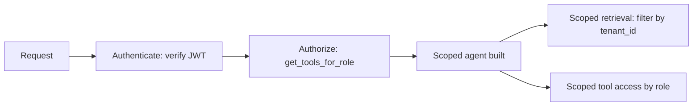

Every AI-specific defense covered this month sits on top of a foundational layer this series hasn't addressed directly: standard authentication and authorization, applied to AI applications specifically. It's still essential, and it interacts with AI-specific concerns in ways worth making explicit.



Authentication answers who's asking; authorization then scopes two separate things an agent can do — which tools it can call and which documents it can retrieve — so a compromised or over-broad session can't reach data or actions outside its role.

## Authentication: Knowing Who's Actually Asking

```python
async def authenticate_request(request: Request) -> dict:
    token = extract_bearer_token(request)
    user = await verify_jwt(token)
    if not user:
        raise HTTPException(401, "Invalid or expired token")
    return user
```

Nothing about this differs from standard web application authentication — the point worth emphasizing is that it's not optional or secondary just because the endpoint happens to call an LLM. An unauthenticated AI endpoint is an unauthenticated endpoint, full stop, with all the standard risks that implies plus the AI-specific ones this month has covered.

## Authorization Scoped to Agent Tool Access

This directly extends the least-privilege tool design from earlier this month — authorization determines *which tools an agent session can even attempt to use*, not just which API endpoints a user can call:

```python
def build_scoped_agent(user: dict) -> Agent:
    available_tools = get_tools_for_role(user["role"])
    return Agent(tools=available_tools, user_context=user)

def get_tools_for_role(role: str) -> dict:
    role_tool_map = {
        "customer": {"get_own_orders", "get_own_account"},
        "support_agent": {"get_own_orders", "get_own_account", "get_any_order", "issue_refund"},
        "admin": {"*"},
    }
    return {name: TOOL_REGISTRY[name] for name in role_tool_map.get(role, set())}
```

## Row-Level Security for RAG and Retrieval

```python
def scoped_retrieval(query: str, user: dict, top_k: int = 5) -> list[dict]:
    results = vector_store.search(embed(query), top_k=top_k, filter={"tenant_id": user["tenant_id"]})
    return results
```

For multi-tenant RAG systems (March's series), retrieval itself needs to be scoped to what the requesting user is authorized to see — a shared vector index without query-time tenant filtering is a data leakage risk regardless of how well the generation-layer prompt is written, since the wrong documents were retrieved before the model ever had a chance to reason about them.

## API Key Management for the Gateway

Directly extending August's internal LLM gateway — per-team API keys, scoped to that team's allowed models and budget, with rotation and revocation capability:

```python
def rotate_api_key(team: str) -> str:
    new_key = generate_secure_key()
    api_key_registry.set(team, new_key, previous_key_grace_period_hours=24)  # avoid breaking in-flight requests
    return new_key
```

A grace period during rotation — accepting both old and new keys briefly — avoids the operational risk of a hard cutover breaking legitimate in-flight sessions, the same zero-disruption principle from August's zero-downtime upgrade post applied to credential rotation.

## Session-Level Authorization for Long-Running Agents

For agent sessions that persist across time (the checkpointed workflows from April), re-verify authorization at resumption, not just at session start — a session paused for human approval and resumed hours later should confirm the resuming user still has appropriate access, not trust a stale authorization check from when the session first began.

```python
def resume_agent_session(session_id: str, resuming_user: dict) -> Agent:
    session = load_checkpoint(session_id)
    if not user_still_authorized(resuming_user, session.required_permissions):
        raise HTTPException(403, "Authorization has changed since this session was created")
    return rebuild_agent_from_checkpoint(session)
```

## Auditing Access Patterns

Extend June's observability dashboards with access-pattern monitoring — a user or API key suddenly accessing tools or data outside their normal pattern is a signal worth flagging, the same anomaly-detection principle from this month's exfiltration post applied at the authorization layer.

---

*Part of the [AI Security series]({{ site.baseurl }}/tags/ai-security-series/) — next: [secrets management in agentic tool configurations]({{ site.baseurl }}/posts/secrets-management-agentic-tools/), protecting the credentials tools themselves depend on.*
