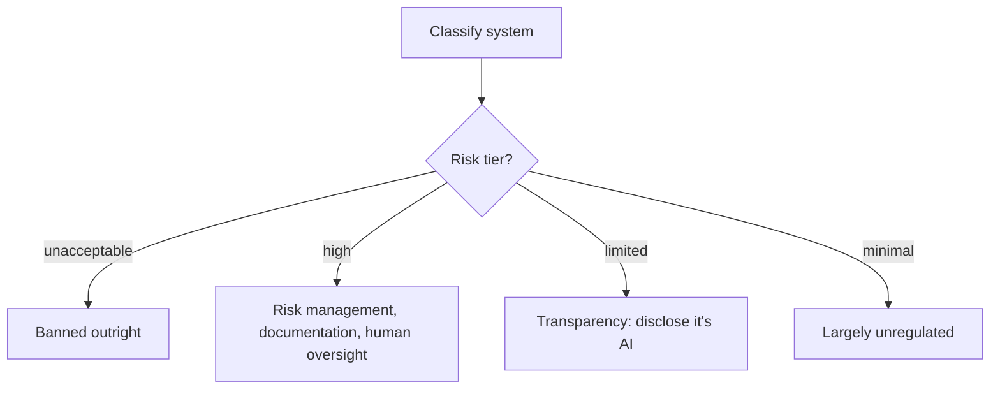

Where GDPR and HIPAA regulate data handling generally, the EU AI Act is the first major regulatory framework specifically targeting AI systems by their capability and risk level — worth understanding as the likely template other jurisdictions will follow.



Classifying which tier a system falls into is the first, most consequential step — a support chatbot's transparency obligation is a one-line disclosure, while a hiring or credit-decision system's high-risk obligations mean substantially more documentation and process, covered next.

## The Risk-Tier Framework

```python
eu_ai_act_risk_tiers = {
    "unacceptable_risk": "banned outright — social scoring, certain manipulative or exploitative AI uses",
    "high_risk": "extensive obligations — AI in hiring, credit scoring, healthcare, law enforcement, critical infrastructure",
    "limited_risk": "transparency obligations — chatbots must disclose they're AI, certain content must be labeled as AI-generated",
    "minimal_risk": "largely unregulated — most internal tooling, spam filters, recommendation systems",
}
```

The first step for any team is honestly classifying which tier their system falls into — a support chatbot is typically limited-risk (transparency obligations only), while an AI system screening job applicants or making credit decisions is high-risk with substantially more extensive obligations, a very different compliance burden.

## Transparency Obligations for Limited-Risk Systems

```python
def add_ai_disclosure(response: dict, is_first_message: bool) -> dict:
    if is_first_message:
        response["disclosure"] = "You are interacting with an AI assistant."
    return response
```

This is the most broadly applicable requirement — most conversational AI products need clear disclosure that users are interacting with AI, not a human, which is a straightforward implementation requirement but an easy one to overlook when a product's UX is designed to feel seamlessly human-like.

## High-Risk System Obligations

```python
high_risk_requirements = {
    "risk_management_system": "documented, continuous risk assessment — echoes tomorrow's model risk management post",
    "data_governance": "training data quality, bias examination, representativeness — echoes September's bias-testing post",
    "technical_documentation": "detailed documentation of the system's design, capabilities, and limitations",
    "human_oversight": "meaningful human oversight capability — connects to March's human-in-the-loop guardrails",
    "accuracy_robustness_cybersecurity": "this entire month's security practices, formalized as a regulatory requirement",
}
```

Notice how closely this maps onto content already covered throughout this roadmap — the EU AI Act largely formalizes practices a mature AI engineering team should already be doing (rigorous evaluation, human oversight for consequential decisions, documented risk management) into explicit legal obligations for high-risk systems specifically.

## Conformity Assessment for High-Risk Systems

Before deploying a high-risk AI system in scope of the Act, a conformity assessment (self-assessment for most categories, third-party assessment for some) verifying the system meets the Act's requirements is generally required — a formal process that should begin well before a planned launch date, not as a final pre-launch checkbox, given the documentation and testing burden involved.

## General-Purpose AI Model Obligations

For teams building on top of foundation models (which is the substantial majority of applications throughout this roadmap), the Act also places obligations on providers of general-purpose AI models themselves — technical documentation, copyright policy compliance, and for the most capable models, systemic risk assessments. As a downstream user of a provider's model, understanding what obligations the provider itself carries (and verifying they're meeting them) is a relevant part of vendor risk assessment, covered later this month.

## Practical Steps for an Engineering Team

```python
def eu_ai_act_readiness_checklist(system: dict) -> dict:
    return {
        "risk_tier_classified": system.get("risk_tier") is not None,
        "disclosure_implemented": system.get("has_ai_disclosure", False),
        "human_oversight_mechanism": system.get("has_human_escalation_path", False),
        "documented_risk_assessment": system.get("has_risk_management_docs", False),
    }
```

## This Is a Rapidly Evolving Area

The EU AI Act's implementation timeline phases in different obligations over several years, and guidance continues to develop — treat this post as a conceptual orientation, not a substitute for legal counsel specific to your system's actual risk classification and your organization's specific obligations, which should be assessed directly with qualified compliance expertise.

---

*Part of the [AI Security series]({{ site.baseurl }}/tags/ai-security-series/) — next: [model risk management frameworks]({{ site.baseurl }}/posts/model-risk-management-frameworks/), the systematic practice several of this month's regulatory frameworks point back to.*
