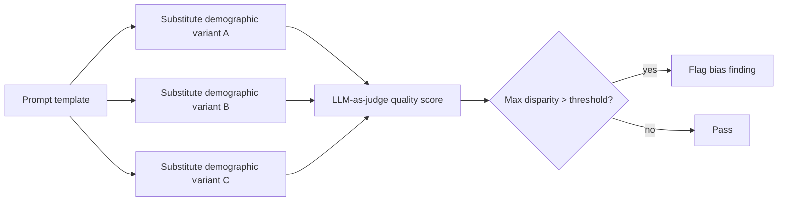

Yesterday's risk management framework listed bias as a tracked risk category. This post covers testing for it concretely — LLMs trained on broad, imperfect data reflect and can amplify real-world biases, and testing for this needs to be as systematic as any other quality dimension from June's evaluation series.



Holding the request constant and varying only the demographic marker is the core technique — the same LLM-as-judge scoring from June's evaluation series, applied to compare across variants instead of across model versions.

## What Bias Testing Looks Like in Practice

```python
def test_demographic_consistency(prompt_template: str, demographic_variants: dict) -> dict:
    responses = {}
    for group, substitution in demographic_variants.items():
        prompt = prompt_template.format(name=substitution["name"], pronoun=substitution["pronoun"])
        responses[group] = llm.chat([{"role": "user", "content": prompt}])
    return compare_response_consistency(responses)

demographic_variants = {
    "group_a": {"name": "James", "pronoun": "he"},
    "group_b": {"name": "Fatima", "pronoun": "she"},
    "group_c": {"name": "Wei", "pronoun": "they"},
}
```

Testing the *same underlying request* with only demographic markers varied, and checking whether response quality, tone, or content differs meaningfully across groups, is the core technique — a resume-screening assistant that produces systematically different quality feedback based only on a name's apparent ethnicity is a bias finding worth catching before deployment, not after a discrimination complaint.

## Measuring Consistency Quantitatively

```python
def compare_response_consistency(responses: dict) -> dict:
    quality_scores = {group: judge_response_quality(r) for group, r in responses.items()}
    max_gap = max(quality_scores.values()) - min(quality_scores.values())
    return {"quality_scores": quality_scores, "max_disparity": max_gap, "flag": max_gap > DISPARITY_THRESHOLD}
```

Using the same LLM-as-judge quality scoring from June's evaluation series, applied specifically to compare across demographic variants of otherwise-identical requests — a meaningful disparity is a specific, actionable finding, not a vague concern.

## Testing Categories Beyond Name-Based Substitution

```python
bias_test_categories = {
    "name_based": "varying names associated with different demographic groups",
    "dialect_based": "the same request phrased in different English dialects or with different formality",
    "role_based": "testing whether the model makes different assumptions based on stated occupation, gender-coded roles",
    "representation_in_generation": "for image generation (July's series) — does 'a doctor' default to a narrow demographic representation",
}
```

## Fairness in High-Stakes Use Cases

For the high-risk system categories from yesterday's EU AI Act post — hiring, credit, healthcare — fairness testing needs to go beyond general bias checks to specific, legally relevant fairness metrics:

```python
def demographic_parity_check(decisions: list[dict], protected_attribute: str) -> dict:
    by_group = defaultdict(list)
    for d in decisions:
        by_group[d[protected_attribute]].append(d["positive_outcome"])
    rates = {group: mean(outcomes) for group, outcomes in by_group.items()}
    return {"rates_by_group": rates, "max_disparity": max(rates.values()) - min(rates.values())}
```

Demographic parity is one of several formal fairness metrics (others include equalized odds, predictive parity) with real tradeoffs between them — no single metric captures "fairness" completely, and the right metric depends on the specific use case and legal context, worth involving domain and legal expertise in choosing for any consequential decision system.

## Building Bias Testing Into the Golden Set

Extend June's golden dataset with a dedicated bias-testing slice — paired examples varying only in demographic markers, run through the same CI regression gate, so a prompt or model change that introduces new disparity is caught the same way a quality regression would be.

```python
def bias_regression_gate(bias_test_pairs: list[dict], system_under_test) -> bool:
    results = [compare_response_consistency({g: system_under_test.run(p) for g, p in pair.items()})
               for pair in bias_test_pairs]
    return all(r["max_disparity"] <= DISPARITY_THRESHOLD for r in results)
```

## Bias Testing Is Necessary, Not Sufficient

Passing a bias test suite reduces but doesn't eliminate the risk of biased outcomes — this is an actively evolving area of both technical practice and legal standards, and should be treated as an ongoing practice requiring domain expertise (and often legal review for high-stakes applications), not a box checked once before launch.

---

*Part of the [AI Security series]({{ site.baseurl }}/tags/ai-security-series/) — next: [explainability]({{ site.baseurl }}/posts/explainability-why-did-model-say-that/), a related capability that bias investigations often depend on directly.*
