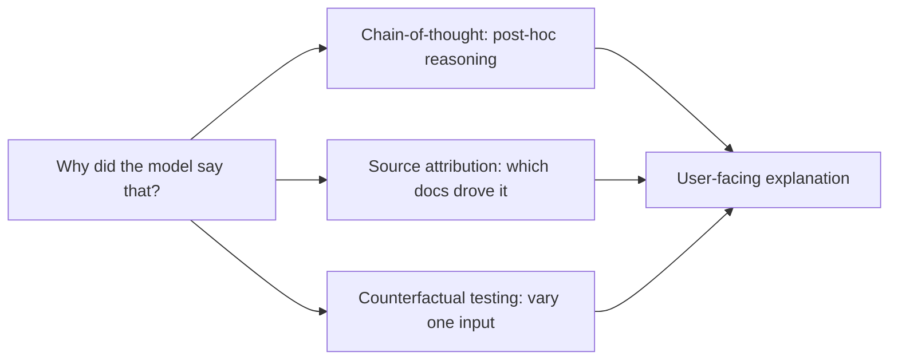

Yesterday's bias testing needs to answer "did this happen," but a full investigation often needs to answer "why did the model produce this specific output." Explainability is that harder question, and it's worth being honest about what's genuinely achievable with today's LLMs versus what remains aspirational.



None of these three techniques is a true mechanistic account of the model's internals — each is a practical interpretability aid, and the honest framing (useful but not a guarantee) matters as much as the technique itself, especially when explainability output feeds a regulatory requirement.

## What "Explainability" Actually Means for an LLM

Unlike a simpler ML model (a decision tree, a linear model) where you can trace exactly which input features drove a prediction, a large language model's internal reasoning isn't directly inspectable in that way — what's practically available is closer to *interpretability aids* than a true mechanistic explanation of "why."

## Chain-of-Thought as a (Partial) Explanation

```python
def get_explained_response(prompt: str) -> dict:
    response = llm.chat([{
        "role": "user",
        "content": f"{prompt}\n\nThink through your reasoning step by step before giving your final answer."
    }])
    return {"reasoning": extract_reasoning(response.content), "answer": extract_final_answer(response.content)}
```

Prompting for explicit reasoning (the same chain-of-thought technique from the prompt engineering series) gives a *post-hoc account* of the model's reasoning — useful and often genuinely informative, but worth understanding it's not a guaranteed, mechanistically faithful trace of what actually happened inside the model. A model can produce a plausible-sounding rationale that doesn't fully reflect its actual computation, a known limitation worth being explicit about rather than overselling.

## Attribution: Which Context Actually Drove the Answer

For RAG systems specifically (March's series), a more tractable and genuinely useful form of explainability is source attribution — which retrieved documents actually contributed to a given claim:

```python
def get_attributed_response(query: str, retrieved_docs: list[dict]) -> dict:
    response = llm.chat([{
        "role": "user",
        "content": f"Answer using the context. For each claim, cite the specific source [1], [2], etc.\n\n"
                    f"Context: {format_with_ids(retrieved_docs)}\n\nQuestion: {query}"
    }])
    return {"answer": response.content, "citations": extract_citations(response.content)}
```

This is a form of explainability that's both practically achievable and directly useful — it doesn't explain the model's internal reasoning process, but it does answer "what evidence supports this specific claim," which is often the actually-useful question for a user or auditor.

## Counterfactual Testing as an Explainability Technique

```python
def counterfactual_explanation(prompt_template: str, base_inputs: dict, variable_field: str, alternatives: list) -> dict:
    results = {}
    for alt_value in alternatives:
        modified_inputs = {**base_inputs, variable_field: alt_value}
        results[alt_value] = llm.chat([{"role": "user", "content": prompt_template.format(**modified_inputs)}])
    return {"variations": results, "sensitivity": measure_output_change(results)}
```

Systematically varying one input at a time and observing how the output changes is a practical, empirical way to understand what's driving a model's behavior — directly related to yesterday's bias-testing technique, generalized beyond demographic variables to any input factor worth investigating.

## Explainability for Regulatory Requirements

Connecting back to yesterday's EU AI Act and this month's GDPR posts — "meaningful information about the logic involved" in an automated decision doesn't require a full mechanistic explanation of model internals; a combination of chain-of-thought reasoning, source attribution, and documented decision criteria (what factors the system was designed to weigh) is generally what regulatory explainability requirements are actually asking for, and what's realistically achievable.

## Setting Honest Expectations Internally and Externally

The most important practice here isn't a specific technique — it's being honest, both internally and with users/regulators, about what your explainability tooling actually provides versus a true mechanistic account of model internals, which remains an open, active area of AI research (interpretability research broadly) rather than a solved, production-ready capability.

## Building Explainability Into User-Facing Features

```python
def render_explained_answer_for_user(response: dict) -> str:
    return f"{response['answer']}\n\n**Sources:** {format_citations(response['citations'])}"
```

For most product use cases, surfacing citations and a brief reasoning summary — not a full chain-of-thought dump — strikes the right balance between transparency and usability, echoing June's tone-consistency principle: an explanation that's technically complete but unreadable serves the compliance checkbox without serving the actual user who needs to trust and verify the answer.

---

*Part of the [AI Security series]({{ site.baseurl }}/tags/ai-security-series/) — next: [audit logging for compliance]({{ site.baseurl }}/posts/audit-logging-compliance-ai-systems/), the record-keeping layer underlying every compliance framework this month has covered.*
