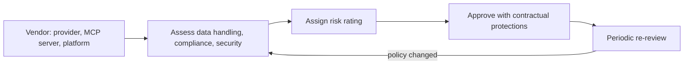

Every application in this roadmap depends on at least one third-party model provider, and often several additional vendors — observability platforms, vector databases, MCP servers. Each is a dependency whose security and compliance posture becomes, transitively, your own.



The assessment doesn't end at onboarding — the loop back into periodic re-review is what catches a vendor's policy change (say, a new default to train on customer data) before it surfaces as a surprise during your own audit.

## What a Vendor Risk Assessment Actually Evaluates

```python
vendor_risk_dimensions = {
    "data_handling": "does the vendor train on your data by default? what's their data retention policy?",
    "compliance_coverage": "do they offer a BAA for HIPAA? a DPA for GDPR? SOC 2 Type II attestation?",
    "security_posture": "their own security certifications, incident history, and disclosed practices",
    "availability_and_slas": "uptime commitments, and what happens to you when they have an outage (Aug's fallback posts)",
    "concentration_risk": "how dependent is your product on this single vendor continuing to exist and operate as expected",
}
```

## A Vendor Assessment Checklist

```python
@dataclass
class VendorAssessment:
    vendor_name: str
    services_used: list[str]
    data_shared: list[str]           # what categories of data this vendor receives
    compliance_certifications: list[str]
    contractual_protections: dict     # DPA, BAA, indemnification terms
    security_incident_history: list[dict]
    risk_rating: Literal["low", "medium", "high"]
    approved_by: str
    next_review_date: date
```

This mirrors the model risk assessment structure from earlier this month, applied to the vendor relationship itself rather than a specific model — and it should feed into the same governance review process (tomorrow's post) rather than being a one-time procurement checkbox never revisited.

## Data Sharing Minimization Per Vendor

```python
def minimize_data_sent_to_vendor(vendor: str, data: dict) -> dict:
    vendor_data_policy = VENDOR_DATA_POLICIES[vendor]
    return {k: v for k, v in data.items() if k in vendor_data_policy["approved_fields"]}
```

Just as data minimization applies within your own system (this month's GDPR post), it applies per-vendor too — an observability platform (June's series) genuinely needs trace data to function, but doesn't necessarily need every field in a request; scope what each specific vendor receives to what their specific function requires.

## Assessing Model Provider Data Usage Policies Specifically

```python
def verify_provider_training_opt_out(provider: str, product_tier: str) -> bool:
    policy = get_provider_data_policy(provider, product_tier)
    return policy["trains_on_customer_data"] == False
```

Whether a model provider trains on your submitted data by default (and whether that's configurable) is one of the most consequential vendor risk questions for any application handling sensitive data — verify this explicitly per product tier, since policies can differ between a provider's consumer product and their enterprise API offering.

## Concentration Risk and Exit Planning

```python
def assess_concentration_risk(vendor_dependencies: dict) -> dict:
    single_points_of_failure = [v for v, usage in vendor_dependencies.items() if usage["criticality"] == "no_fallback_exists"]
    return {"high_concentration_risk_vendors": single_points_of_failure}
```

This connects directly to August's fallback-strategy and disaster-recovery posts — a vendor risk assessment isn't complete without asking "what happens to our product if this vendor disappears or changes terms unfavorably tomorrow," and for any vendor without a viable fallback path, that's a specific, documented risk worth a mitigation plan, not just an accepted unknown.

## MCP Servers and Tool Providers as Vendors Too

Extending September's supply chain security post — a third-party MCP server, even a free open-source one, is functionally a vendor relationship carrying real risk (what data does it see, what could it do with the access it's granted) and deserves the same assessment discipline as a paid API vendor, not a lighter bar just because no money changes hands.

## Ongoing Monitoring, Not Just Onboarding Review

```python
def check_for_vendor_policy_changes(vendor: str) -> list[str]:
    current_policy = fetch_current_vendor_terms(vendor)
    last_reviewed_policy = get_stored_policy_snapshot(vendor)
    return diff_meaningful_changes(current_policy, last_reviewed_policy)
```

Vendor terms and practices change over time — a periodic re-review (tied to the same cadence as the model risk management posts) catches a provider policy change that affects your compliance posture before it becomes a surprise discovered during your own audit.

---

*Part of the [AI Security series]({{ site.baseurl }}/tags/ai-security-series/) — next: [incident response planning]({{ site.baseurl }}/posts/incident-response-planning-ai-security/), for when a risk from this month's series materializes despite the mitigations.*
