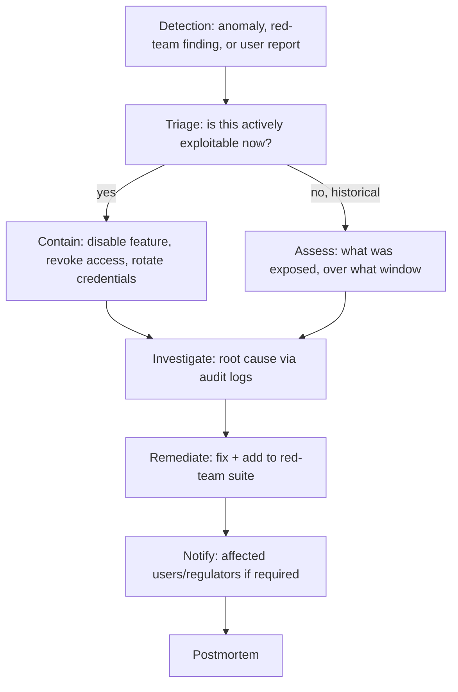

June's postmortem post covered quality incidents. This post covers the security-specific incident response process — what happens the moment a prompt injection succeeds, an exfiltration attempt is detected, or a red-team finding turns out to already be actively exploited in production.

## AI Security Incidents Have a Distinct Shape



The containment step deliberately differs from a typical software incident — for a compromised agent mid-session, containment might mean immediately revoking that session's tool access or credentials (September's secrets management post) rather than a full service rollback, since the "bug" is behavioral, not necessarily a bad deployment.

## Severity Classification Specific to AI Incidents

```python
def classify_ai_incident_severity(incident: dict) -> str:
    if incident["type"] == "data_exfiltration" and incident["confirmed"]:
        return "critical"
    if incident["type"] == "unauthorized_irreversible_action":
        return "critical"
    if incident["type"] == "jailbreak_producing_policy_violation" and not incident["data_exposed"]:
        return "high"
    if incident["type"] == "output_filter_bypass_no_harm_caused":
        return "medium"
    return "low"
```

Distinguishing "an attack was attempted and blocked by existing defenses" from "an attack succeeded" matters for both severity classification and required response — the former is valuable red-team-suite material (September's post) captured through normal monitoring; the latter triggers the full incident response process including potential notification obligations.

## The First 30 Minutes: Immediate Containment Actions

```python
def emergency_containment_playbook(incident_type: str) -> list[str]:
    playbooks = {
        "active_data_exfiltration": [
            "revoke the compromised session's credentials immediately",
            "disable the specific outbound tool/destination if identifiable",
            "preserve all logs before any further system changes",
        ],
        "jailbreak_producing_harmful_content": [
            "disable the specific feature/endpoint if the technique is actively being used at scale",
            "deploy an emergency output filter rule targeting the specific pattern",
        ],
    }
    return playbooks.get(incident_type, ["escalate to security team for manual assessment"])
```

Having pre-written playbooks for the most likely incident categories (each mapping to a risk this month has covered) means the response team isn't improvising containment steps under pressure — the same principle as June's postmortem template, applied to the more time-sensitive security context.

## Forensic Investigation Using This Month's Audit Infrastructure

```python
def investigate_incident(incident: dict) -> dict:
    relevant_logs = query_audit_log(SECURITY_TEAM_USER, {
        "actor": incident.get("suspected_session_id"),
        "timestamp": {"$gte": incident["window_start"], "$lte": incident["window_end"]},
    })
    return {
        "actions_taken": [log["action_type"] for log in relevant_logs],
        "data_accessed": [log["resource_accessed"] for log in relevant_logs if log["resource_accessed"]],
        "attack_vector": identify_injection_source(relevant_logs),
    }
```

This is where the audit logging investment from earlier this week pays off directly — a well-instrumented system can answer "exactly what did this compromised session do" precisely; a poorly logged one requires guesswork.

## Notification Obligations

For confirmed data exposure incidents involving personal data, GDPR (72-hour notification requirement to supervisory authorities in many cases) and other regulatory frameworks from this month impose specific, time-bound notification obligations — this needs legal counsel involved immediately upon confirming an incident meets the threshold, not as an afterthought once the technical response concludes.

## Closing the Loop: Every Incident Strengthens the Defenses

```python
def close_incident(incident: dict, root_cause: str, fix_applied: str):
    add_to_red_team_suite(build_test_case_from_incident(incident))  # September's red-team post
    update_model_risk_assessment(incident["affected_model"], new_finding=incident)  # this month's risk mgmt post
    schedule_postmortem_review(incident)
```

Every confirmed security incident should produce, at minimum, a new red-team test case and an update to the affected system's risk assessment — turning each incident into a permanent improvement to the defenses covered throughout this month, not just a resolved ticket.

---

*Part of the [AI Security series]({{ site.baseurl }}/tags/ai-security-series/) — next: [building an AI governance committee]({{ site.baseurl }}/posts/ai-governance-committee-review-process/), the organizational structure overseeing all of this month's practices.*
