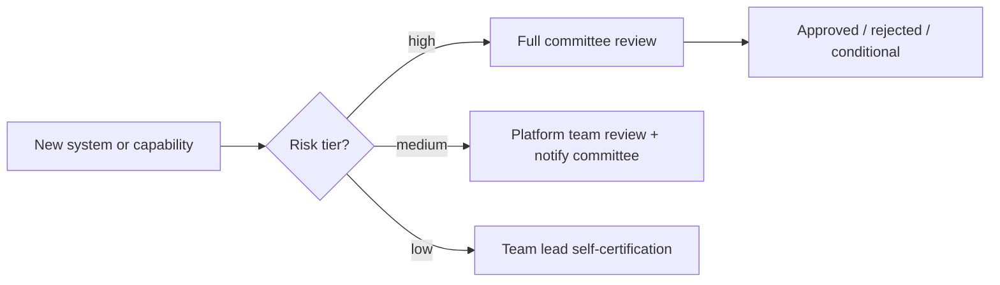

Every framework and process this month — model risk assessments, vendor risk reviews, incident response — needs an organizational home: a body that actually reviews, approves, and holds the whole practice accountable. This post covers building that governance structure.



Routing review effort by risk tier is what keeps the committee from becoming either a rubber stamp or a bottleneck teams route around — full review is reserved for genuinely high-stakes deployments, the same tiering the model risk management post established.

## What a Governance Committee Actually Does

```python
governance_committee_responsibilities = {
    "approve_high_risk_deployments": "review model risk assessments (Sep 22) before high-tier models reach production",
    "review_incidents": "oversee the incident response process (yesterday), ensure remediation actually happens",
    "set_policy": "approve organization-wide policy — acceptable use, data retention (Sep 26), vendor standards (yesterday)",
    "track_compliance_posture": "maintain visibility into SOC 2/GDPR/HIPAA/EU AI Act readiness across all AI systems",
    "review_new_capabilities": "assess new agent capabilities or tool grants before they ship, not after",
}
```

## Composition: Who Should Be in the Room

```python
committee_composition = {
    "engineering_leadership": "understands technical feasibility and tradeoffs",
    "security_team": "owns the red-team suite (Sep 15) and incident response process",
    "legal_and_compliance": "owns regulatory interpretation (GDPR, HIPAA, EU AI Act)",
    "product": "understands the business context and user impact of decisions",
    "an_ethics_or_responsible_ai_representative": "for organizations with the scale to warrant a dedicated role",
}
```

A committee composed only of engineers tends to under-weight legal and reputational risk; a committee without engineering representation tends to approve policy that's impractical to actually implement — the composition itself is a design decision worth getting right, not an afterthought.

## A Tiered Review Process Matching Risk Level

```python
def route_for_review(system: dict) -> str:
    risk_tier = system["risk_tier"]  # from Sep 22's model risk management framework
    if risk_tier == "high":
        return "full_committee_review_required"
    if risk_tier == "medium":
        return "platform_team_review_with_committee_notification"
    return "team_lead_self_certification"
```

Not every feature needs full committee review — this connects directly to the tiered review cadence from the model risk management post, ensuring committee attention is spent on genuinely high-stakes decisions rather than becoming a bottleneck that teams route around informally when it's applied uniformly to everything.

## Review Meeting Structure

```python
review_agenda_template = {
    "new_high_risk_deployments": "risk assessment + eval results (June's series) presented for approval",
    "open_incidents": "status update from incident response process (yesterday)",
    "vendor_risk_changes": "any new or changed vendor relationships (yesterday's post)",
    "red_team_findings": "significant findings from ongoing red-teaming (Sep 15) needing broader visibility",
    "policy_updates": "proposed changes to organization-wide AI policy",
}
```

A recurring cadence (commonly monthly, with an expedited path for urgent decisions) with a consistent agenda structure is what makes governance a functioning process rather than an occasional, ad hoc gathering that loses continuity between meetings.

## Avoiding Governance Theater

```python
def governance_effectiveness_check(committee_history: list[dict]) -> dict:
    return {
        "decisions_actually_enforced": count_enforced_vs_approved(committee_history),
        "average_time_to_review": measure_review_latency(committee_history),
        "incidents_with_prior_committee_visibility": cross_reference_incidents_and_reviews(committee_history),
    }
```

A governance process that approves everything without meaningful scrutiny, or takes so long that teams route around it, provides the appearance of oversight without its substance — track whether the committee's decisions are actually changing outcomes (blocking or modifying genuinely risky deployments) versus rubber-stamping, and whether review latency is compatible with the pace of actual product development.

## Escalation Paths for Disagreement

```python
escalation_process = {
    "engineering_disagrees_with_committee_decision": "documented appeal to executive sponsor",
    "urgent_deployment_needed_before_scheduled_review": "expedited review process with a defined SLA",
}
```

A governance process without a clear escalation and expedited-review path creates pressure to bypass it entirely during time-sensitive situations — building these paths in explicitly, rather than leaving them undefined, keeps the process credible and used consistently rather than selectively ignored under deadline pressure.

## Scaling Governance to Organization Size

A small team might implement this as a lightweight weekly sync between a handful of people wearing multiple hats; a large enterprise needs the fuller structure above with dedicated roles. The specific structure matters less than the underlying commitment: every practice covered this month needs an accountable owner and a review cadence, at whatever scale fits the organization.

---

*Part of the [AI Security series]({{ site.baseurl }}/tags/ai-security-series/) — closing tomorrow with [a complete AI security checklist for production launch]({{ site.baseurl }}/posts/complete-ai-security-checklist-launch/) tying the entire month together.*
