This closes out September by consolidating the entire month into one practical pre-launch checklist — every category, with the specific post covering implementation detail for each.

## The Full Checklist

```mermaid
flowchart TB
    A[Technical Defenses] --> A1[Injection defenses: input + structural + output]
    A --> A2[Least-privilege tool scoping]
    A --> A3[Sandboxed code execution if applicable]
    A --> A4[PII detection/redaction pipeline]
    A --> A5[Output filtering + content moderation]
    B[Identity & Access] --> B1[Authentication + authorization]
    B --> B2[Secrets management for tool credentials]
    B --> B3[Row-level security for multi-tenant RAG]
    C[Compliance] --> C1[Applicable framework identified: GDPR/HIPAA/SOC2/EU AI Act]
    C --> C2[Data retention + deletion policy implemented]
    C --> C3[Audit logging wired in]
    D[Testing & Validation] --> D1[Red-team test suite, CI-gated]
    D --> D2[Bias/fairness testing]
    D --> D3[Model risk assessment completed]
    E[Operational Readiness] --> E1[Incident response playbook]
    E --> E2[Vendor risk assessments completed]
    E --> E3[Governance review completed if high-risk tier]
```



## Technical Defenses Checklist

```python
technical_checklist = {
    "prompt_injection_defenses": "structural separation + input scanning + output validation (Sep 2-3)",
    "least_privilege_tools": "every tool scoped to minimum necessary access (Sep 10)",
    "sandboxed_execution": "if the system executes generated code (Sep 11)",
    "pii_pipeline": "detection + redaction at every relevant checkpoint (Sep 6)",
    "output_filtering": "safety, PII, and custom policy checks before serving (Sep 9)",
    "exfiltration_mitigation": "session separation, destination allowlisting for sensitive read+send combos (Sep 5)",
}
```

## Identity, Access, and Compliance Checklist

```python
governance_checklist = {
    "authentication_authorization": "every endpoint, no exceptions (Sep 16)",
    "secrets_management": "credentials never enter model context (Sep 17)",
    "compliance_framework_identified": "GDPR/HIPAA/SOC2/EU AI Act applicability assessed (Sep 18-21)",
    "retention_policy": "every data store has a defined, enforced retention period (Sep 26)",
    "audit_logging": "tamper-evident, queryable, appropriately access-controlled (Sep 25)",
}
```

## Testing and Governance Checklist

```python
readiness_checklist = {
    "red_team_suite_passing": "CI-gated against known attack categories (Sep 14-15)",
    "bias_testing_passing": "demographic consistency checks for relevant use cases (Sep 23)",
    "model_risk_assessment": "completed and approved at appropriate tier (Sep 22)",
    "vendor_risk_assessments": "every third-party dependency reviewed (Sep 27)",
    "incident_response_plan": "documented, with pre-written playbooks (Sep 28)",
    "governance_review": "completed for high-risk tier systems (yesterday)",
}
```

## Using This as an Actual Gate, Not Just a Reference

```python
def launch_readiness_check(system: dict) -> dict:
    all_checks = {**technical_checklist, **governance_checklist, **readiness_checklist}
    results = {check: verify_check_status(system, check) for check in all_checks}
    return {"ready_to_launch": all(results.values()), "gaps": [k for k, v in results.items() if not v]}
```

Wire this into the actual launch process — the model registry's status transition from "staged" to "production" (August's post) is a natural gate to attach this checklist to, ensuring it's systematically applied rather than relying on someone remembering to run through it manually.

## What Level of Rigor Is Right for Your System

Not every system needs every item at full rigor — a low-risk internal tool warrants a lighter pass than a high-risk, customer-facing system processing regulated data. Use the risk-tiering from the model risk management post to calibrate which items are mandatory versus recommended for your specific system's risk level.

## The Throughline of This Entire Month

Every individual post this month solves a specific, narrow problem. The checklist's real value is forcing a holistic view — a system with excellent injection defenses but no audit logging, or strong compliance documentation but no red-team testing, has a real gap that a narrow, single-dimension review would miss.

## What's Next

October returns to deep technical work — advanced patterns in the agentic frameworks from April, building custom orchestration, and durable execution for genuinely long-running agent systems, now with this month's security discipline as a baseline assumption for everything built.

---

*Part of the [AI Security series]({{ site.baseurl }}/tags/ai-security-series/) — the final post in this series, leading into [Agentic Framework Deep Dives]({{ site.baseurl }}/tags/deep-dive-series/) starting tomorrow.*
