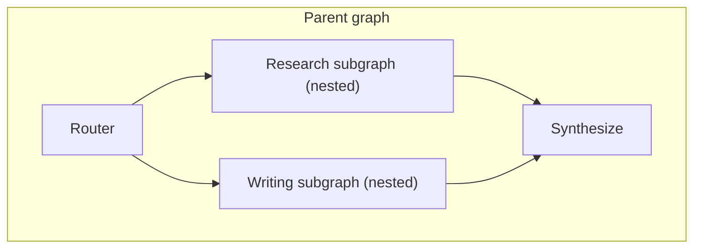

April's multi-agent coordination post covered the conceptual patterns. This post implements them concretely in LangGraph using subgraphs — a graph nested inside another graph's node, which is how LangGraph composes complex multi-agent systems from smaller, independently testable pieces.

## Why Subgraphs, Not One Flat Graph



A single flat graph with dozens of nodes for a complex multi-agent system becomes unreadable and hard to test in isolation. Subgraphs let each agent's internal logic (its own ReAct loop, its own tool nodes) be defined, tested, and reasoned about independently, then composed into a parent graph as a single node.

## Defining a Subgraph

```python
from langgraph.graph import StateGraph

def build_research_subgraph() -> StateGraph:
    subgraph = StateGraph(ResearchState)
    subgraph.add_node("search", search_node)
    subgraph.add_node("synthesize_findings", synthesize_node)
    subgraph.add_conditional_edges("search", should_search_more, {"more": "search", "done": "synthesize_findings"})
    subgraph.set_entry_point("search")
    return subgraph.compile()

research_subgraph = build_research_subgraph()
```

## Composing Into a Parent Graph

```python
parent_graph = StateGraph(ParentState)
parent_graph.add_node("route", route_node)
parent_graph.add_node("research", research_subgraph)  # the compiled subgraph used directly as a node
parent_graph.add_node("write", writing_subgraph)
parent_graph.add_conditional_edges("route", decide_path, {"research": "research", "write": "write"})
parent_graph.add_edge("research", "write")

app = parent_graph.compile()
```

The subgraph is invoked exactly like any other node from the parent's perspective — the parent graph doesn't need to know or care about the research subgraph's internal complexity, only its input and output contract, the same encapsulation principle as any well-designed software module.

## State Schema Translation Between Parent and Subgraph

```python
class ParentState(TypedDict):
    messages: list
    research_findings: list

class ResearchState(TypedDict):
    query: str
    findings: list

def research_node_wrapper(parent_state: ParentState) -> dict:
    research_result = research_subgraph.invoke({"query": extract_query(parent_state), "findings": []})
    return {"research_findings": research_result["findings"]}
```

When the parent and subgraph have different state schemas (common, since a subgraph's internal state often shouldn't leak its full complexity into the parent), an explicit translation layer at the boundary keeps each graph's state schema focused on what it actually needs.

## Testing Subgraphs in Isolation

```python
def test_research_subgraph_finds_relevant_sources():
    result = research_subgraph.invoke({"query": "vector database comparison", "findings": []})
    assert len(result["findings"]) >= 3
    assert all(f["relevance_score"] > 0.7 for f in result["findings"])
```

This is the real payoff — applying June's evaluation discipline to each subgraph independently, the same way you'd unit test a function, rather than only being able to test the full multi-agent system end to end where a failure could originate from any of many nested components.

## Parallel Subgraph Execution

```python
parent_graph.add_node("research_pricing", pricing_subgraph)
parent_graph.add_node("research_features", features_subgraph)
parent_graph.add_edge("start", "research_pricing")
parent_graph.add_edge("start", "research_features")
parent_graph.add_edge("research_pricing", "compare")
parent_graph.add_edge("research_features", "compare")
```

This is April's parallel-orchestration pattern, now with each parallel branch being a full subgraph rather than a single node — LangGraph waits for both subgraphs to complete before proceeding, with each one internally managing its own multi-step logic independently.

## When Subgraph Complexity Is Worth It

For a genuinely simple agent, a flat graph is easier to reason about than the added indirection of subgraphs. Reach for subgraphs specifically once a system has multiple distinct agents each with meaningful internal complexity worth testing and reasoning about independently — the same modularity threshold that justifies breaking up any large codebase into separate modules.

---

*Part of the [Agentic Framework Deep Dives series]({{ site.baseurl }}/tags/deep-dive-series/) — next: [CrewAI deep dive on custom tools and memory backends]({{ site.baseurl }}/posts/crewai-deep-dive-custom-tools-memory/).*
