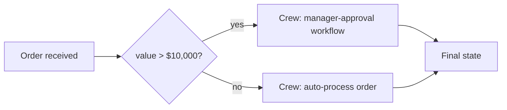

April's CrewAI posts covered `Process.sequential` and `Process.hierarchical` — both still LLM-driven at the coordination level. CrewAI Flows offer a third option: explicit, code-defined control flow around crews, for the parts of a system that shouldn't be left to LLM judgment at all.



The routing decision itself — the `if` check — is plain code, not an LLM call; only the branches it routes to are handed off to a crew. That split is the core idea behind Flows: deterministic control for the parts of the system where a business rule is the right tool, agentic delegation for the parts that genuinely need judgment.

## Why Deterministic Control Sometimes Beats LLM Orchestration

Not every step in a multi-agent system benefits from LLM-driven decision-making — routing logic that depends on a simple, well-defined business rule ("if the order value exceeds $10,000, require manager approval") is more reliable, faster, and cheaper as plain code than as an LLM inference call, even inside an otherwise agentic system.

## Defining a Flow

```python
from crewai.flow.flow import Flow, listen, start, router

class OrderProcessingFlow(Flow):
    @start()
    def receive_order(self):
        return {"order": self.state["order"]}

    @router(receive_order)
    def route_by_value(self, result):
        if result["order"]["value"] > 10000:
            return "high_value"
        return "standard"

    @listen("high_value")
    def run_approval_crew(self):
        return approval_crew.kickoff(inputs={"order": self.state["order"]})

    @listen("standard")
    def run_standard_processing_crew(self):
        return standard_crew.kickoff(inputs={"order": self.state["order"]})
```

The `@router` decorator is plain Python conditional logic — no LLM call involved in the routing decision itself, only in the crews it dispatches to. This is the CrewAI-specific implementation of the same principle from June's cost-optimization posts: reserve model calls for decisions that genuinely need reasoning, use code for decisions that don't.

## Combining Deterministic Steps with Agentic Ones

```python
class ResearchAndReportFlow(Flow):
    @start()
    def validate_input(self):
        if not self.state.get("topic"):
            raise ValueError("Topic is required")  # deterministic validation, no LLM needed
        return self.state["topic"]

    @listen(validate_input)
    def run_research_crew(self, topic):
        return research_crew.kickoff(inputs={"topic": topic})  # agentic step

    @listen(run_research_crew)
    def format_output(self, research_result):
        return format_as_markdown_report(research_result)  # deterministic formatting, no LLM needed
```

A well-designed Flow mixes deterministic and agentic steps deliberately — input validation and output formatting rarely benefit from LLM involvement, while the actual research and synthesis genuinely do; Flows make that distinction explicit in the code structure rather than burying everything inside agent prompts.

## State Management Across Flow Steps

```python
class DataPipelineFlow(Flow):
    @start()
    def extract(self):
        self.state["raw_data"] = fetch_data()

    @listen(extract)
    def transform(self):
        self.state["cleaned_data"] = clean_and_validate(self.state["raw_data"])

    @listen(transform)
    def load_via_crew(self):
        return processing_crew.kickoff(inputs={"data": self.state["cleaned_data"]})
```

`self.state` persists across every step in the flow — a lighter-weight state mechanism than LangGraph's full checkpointing system, well-suited to flows that don't need LangGraph's durable-interruption capabilities but still need to pass accumulating context between deterministic and agentic steps.

## Flows vs LangGraph: When to Choose Which

For teams already invested in CrewAI's role-based crew model, Flows provide a lighter-weight way to add deterministic control without adopting an entirely different framework — a reasonable middle ground. For genuinely complex control flow needing durable interruption, human-in-the-loop checkpointing, or fine-grained conditional branching, LangGraph's fuller graph model (this month's earlier posts) remains the more capable, if more complex, option.

## Testing Flows

```python
def test_high_value_order_routes_to_approval():
    flow = OrderProcessingFlow()
    flow.state["order"] = {"value": 15000}
    result = flow.kickoff()
    assert flow.route_by_value(flow.state) == "high_value"
```

Because routing logic is plain Python, it's directly unit-testable without any LLM call involved — a meaningful reliability advantage over routing decisions embedded in prompt instructions, echoing this month's testing-in-isolation principle applied specifically to the parts of a system that don't need to be agentic at all.

---

*Part of the [Agentic Framework Deep Dives series]({{ site.baseurl }}/tags/deep-dive-series/) — next: [AutoGen deep dive on custom agents and termination conditions]({{ site.baseurl }}/posts/autogen-deep-dive-custom-agents-termination/).*
