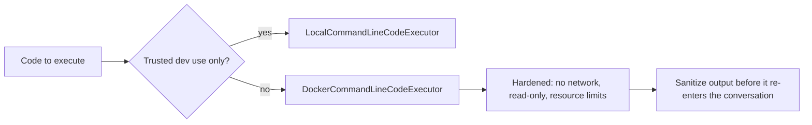

April's coding-agent post and September's sandboxing security post covered the general principles. This post covers AutoGen's specific code execution configuration options and how to harden them to the standard those earlier posts established.



The executor choice is the first decision, but hardening and output sanitization matter just as much — a Docker executor with default settings is a reasonable start, not a finished security posture, per September's sandbox checklist.

## AutoGen's Executor Options

```python
from autogen.coding import DockerCommandLineCodeExecutor, LocalCommandLineCodeExecutor

# Local — fast, no isolation, only for fully trusted development use
local_executor = LocalCommandLineCodeExecutor(timeout=10, work_dir="./scratch")

# Docker — isolated, the production-appropriate default
docker_executor = DockerCommandLineCodeExecutor(
    image="python:3.12-slim",
    timeout=30,
    work_dir="./scratch",
)
```

`LocalCommandLineCodeExecutor` runs code directly on the host — appropriate only for local development with fully trusted input, never for anything processing user-influenced content, exactly the distinction September's sandboxing post drew between adversarial and purely-accidental threat models.

## Hardening the Docker Executor

```python
from autogen.coding import DockerCommandLineCodeExecutor
import docker

executor = DockerCommandLineCodeExecutor(
    image="python:3.12-slim",
    timeout=30,
    container_kwargs={
        "network_mode": "none",
        "mem_limit": "256m",
        "pids_limit": 50,
        "read_only": True,
        "cap_drop": ["ALL"],
        "security_opt": ["no-new-privileges"],
    },
)
```

Every one of these `container_kwargs` maps directly to September's sandbox-hardening checklist — AutoGen's default Docker executor configuration is a reasonable starting point but doesn't apply this hardening by default, so it's worth setting explicitly rather than trusting defaults for anything beyond initial prototyping.

## Wiring the Executor Into an Agent

```python
from autogen import ConversableAgent

code_executor_agent = ConversableAgent(
    name="code_executor",
    llm_config=False,  # this agent only executes, doesn't call an LLM itself
    code_execution_config={"executor": executor},
    human_input_mode="NEVER",
)
```

Setting `llm_config=False` on the execution agent is a deliberate security boundary — this agent's only job is running code in the sandbox and reporting results, with no LLM reasoning capability of its own that could itself be manipulated; the reasoning happens in a separate agent, keeping execution and reasoning cleanly separated.

## Capturing and Sanitizing Execution Output

```python
def sanitize_execution_result(raw_output: str) -> str:
    if scan_for_injection_attempts(raw_output)["suspicious"]:  # September's indirect injection scan
        log_security_event("suspicious_code_execution_output", raw_output)
        return "[Output flagged for review]"
    return raw_output[:MAX_OUTPUT_LENGTH]
```

Code execution output is itself untrusted content once it flows back into the conversation — apply the same indirect-injection scanning from September's post to execution results, since a sufficiently crafted script could produce output designed to manipulate the next agent turn.

## Resource Cleanup and Container Lifecycle

```python
async def managed_execution_session():
    executor = DockerCommandLineCodeExecutor(image="python:3.12-slim", timeout=30, auto_remove=True)
    try:
        yield executor
    finally:
        await executor.stop()  # explicit cleanup, don't rely solely on auto_remove
```

Explicit lifecycle management — ensuring containers are stopped and removed even if an exception occurs mid-execution — prevents resource leaks that would otherwise accumulate orphaned containers over a long-running service's uptime, a real operational concern connecting to August's capacity planning.

## Monitoring Code Execution Usage

Extend June's observability dashboards with code-execution-specific metrics — execution frequency, average duration, timeout rate, and the security-event rate from the sanitization check above — giving visibility into a capability that's both genuinely powerful and, per September's threat model, genuinely higher-risk than most other agent tools.

## The Production Checklist for This Specific Capability

Before shipping any AutoGen deployment with code execution enabled: Docker executor (never local), full hardening applied, output sanitization wired in, resource limits enforced, and this specific tool included explicitly in the red-team test suite from September's post — code execution is exactly the kind of high-risk tool combination that checklist was designed to catch.

---

*Part of the [Agentic Framework Deep Dives series]({{ site.baseurl }}/tags/deep-dive-series/) — next: [DSPy deep dive on multi-stage pipelines]({{ site.baseurl }}/posts/dspy-deep-dive-multi-stage-pipeline/).*
