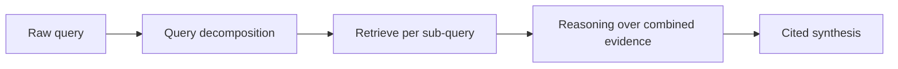

April's DSPy posts covered single-signature modules. Real applications chain several DSPy modules together into a multi-stage pipeline — this post builds one end to end, showing how DSPy's composability scales to genuinely complex workflows.

## The Pipeline: Query Understanding → Retrieval → Multi-Hop Reasoning → Synthesis



## Defining Each Stage as a Signature

```python
import dspy

class DecomposeQuery(dspy.Signature):
    """Break a complex question into simpler sub-questions if needed."""
    question: str = dspy.InputField()
    sub_questions: list[str] = dspy.OutputField(desc="1-3 simpler sub-questions, or just the original if simple enough")

class ReasonOverEvidence(dspy.Signature):
    """Reason step by step over retrieved evidence to answer a sub-question."""
    sub_question: str = dspy.InputField()
    evidence: str = dspy.InputField()
    reasoning: str = dspy.OutputField()
    answer: str = dspy.OutputField()

class SynthesizeFinal(dspy.Signature):
    """Combine sub-answers into one coherent, cited final answer."""
    original_question: str = dspy.InputField()
    sub_answers: list[str] = dspy.InputField()
    final_answer: str = dspy.OutputField(desc="cited, coherent answer to the original question")
```

## Composing the Full Module

```python
class MultiHopQA(dspy.Module):
    def __init__(self):
        super().__init__()
        self.decompose = dspy.ChainOfThought(DecomposeQuery)
        self.retrieve = dspy.Retrieve(k=5)
        self.reason = dspy.ChainOfThought(ReasonOverEvidence)
        self.synthesize = dspy.ChainOfThought(SynthesizeFinal)

    def forward(self, question: str):
        sub_questions = self.decompose(question=question).sub_questions
        sub_answers = []
        for sq in sub_questions:
            evidence = "\n".join(self.retrieve(sq).passages)
            result = self.reason(sub_question=sq, evidence=evidence)
            sub_answers.append(result.answer)
        return self.synthesize(original_question=question, sub_answers=sub_answers)
```

This is functionally the same multi-hop retrieval pattern from April's retrieval-augmented-agents post, expressed as a fully typed DSPy pipeline — every intermediate output has a defined schema, and the whole thing is a plain Python `forward` method, not an opaque prompt chain.

## Optimizing the Whole Pipeline Jointly

```python
from dspy.teleprompt import MIPROv2

def pipeline_accuracy_metric(example, prediction, trace=None) -> float:
    return factual_consistency_score(prediction.final_answer, example.reference_answer)

optimizer = MIPROv2(metric=pipeline_accuracy_metric, auto="medium")
optimized_pipeline = optimizer.compile(MultiHopQA(), trainset=labeled_examples, valset=held_out_examples)
```

The key advantage over hand-tuning each stage's prompt independently: DSPy's optimizer can jointly tune every stage's prompt against the *end-to-end* metric, catching cases where an individually "good" decomposition prompt actually produces sub-questions that are harder for the reasoning stage to work with — an interaction effect manual per-stage tuning would likely miss.

## Debugging a Multi-Stage Pipeline

```python
dspy.inspect_history(n=4)  # shows the compiled prompts for the last 4 module calls across the pipeline

def trace_pipeline_execution(question: str, pipeline: MultiHopQA) -> dict:
    with dspy.context(trace=[]):
        result = pipeline(question=question)
        return {"trace": dspy.settings.trace, "final": result}
```

This connects to June's trace-structuring discipline — even though DSPy manages the prompts, you still need visibility into what each stage actually produced to diagnose a pipeline failure, and `inspect_history` combined with explicit trace capture gives that visibility without manually instrumenting each stage.

## Evaluating a Multi-Stage Pipeline

Apply June's full evaluation toolkit at two levels: end-to-end (does the final answer satisfy the golden set's criteria) and per-stage (is the decomposition producing sensible sub-questions, is retrieval finding relevant evidence per sub-question) — a pipeline that scores well end-to-end but has a weak intermediate stage is fragile in ways only per-stage evaluation reveals.

## When Multi-Stage DSPy Is Worth the Complexity

This level of structure pays off for genuinely complex reasoning tasks where a single-shot prompt underperforms — for simpler tasks, a single well-optimized DSPy signature (April's posts) or even a hand-written prompt remains simpler and sufficient; reserve multi-stage pipelines for tasks that demonstrably benefit from decomposition.

---

*Part of the [Agentic Framework Deep Dives series]({{ site.baseurl }}/tags/deep-dive-series/) — next: [DSPy custom metrics and teleprompters]({{ site.baseurl }}/posts/dspy-custom-metrics-teleprompters/) in depth.*
