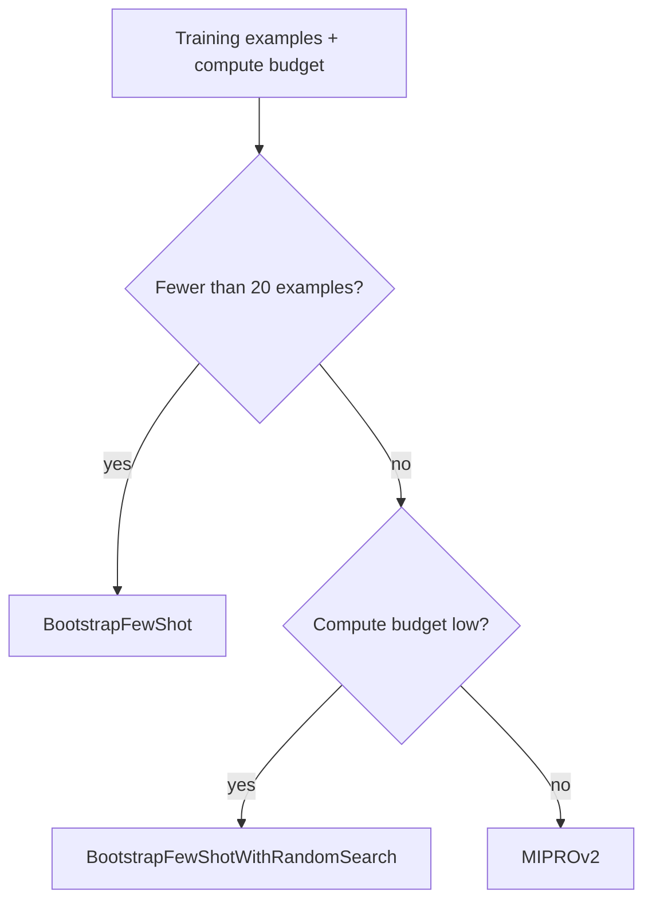

April's DSPy optimizer post used a simple binary metric. Real optimization needs richer, well-designed metrics and an understanding of which teleprompter (DSPy's term for its optimizer algorithms) fits your specific situation — this post covers both.



Which teleprompter is worth using depends on data volume and compute budget, not just which one produces the best results in the abstract — `MIPROv2` is strongest but most expensive, so the lighter bootstrap-based options are often the right call for a fast iteration cycle.

## Beyond Binary Metrics: Weighted Multi-Criteria Scoring

```python
def rich_quality_metric(example, prediction, trace=None) -> float:
    faithfulness = measure_faithfulness(prediction.answer, example.context)
    conciseness = 1.0 if word_count(prediction.answer) < 150 else 0.5
    cites_sources = 1.0 if has_citations(prediction.answer) else 0.0
    return 0.6 * faithfulness + 0.2 * conciseness + 0.2 * cites_sources
```

This directly reuses June's multi-dimensional evaluation approach as the actual optimization objective — DSPy will optimize prompts and few-shot examples specifically toward whatever this function rewards, so the weighting here is a genuine design decision with real downstream effect on what the optimized pipeline prioritizes.

## Metrics That Use the Trace for Intermediate Feedback

```python
def metric_with_intermediate_feedback(example, prediction, trace=None) -> float:
    if trace is not None:
        # trace lets you inspect and score intermediate module calls, not just final output
        decompose_call = trace[0]
        if len(decompose_call[1]["sub_questions"]) > 5:
            return 0.0  # penalize over-decomposition even if the final answer happens to be fine
    return factual_consistency_score(prediction.final_answer, example.reference_answer)
```

The `trace` parameter gives access to every intermediate module call within a multi-stage pipeline (yesterday's post) — letting a metric penalize a specific intermediate failure (excessive decomposition, poor sub-question quality) even when the final output happens to compensate for it, producing an optimizer that improves the whole pipeline's quality, not just its final-output score.

## Comparing DSPy's Teleprompters

```python
teleprompter_comparison = {
    "BootstrapFewShot": "fast, selects good few-shot examples from training data, no instruction optimization",
    "BootstrapFewShotWithRandomSearch": "adds random search over demo combinations — better results, more compute",
    "MIPROv2": "optimizes instructions AND demonstrations jointly via Bayesian search — strongest results, most expensive",
    "COPRO": "focuses specifically on instruction refinement through iterative proposal and evaluation",
}
```

## Choosing a Teleprompter Based on Budget and Data

```python
def choose_teleprompter(training_examples: int, compute_budget: str) -> str:
    if training_examples < 20:
        return "BootstrapFewShot"  # not enough data to justify expensive search
    if compute_budget == "low":
        return "BootstrapFewShotWithRandomSearch"
    return "MIPROv2"  # best results, worth it with sufficient data and budget
```

`MIPROv2` typically produces the strongest results but costs the most in optimization-time compute (many candidate evaluations); for a quick iteration cycle or a smaller training set, the lighter bootstrap-based optimizers converge faster and are often sufficient.

## Custom Teleprompters for Specialized Needs

```python
from dspy.teleprompt import Teleprompter

class CostAwareOptimizer(Teleprompter):
    def compile(self, program, trainset, **kwargs):
        candidates = self.generate_candidates(program, trainset)
        scored = [(c, self.metric(c, trainset), self.estimate_cost(c)) for c in candidates]
        # optimize for quality per dollar, not quality alone
        best = max(scored, key=lambda x: x[1] / x[2])
        return best[0]
```

For organizations where inference cost (June and August's cost-optimization posts) is as important as raw quality, a custom teleprompter optimizing for quality-per-dollar rather than quality alone directly encodes that business priority into the automated search, rather than requiring a manual tradeoff decision after the fact.

## Avoiding Overfitting During Optimization

```python
def validate_optimization_generalizes(optimized_program, valset, held_out_test_set) -> bool:
    val_score = evaluate(optimized_program, valset)
    test_score = evaluate(optimized_program, held_out_test_set)
    return abs(val_score - test_score) < GENERALIZATION_TOLERANCE
```

This restates April's held-out validation caution with specific emphasis: always confirm an optimized pipeline's performance on a genuinely separate test set, not just the validation set the optimizer's search process may have implicitly overfit to through repeated evaluation during the search itself.

## Tracking Optimization Runs

Apply May's experiment-tracking discipline (Weights & Biases) directly to DSPy optimization runs — logging which teleprompter, which metric, and the resulting score across successive optimization attempts, since a DSPy compile run is fundamentally a training experiment deserving the same tracking rigor as a fine-tuning run.

---

*Part of the [Agentic Framework Deep Dives series]({{ site.baseurl }}/tags/deep-dive-series/) — next: [Semantic Kernel deep dive on planners and plugins]({{ site.baseurl }}/posts/semantic-kernel-deep-dive-planners-plugins/).*
