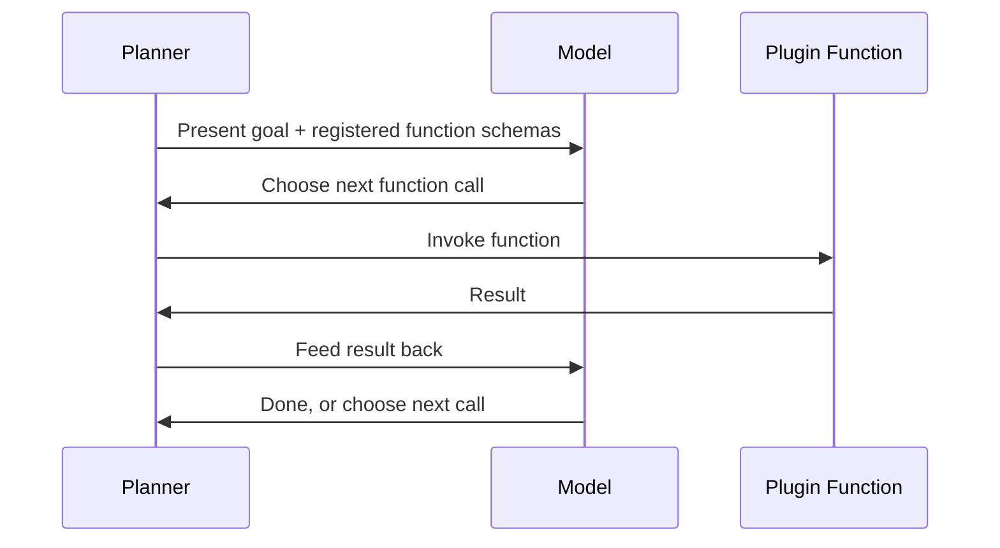

April's Semantic Kernel post introduced kernels, plugins, and planners at a high level. This post goes deeper into building genuinely production-grade plugins and understanding what the planner is actually doing when it composes them.



This loop is what "the planner composes functions" actually means under the hood — structurally identical to the ReAct loop from March, just expressed through Semantic Kernel's plugin abstraction instead of raw tool calls.

## Building a Full-Featured Plugin

```python
from semantic_kernel.functions import kernel_function
from typing import Annotated

class OrderManagementPlugin:
    def __init__(self, order_service):
        self.order_service = order_service

    @kernel_function(description="Get the current status of an order")
    def get_order_status(
        self, order_id: Annotated[str, "The order ID, format ORD-XXXXX"]
    ) -> Annotated[str, "The order's current status"]:
        return self.order_service.get_status(order_id)

    @kernel_function(description="Cancel an order if it hasn't shipped yet")
    def cancel_order(
        self, order_id: Annotated[str, "The order ID"],
        reason: Annotated[str, "Cancellation reason"],
    ) -> Annotated[str, "Confirmation or error message"]:
        if self.order_service.has_shipped(order_id):
            return "Cannot cancel: order has already shipped"
        return self.order_service.cancel(order_id, reason)
```

The `Annotated` type hints aren't just documentation — Semantic Kernel extracts them directly into the function schema the planner and the underlying model see, exactly the tool-schema-as-prompt principle from April's tool-design post, expressed through Python's type system instead of a docstring.

## How the Planner Actually Composes Functions

```python
from semantic_kernel.planners import FunctionCallingStepwisePlanner

planner = FunctionCallingStepwisePlanner(service_id="chat")
result = await planner.invoke(kernel, "Cancel order ORD-12345 because the customer changed their mind")
```

Internally, the stepwise planner works much like the ReAct loop from March — at each step, it presents the model with all registered plugin functions' schemas, lets the model choose the next function call (or decide it's done), executes it, and feeds the result back. Understanding this is what makes planner behavior debuggable rather than feeling like a black box.

## Plugin Composition and Dependency Injection

```python
def build_kernel_for_session(user: dict) -> Kernel:
    kernel = Kernel()
    order_service = OrderService(user_context=user)  # scoped to the requesting user
    kernel.add_plugin(OrderManagementPlugin(order_service), plugin_name="orders")
    if user["role"] == "support_agent":
        kernel.add_plugin(AdminOrderPlugin(order_service), plugin_name="admin_orders")
    return kernel
```

This directly implements September's least-privilege access-scoping pattern — building a fresh kernel per session with plugins scoped to the requesting user's actual permissions, rather than one global kernel with every plugin always available regardless of who's asking.

## MCP Integration: Plugins from External Servers

```python
from semantic_kernel.connectors.mcp import MCPStdioPlugin

mcp_plugin = await kernel.add_plugin_from_mcp_server(
    plugin_name="github_tools",
    command="npx", args=["-y", "@modelcontextprotocol/server-github"],
)
```

This is Semantic Kernel treating an MCP server's tools as just another plugin source — directly connecting April's MCP series to this framework, and meaning the supply-chain vetting discipline from September's post applies equally here: an MCP server imported this way gets full plugin-level access within the kernel.

## Custom Planners for Specialized Control

```python
from semantic_kernel.planners import Planner

class ConstrainedPlanner(Planner):
    async def create_plan(self, goal: str, kernel: Kernel) -> Plan:
        if violates_policy(goal):
            raise PlanningError("Goal violates usage policy")
        plan = await super().create_plan(goal, kernel)
        if len(plan.steps) > MAX_ALLOWED_STEPS:
            raise PlanningError("Plan exceeds allowed complexity")
        return plan
```

Subclassing the planner to add policy checks before plan execution begins is the Semantic Kernel equivalent of March's guardrail-as-a-check-before-action pattern, applied at the planning stage rather than the individual tool-call stage.

## Testing Plugins Independently of the Planner

```python
def test_cancel_order_plugin_rejects_shipped_orders():
    plugin = OrderManagementPlugin(mock_order_service_with_shipped_order())
    result = plugin.cancel_order(order_id="ORD-99999", reason="test")
    assert "cannot cancel" in result.lower()
```

Every plugin function is a plain, testable Python function once you look past the decorator — the same testing-tools-in-isolation principle from April, directly applicable here without needing to invoke the planner or an actual model at all.

---

*Part of the [Agentic Framework Deep Dives series]({{ site.baseurl }}/tags/deep-dive-series/) — next: [Haystack deep dive on production pipelines]({{ site.baseurl }}/posts/haystack-deep-dive-production-pipelines/), a framework not yet covered in this roadmap.*
