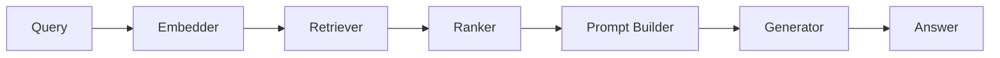

Haystack hasn't appeared elsewhere in this roadmap — it's a framework built specifically around composable, production-oriented pipelines, with deep roots in search and retrieval that predate the current wave of LLM frameworks, worth understanding as a distinct option from the agent-first frameworks covered so far.

## The Pipeline-as-DAG Model



Haystack pipelines are explicit directed acyclic graphs of components — closer in spirit to LangGraph's explicit graph model than to CrewAI's role-based abstraction, but purpose-built around the retrieval-and-generation shape rather than general agent orchestration.

## Building a RAG Pipeline

```python
from haystack import Pipeline
from haystack.components.embedders import SentenceTransformersTextEmbedder
from haystack.components.retrievers import InMemoryEmbeddingRetriever
from haystack.components.builders import PromptBuilder
from haystack.components.generators import OpenAIGenerator

pipeline = Pipeline()
pipeline.add_component("embedder", SentenceTransformersTextEmbedder())
pipeline.add_component("retriever", InMemoryEmbeddingRetriever(document_store=doc_store))
pipeline.add_component("prompt_builder", PromptBuilder(template=rag_prompt_template))
pipeline.add_component("generator", OpenAIGenerator(model="gpt-4.1"))

pipeline.connect("embedder.embedding", "retriever.query_embedding")
pipeline.connect("retriever.documents", "prompt_builder.documents")
pipeline.connect("prompt_builder.prompt", "generator.prompt")

result = pipeline.run({"embedder": {"text": "What's the refund policy?"}})
```

Each `.connect()` call wires one component's named output to another's named input — this explicit wiring makes the data flow through a RAG pipeline fully visible and inspectable at every stage, directly supporting the per-stage evaluation discipline from June's RAG evaluation posts.

## Custom Components

```python
from haystack import component

@component
class RerankerComponent:
    @component.output_types(documents=list)
    def run(self, documents: list, query: str):
        reranked = cross_encoder_rerank(query, documents)
        return {"documents": reranked}

pipeline.add_component("reranker", RerankerComponent())
pipeline.connect("retriever.documents", "reranker.documents")
pipeline.connect("reranker.documents", "prompt_builder.documents")
```

Custom components implement a simple `run` method with typed outputs — inserting a reranking step (the same hybrid-search-plus-rerank pattern from earlier this year) into an existing pipeline is a matter of adding a node and rewiring connections, not restructuring the whole pipeline.

## Branching and Conditional Pipelines


```python
from haystack.components.routers import ConditionalRouter

router = ConditionalRouter(routes=[
    {"condition": "{{query_type}} == 'factual'", "output": "{{query}}", "output_name": "to_rag", "output_type": str},
    {"condition": "{{query_type}} == 'conversational'", "output": "{{query}}", "output_name": "to_chat", "output_type": str},
])
pipeline.add_component("router", router)
```


Conditional routing within a Haystack pipeline mirrors LangGraph's conditional edges — different query types can flow through entirely different sub-pipelines, useful for the same complexity-based routing pattern from August's model-routing post, expressed within Haystack's pipeline abstraction.

## Evaluating Haystack Pipelines

```python
from haystack.evaluation import EvaluationRunResult

eval_pipeline = build_eval_pipeline(faithfulness_evaluator, context_relevance_evaluator)
results = eval_pipeline.run({"questions": golden_set_questions, "contexts": retrieved_contexts, "answers": generated_answers})
```

Haystack ships built-in evaluators covering the same faithfulness and relevancy metrics from March's RAGAS-based evaluation — worth using directly rather than reimplementing, when Haystack is already your pipeline framework.

## When Haystack Is the Right Choice

Haystack's strength is retrieval-and-generation pipelines with a need for precise, inspectable data flow and strong production deployment tooling (it includes deployment-oriented tooling like a REST API wrapper and pipeline serialization) — a strong fit for search-centric products. For general-purpose agentic behavior beyond retrieval-augmented generation, the agent-first frameworks from earlier in this roadmap (LangGraph, CrewAI) are typically a better fit.

---

*Part of the [Agentic Framework Deep Dives series]({{ site.baseurl }}/tags/deep-dive-series/) — next: [Temporal for AI]({{ site.baseurl }}/posts/temporal-durable-execution-agents/), durable execution for agents that run far longer than a typical request.*
