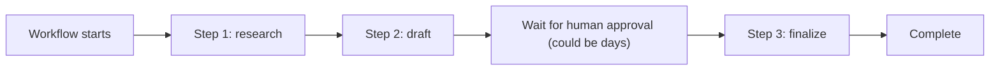

LangGraph's checkpointing (this month's opening posts) handles durability for graph-shaped agent workflows. Temporal takes a different, more general approach to the same underlying problem — durable execution for workflows that might run for hours, days, or weeks, surviving any number of process restarts along the way.

## The Core Idea: Workflows as Ordinary Code That Survives Crashes

```python
from temporalio import workflow, activity

@activity.defn
async def call_llm_activity(prompt: str) -> str:
    return await llm.generate(prompt)

@activity.defn
async def send_approval_request(action: dict) -> None:
    await notify_approver(action)

@workflow.defn
class LongRunningResearchWorkflow:
    @workflow.run
    async def run(self, topic: str) -> str:
        plan = await workflow.execute_activity(call_llm_activity, f"Plan research on {topic}", start_to_close_timeout=timedelta(minutes=2))
        findings = []
        for step in parse_plan(plan):
            result = await workflow.execute_activity(call_llm_activity, step, start_to_close_timeout=timedelta(minutes=5))
            findings.append(result)
        await workflow.execute_activity(send_approval_request, {"findings": findings}, start_to_close_timeout=timedelta(days=7))
        return await workflow.wait_condition(lambda: workflow.info().is_approved) 
```

Unlike LangGraph's checkpoint-and-resume model where you explicitly manage state serialization, Temporal's workflow code looks like ordinary sequential Python — the framework handles durability transparently, replaying the workflow's history from an event log to reconstruct exact state after any crash or restart, without you writing explicit checkpoint logic.

## Why This Matters for Genuinely Long-Running Agents



The `send_approval_request` step above can wait for days without holding any actual compute resource — Temporal's workflow engine persists the "waiting" state durably and resumes exactly where it left off when the approval signal arrives, at any point in the future, on any available worker process. This is a fundamentally different durability model than a checkpointed graph waiting in a database row for a resume call.

## Activities vs Workflow Code

```python
# Activities: where actual side effects happen — can fail and be retried independently
@activity.defn(retry_policy=RetryPolicy(maximum_attempts=3, backoff_coefficient=2.0))
async def call_tool_activity(tool_name: str, arguments: dict) -> dict:
    return await execute_tool(tool_name, arguments)
```

Temporal's separation of workflow code (must be deterministic, replayable) from activities (where actual LLM calls, tool calls, and other side effects happen, with independent retry policies) maps cleanly onto agent architecture — the workflow is the orchestration logic, activities are the individual LLM/tool calls, each retryable independently per this month's idempotency discussion.

## Signals for External Events Mid-Workflow

```python
@workflow.defn
class ApprovalWorkflow:
    def __init__(self):
        self.is_approved = False

    @workflow.signal
    def approve(self):
        self.is_approved = True

    @workflow.run
    async def run(self, request: dict):
        await workflow.wait_condition(lambda: self.is_approved)
        return await workflow.execute_activity(finalize_action, request)
```

Signals let external systems (a human clicking "approve" in a UI, days after the workflow started) inject events into an already-running, possibly-suspended workflow — directly implementing April's human-in-the-loop pattern with genuine durability across arbitrary time spans, not just a single process's uptime.

## When Temporal Is Worth the Operational Complexity

Temporal requires running its own server infrastructure (or using their managed cloud offering) — real operational overhead beyond LangGraph's simpler checkpointer. It earns that cost specifically for workflows spanning genuinely long durations (multi-day approval waits, scheduled recurring agent tasks, workflows coordinating across many independent services) where LangGraph's checkpoint-and-resume model, while capable, requires more manual state management to achieve the same durability guarantees.

## Combining Temporal with an Agent Framework

```python
@activity.defn
async def run_langgraph_subgraph_activity(state: dict) -> dict:
    return await research_subgraph.ainvoke(state)  # October 2's subgraph, wrapped as a Temporal activity
```

These aren't mutually exclusive — a Temporal workflow orchestrating the long-running, multi-day structure of a business process, with individual steps delegating to a LangGraph or CrewAI agent for their actual reasoning, combines Temporal's durability strengths with the agent frameworks' reasoning strengths.

---

*Part of the [Agentic Framework Deep Dives series]({{ site.baseurl }}/tags/deep-dive-series/) — next: [event-driven agent architectures]({{ site.baseurl }}/posts/event-driven-agent-architectures-message-queues/), another approach to decoupling agent components.*
