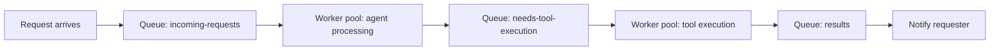

Every agent architecture so far assumes a fairly direct call structure — request comes in, agent processes, response goes out. Event-driven architecture decouples this entirely, using message queues to connect agent components that don't call each other directly, trading simplicity for resilience and independent scalability.

## Why Decouple Agent Components with a Queue



Each stage scales independently — if tool execution is the bottleneck, add more tool-execution workers without touching the agent-reasoning worker pool, directly extending August's autoscaling discussion to a finer-grained, per-stage level than scaling a single monolithic service.

## Implementing an Event-Driven Agent Step

```python
async def agent_reasoning_worker():
    async for message in incoming_requests_queue.consume():
        request = json.loads(message.body)
        response = await llm.chat(request["messages"], tools=available_tools)
        if response.tool_calls:
            for call in response.tool_calls:
                await tool_execution_queue.publish({"request_id": request["id"], "tool_call": call})
        else:
            await results_queue.publish({"request_id": request["id"], "final_answer": response.content})
        await message.ack()  # only acknowledge after successfully publishing downstream

async def tool_execution_worker():
    async for message in tool_execution_queue.consume():
        payload = json.loads(message.body)
        result = await execute_tool(payload["tool_call"])
        await incoming_requests_queue.publish({"request_id": payload["request_id"], "tool_result": result})
        await message.ack()
```

The explicit `ack()` only after successful downstream publishing is what makes this resilient — a worker that crashes mid-processing leaves the message unacknowledged, and the queue redelivers it to another worker, directly implementing the idempotent-retry-safe processing principle from earlier this year.

## State Reconstruction Across Async Steps

```python
async def reconstruct_conversation_state(request_id: str) -> list[dict]:
    events = await event_store.get_events(request_id)  # every published/consumed message for this request
    return build_message_history_from_events(events)
```

Because processing is now spread across independent, asynchronous steps rather than one continuous function call, you need an explicit event store to reconstruct a request's full state at any point — conceptually similar to Temporal's event-log-based replay from yesterday's post, but built manually on top of a message queue rather than provided by a dedicated durable-execution framework.

## Dead Letter Queues for Failed Processing

```python
async def handle_processing_failure(message, error: Exception, retry_count: int):
    if retry_count >= MAX_RETRIES:
        await dead_letter_queue.publish({"original_message": message.body, "error": str(error), "retry_count": retry_count})
        await message.ack()  # stop retrying, it's now in the dead letter queue for manual investigation
    else:
        await message.nack(requeue=True)
```

A dead letter queue is where messages go after exhausting retries — directly connecting to June's incident-response discipline, since a growing dead letter queue is a first-class monitoring signal (feeding the same dashboards from June) indicating a systemic processing failure worth investigating, not silently dropped work.

## When Event-Driven Architecture Is Worth It

This adds real complexity — debugging a request now means tracing across multiple queues and workers rather than following one call stack, and the "async, decoupled" model is harder to reason about than direct invocation. It earns that complexity specifically for high-volume systems needing independent scaling per processing stage, or systems where different stages have very different reliability/retry characteristics (a flaky external tool call versus a reliable internal LLM call) that benefit from independent retry and backoff policies.

## Monitoring an Event-Driven Agent System

```python
def queue_health_metrics() -> dict:
    return {
        "incoming_requests_depth": incoming_requests_queue.depth(),
        "tool_execution_depth": tool_execution_queue.depth(),
        "dead_letter_depth": dead_letter_queue.depth(),
        "end_to_end_latency_p95": measure_request_to_result_latency_p95(),
    }
```

Queue depth per stage is the event-driven equivalent of June's per-stage latency breakdown — a growing queue at one specific stage points precisely at which worker pool needs more capacity, the same diagnostic value as a per-span latency trace, expressed at the infrastructure level instead.

---

*Part of the [Agentic Framework Deep Dives series]({{ site.baseurl }}/tags/deep-dive-series/) — next: [building a workflow engine for agentic tasks]({{ site.baseurl }}/posts/building-workflow-engine-agentic-tasks/) from these primitives.*
