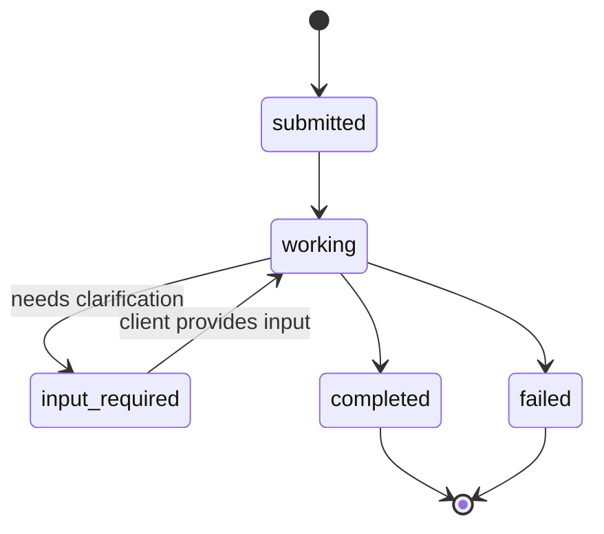
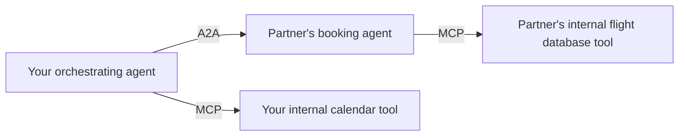

April's A2A post introduced the concept and agent cards. This post goes deeper into the protocol's actual message flow, task lifecycle, and how it interoperates with MCP in a real multi-agent system spanning organizational boundaries.

## The Full Task Lifecycle



Every A2A task moves through this explicit state machine — critically including `input_required`, a state that lets a remote agent pause and ask its client a clarifying question mid-task, rather than either guessing or failing outright when it lacks information.

## Implementing an A2A Server

```python
from a2a.server import A2AServer, Task, TaskState

class TravelBookingAgent(A2AServer):
    async def handle_task(self, task: Task) -> TaskState:
        request = parse_task_input(task.input)
        if not request.get("dates"):
            return TaskState.input_required(prompt="What are your travel dates?")

        results = await search_flights(request)
        if not results:
            return TaskState.failed(reason="No flights found matching criteria")

        return TaskState.completed(output={"flights": results, "booking_ref": None})
```

## Implementing an A2A Client

```python
async def delegate_to_travel_agent(agent_card: dict, request: dict) -> dict:
    client = A2AClient(agent_card["endpoint"])
    task = await client.submit_task(input=request)

    while task.state in (TaskState.SUBMITTED, TaskState.WORKING):
        await asyncio.sleep(2)
        task = await client.get_task(task.id)

    if task.state == TaskState.INPUT_REQUIRED:
        clarification = await get_clarification_from_user(task.prompt)
        task = await client.provide_input(task.id, clarification)

    return task.output
```

Polling `get_task` (or subscribing via streaming updates, where supported) is how a client agent tracks a long-running remote task's progress — directly analogous to the async approval queue pattern from April's human-in-the-loop post, now applied across an agent-to-agent boundary instead of an agent-to-human one.

## A2A and MCP Working Together



This is the layered relationship April's introduction described, now concrete: your agent uses MCP to access your own internal tools, and A2A to delegate to a partner's entire agent (which itself uses MCP for its own internal tools) — two different protocols solving two different problems, composed together in one system.

## Security Considerations for Cross-Organizational A2A

Directly extending September's security series across an organizational trust boundary: authenticate every A2A request (mutual TLS or signed tokens are common), validate task inputs before processing them (the same input validation discipline from March's guardrails, now defending against a genuinely external, less-trusted caller), and apply the least-privilege principle to what data a task response actually includes — never send more than the requesting agent needs.

```python
async def handle_task_with_security(self, task: Task) -> TaskState:
    if not verify_caller_authorization(task.metadata["caller_id"]):
        return TaskState.failed(reason="Unauthorized")
    sanitized_input = validate_and_sanitize(task.input)
    return await self.process_task(sanitized_input)
```

## Discovery: Finding Agents to Delegate To

```python
def discover_agents_for_capability(capability: str, registry_url: str) -> list[dict]:
    registry = fetch_agent_registry(registry_url)
    return [card for card in registry if capability in card["capabilities"]]
```

For ecosystems with many available agents, a registry of published agent cards (conceptually similar to a service registry in microservices architecture) lets an orchestrating agent discover capable partners dynamically rather than hardcoding known endpoints — this connects directly to October's later post on building an agent marketplace or plugin registry.

## Testing Cross-Agent Interactions

```python
async def test_a2a_handles_input_required_gracefully():
    mock_server = MockA2AServer(scripted_responses=[TaskState.input_required("dates?"), TaskState.completed({"flights": []})])
    result = await delegate_to_travel_agent(mock_server.agent_card, incomplete_request)
    assert result is not None
```

Mocking the remote agent's responses (rather than depending on a live partner service for every test run) applies the same testing-in-isolation discipline as every other framework this month, particularly important given A2A interactions cross a boundary you don't fully control.

---

*Part of the [Agentic Framework Deep Dives series]({{ site.baseurl }}/tags/deep-dive-series/) — next: [MCP advanced patterns]({{ site.baseurl }}/posts/mcp-advanced-patterns-resources-prompts/), resources and prompts beyond basic tool calls.*
