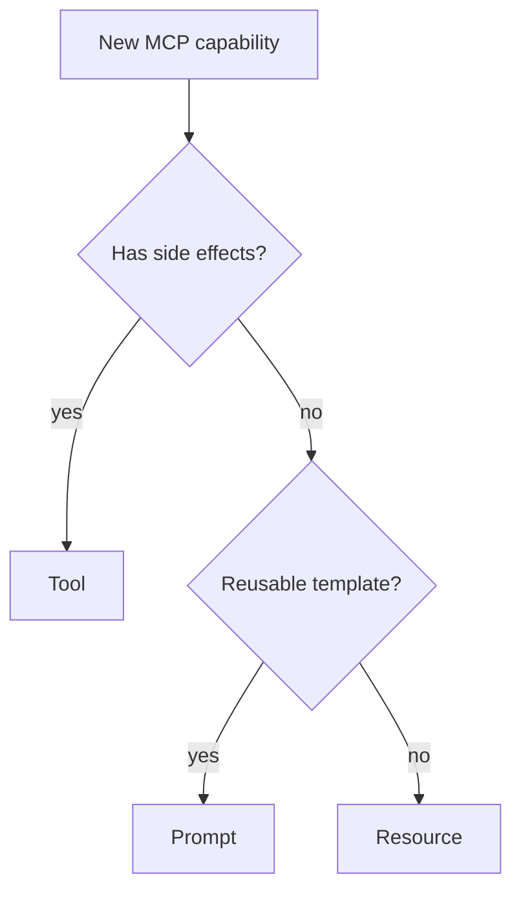

March's MCP series focused almost entirely on tools. MCP defines two other primitives — resources and prompts — that are underused relative to how useful they are, worth their own dedicated treatment.



Picking the right primitive for a given capability — rather than defaulting everything to a tool — matters for cost and latency, since resources and prompts don't require a model reasoning step to access the way a tool call does.

## Resources: Exposing Data Without a Tool Call

```python
from mcp.server import Server
import mcp.types as types

server = Server("company-docs")

@server.list_resources()
async def list_resources() -> list[types.Resource]:
    return [
        types.Resource(uri="docs://handbook/pto-policy", name="PTO Policy", mimeType="text/markdown"),
        types.Resource(uri="docs://handbook/expense-policy", name="Expense Policy", mimeType="text/markdown"),
    ]

@server.read_resource()
async def read_resource(uri: str) -> str:
    return load_document_content(uri)
```

The key distinction from a tool: resources are meant to be *browsable* and *attachable* to context directly by the client application (or a user), not necessarily invoked as a reasoning step by the model — think of them as the MCP equivalent of a file listing, letting a client show "here's what's available" before anything is loaded into a conversation.

## Prompts: Reusable, Parameterized Prompt Templates

```python
@server.list_prompts()
async def list_prompts() -> list[types.Prompt]:
    return [
        types.Prompt(
            name="summarize_ticket",
            description="Summarize a support ticket in a standard format",
            arguments=[types.PromptArgument(name="ticket_id", required=True)],
        )
    ]

@server.get_prompt()
async def get_prompt(name: str, arguments: dict) -> types.GetPromptResult:
    if name == "summarize_ticket":
        ticket = fetch_ticket(arguments["ticket_id"])
        return types.GetPromptResult(messages=[
            types.PromptMessage(role="user", content=types.TextContent(
                type="text", text=f"Summarize this ticket using our standard format:\n{ticket}"
            ))
        ])
```

MCP prompts let a server publish well-tested, versioned prompt templates that any client can invoke by name — directly connecting to August's prompt-versioning concerns (from the internal LLM gateway post) and Langfuse's prompt management (June's observability post), now standardized as a protocol-level capability rather than a framework-specific feature.

## Combining All Three Primitives in One Server

```python
@server.list_tools()
async def list_tools() -> list[types.Tool]:
    return [types.Tool(name="create_ticket", description="Create a new support ticket", inputSchema=create_ticket_schema)]

@server.call_tool()
async def call_tool(name: str, arguments: dict) -> list[types.TextContent]:
    if name == "create_ticket":
        ticket_id = create_ticket(arguments)
        return [types.TextContent(type="text", text=f"Created ticket {ticket_id}")]
```

A well-designed MCP server typically offers all three: resources for browsable reference material (the PTO policy), prompts for standardized workflows (ticket summarization), and tools for actions with side effects (creating a ticket) — matching each primitive to the kind of interaction it's actually suited for, rather than forcing everything through the tool-calling mechanism alone.

## Resource Subscriptions for Live Data

```python
@server.subscribe_resource()
async def subscribe_resource(uri: str):
    async for update in watch_document_changes(uri):
        await server.notify_resource_updated(uri)
```

For resources backed by frequently-changing data, subscriptions let a client be notified when the underlying content changes — relevant for a knowledge base document that's actively being edited, where a stale cached version could otherwise silently feed outdated content into an agent's reasoning, echoing March's RAG freshness concerns.

## Choosing Resources vs Tools for a Given Capability

```python
def choose_primitive(capability: dict) -> str:
    if capability["has_side_effects"]:
        return "tool"
    if capability["is_reusable_template"]:
        return "prompt"
    return "resource"  # read-only, referenceable content
```

A common design mistake is exposing everything as a tool, including genuinely static reference content that would be better served as a resource — resources are cheaper for a client to browse and cache, and don't require a model reasoning step to access, which matters for cost and latency on frequently-accessed reference material.

## Client-Side Handling of All Three Primitives

```python
async def build_context_from_mcp_server(client: MCPClient, task: str) -> list[dict]:
    relevant_resources = await client.list_resources()
    attached = [await client.read_resource(r.uri) for r in relevant_resources if is_relevant(r, task)]
    return [{"role": "system", "content": f"Reference material:\n{c}"} for c in attached]
```

---

*Part of the [Agentic Framework Deep Dives series]({{ site.baseurl }}/tags/deep-dive-series/) — next: [building an MCP gateway for multiple servers]({{ site.baseurl }}/posts/mcp-gateway-multiple-servers/), managing many MCP servers as unified infrastructure.*
