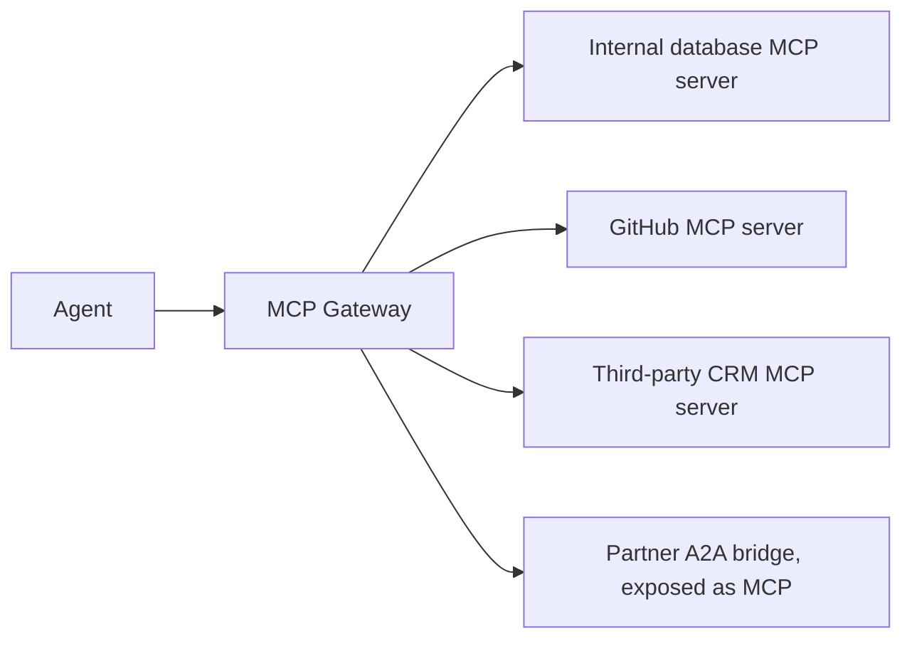

March's series had agents connecting directly to individual MCP servers. Once an organization has more than a handful of MCP servers — internal tools, third-party integrations, partner A2A bridges — a gateway consolidating them becomes as valuable as August's LLM gateway was for model providers.

## Why an MCP Gateway



Without a gateway, every agent that needs access to multiple MCP servers has to manage multiple separate connections, each with its own auth, its own health monitoring, and its own vetting status — a gateway centralizes this the same way August's LLM gateway centralized model provider access.

## Aggregating Multiple Servers Behind One Interface

```python
class MCPGateway:
    def __init__(self, server_configs: list[dict]):
        self.servers = {cfg["name"]: MCPClient(cfg["command"], cfg["args"]) for cfg in server_configs}
        self.tool_registry = {}

    async def initialize(self):
        for name, client in self.servers.items():
            await client.connect()
            tools = await client.list_tools()
            for tool in tools:
                self.tool_registry[f"{name}.{tool.name}"] = (name, tool)

    async def call_tool(self, qualified_name: str, arguments: dict) -> dict:
        server_name, tool = self.tool_registry[qualified_name]
        return await self.servers[server_name].call_tool(tool.name, arguments)
```

Namespacing tools by server (`github.create_issue` vs `crm.create_ticket`) avoids name collisions between independently-developed servers and makes it immediately clear, from an agent's tool list, which underlying system each capability actually touches.

## Access Control Per Server, Per Team

```python
def get_authorized_tools(team: str, gateway: MCPGateway) -> dict:
    allowed_servers = TEAM_MCP_PERMISSIONS.get(team, [])
    return {name: tool for name, (server, tool) in gateway.tool_registry.items() if server in allowed_servers}
```

This directly extends September's least-privilege access-control discipline to the MCP layer — a team building a customer-facing agent shouldn't have implicit access to an internal admin MCP server just because it's connected to the shared gateway; access needs the same explicit, per-team scoping as any other resource.

## Health Monitoring and Circuit Breaking Per Server

```python
class MonitoredMCPGateway(MCPGateway):
    async def call_tool(self, qualified_name: str, arguments: dict) -> dict:
        server_name = qualified_name.split(".")[0]
        try:
            result = await self.circuit_breakers[server_name].call(
                lambda: super().call_tool(qualified_name, arguments)
            )
            return result
        except CircuitOpen:
            return {"error": f"{server_name} is currently unavailable"}
```

Applying August's circuit-breaker pattern per MCP server means one struggling third-party server (the CRM integration having an outage) doesn't take down an agent's access to every other, healthy MCP server — the same resilience principle as provider fallback, applied to tool infrastructure.

## Centralized Vetting and Onboarding

```python
mcp_server_registry = {
    "github": {"status": "approved", "vetted_date": "2026-08-01", "vetted_by": "security-team"},
    "new-vendor-tool": {"status": "pending_review", "vetted_date": None},
}

def require_approved_server(server_name: str):
    if mcp_server_registry[server_name]["status"] != "approved":
        raise UnapprovedServerError(f"{server_name} has not completed security review")
```

This directly implements September's supply-chain vetting process as a hard gate — a new MCP server can't be added to the gateway's active registry (and therefore can't be reachable by any agent) until it's been through the source-code review and permission audit that post described.

## Caching and Rate Limiting Per Server

Extending August's caching and rate-limiting patterns to tool calls specifically — a frequently-repeated read-only tool call (checking a status that rarely changes) is a strong caching candidate, and per-server rate limits prevent one misbehaving agent from overwhelming a shared third-party integration that other teams also depend on.

## Observability Across the Gateway

```python
def log_mcp_call(qualified_name: str, arguments: dict, result: dict, latency_ms: float, team: str):
    mcp_gateway_log.record({"tool": qualified_name, "team": team, "latency_ms": latency_ms,
                             "success": "error" not in result, "timestamp": now()})
```

Feeding this into June's observability dashboards, broken down by MCP server, gives the same visibility into tool-layer health that the application layer already has — essential once tool calls, not just model calls, are a meaningful fraction of total system latency and failure surface.

---

*Part of the [Agentic Framework Deep Dives series]({{ site.baseurl }}/tags/deep-dive-series/) — next: [composing agents from smaller, testable subagents]({{ site.baseurl }}/posts/composing-agents-testable-subagents/), a design pattern this gateway architecture supports directly.*
