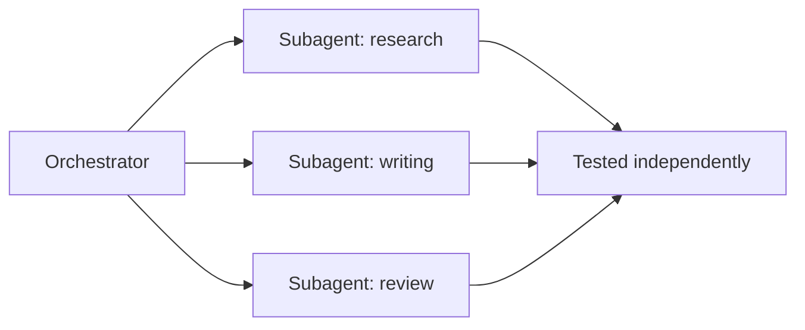

October 2's LangGraph subgraphs showed one framework's implementation of this idea. This post generalizes the principle across any framework — decomposing a large agent into small, independently testable subagents is the single highest-leverage design practice for keeping a complex agentic system maintainable.



Each subagent has its own narrow interface contract and its own test suite, so a failure in the writing subagent can be diagnosed and fixed without touching research or review — the same separation-of-concerns discipline that keeps large codebases maintainable, applied to agent architecture.

## Why Monolithic Agents Become Unmaintainable

A single agent with one system prompt, twenty tools, and complex multi-step reasoning logic accumulates the same problems a 5,000-line function does — hard to test in isolation, hard to reason about which part is responsible for a given failure, and every change risks breaking unrelated behavior.

## The Subagent Interface Contract

```python
@dataclass
class SubagentSpec:
    name: str
    input_schema: type[BaseModel]
    output_schema: type[BaseModel]
    run: Callable[[BaseModel], Awaitable[BaseModel]]

class ResearchInput(BaseModel):
    query: str
    max_sources: int = 5

class ResearchOutput(BaseModel):
    findings: list[str]
    sources: list[str]

research_subagent = SubagentSpec(
    name="research", input_schema=ResearchInput, output_schema=ResearchOutput, run=run_research_agent,
)
```

A strict, typed input/output contract per subagent — the same discipline April's tool-schema post applied to individual tools, now applied to whole subagents — is what makes composition and independent testing tractable; a subagent whose contract is "takes some dict, returns some dict" can't be reasoned about or tested reliably.

## Composing Subagents Into a Larger System

```python
async def orchestrate(goal: str) -> dict:
    research_result = await research_subagent.run(ResearchInput(query=goal))
    draft_result = await writing_subagent.run(WritingInput(
        findings=research_result.findings, sources=research_result.sources,
    ))
    review_result = await review_subagent.run(ReviewInput(draft=draft_result.text))
    return {"final": review_result.approved_text if review_result.approved else draft_result.text}
```

The orchestrator itself stays simple — plain function calls between typed contracts — with all the actual complexity contained within each subagent's own implementation, exactly the encapsulation benefit October 2's subgraph post described.

## Testing Each Subagent Independently

```python
async def test_research_subagent_returns_relevant_findings():
    result = await research_subagent.run(ResearchInput(query="vector database pricing"))
    assert len(result.findings) > 0
    assert all(is_relevant_to_query(f, "vector database pricing") for f in result.findings)

async def test_orchestrator_with_mocked_subagents():
    mock_research = SubagentSpec(name="research", input_schema=ResearchInput, output_schema=ResearchOutput,
                                   run=lambda x: ResearchOutput(findings=["mock finding"], sources=["mock.com"]))
    result = await orchestrate_with_subagents(goal="test", research=mock_research, ...)
    assert result["final"] is not None
```

Two distinct test levels: each subagent tested against real behavior in isolation, and the orchestrator tested with mocked subagents to verify the composition logic itself — directly mirroring standard software testing practice (unit tests plus integration tests with mocked dependencies), applied to agent architecture.

## Versioning Subagents Independently

```python
subagent_registry = {
    "research": {"v1": research_subagent_v1, "v2": research_subagent_v2, "active": "v2"},
    "writing": {"v1": writing_subagent_v1, "active": "v1"},
}
```

Because each subagent has a clean contract, it can be improved, re-evaluated (June's golden-set discipline applied per subagent), and versioned independently — a better research subagent can ship without touching or re-testing the writing subagent at all, as long as the output schema contract remains stable.

## Reuse Across Multiple Orchestrators

```python
customer_support_orchestrator = build_orchestrator(subagents=[classification_subagent, research_subagent, response_subagent])
internal_qa_orchestrator = build_orchestrator(subagents=[research_subagent, response_subagent])  # reuses research_subagent
```

A well-designed subagent with a clean, general contract becomes reusable infrastructure across multiple higher-level agents — the same research subagent serving both a customer-facing support system and an internal Q&A tool, tested once and trusted in both contexts.

## When Decomposition Goes Too Far

Over-decomposing into subagents that are trivially small adds coordination overhead (more calls, more serialization, more places for a contract mismatch) without a corresponding benefit — the right granularity is roughly "a coherent unit of reasoning a team could own and test independently," not an arbitrary minimum size.

---

*Part of the [Agentic Framework Deep Dives series]({{ site.baseurl }}/tags/deep-dive-series/) — next: [designing idempotent tools for safe retries]({{ site.baseurl }}/posts/idempotent-tools-safe-retries/), a property every subagent's tools need for the retry logic covered throughout this month.*
