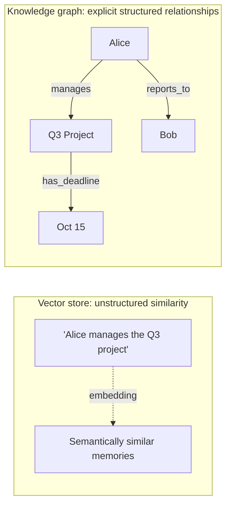

March's memory post used a vector store for long-term memory throughout. That's the right default for many cases, but it has real limitations a knowledge graph addresses differently — this post compares them directly, setting up the next two posts' deeper treatment of graph-based approaches.

## What Each Approach Actually Represents



A vector store retrieves memories by semantic similarity to a query — good at "find things related to X," structurally blind to explicit relationships between facts. A knowledge graph stores facts as explicit entities and relationships — good at "who does Alice report to" or multi-hop questions a similarity search can't reliably traverse.

## Where Vector-Store Memory Falls Short

```python
# A vector store struggles with this kind of multi-hop factual question
query = "Who does the manager of the Q3 project report to?"
# Similarity search finds memories *about* Alice or the Q3 project,
# but doesn't structurally know to chain: Q3 Project -> managed_by -> Alice -> reports_to -> Bob
```

Multi-hop reasoning over explicit relationships is exactly what similarity search wasn't designed for — it can retrieve facts that happen to be relevant, but has no structural mechanism for the kind of relationship-chaining a graph traversal handles natively.

## Where Knowledge Graphs Fall Short

Building and maintaining a knowledge graph requires extracting structured entities and relationships from unstructured text — a genuinely harder engineering problem than embedding a chunk of text, and the graph is only as good as that extraction pipeline's accuracy. Vector stores handle messy, unstructured content far more gracefully, with no upfront schema or extraction step required.

## A Practical Comparison Table

| | Vector Store | Knowledge Graph |
|---|---|---|
| Best for | Semantic similarity, unstructured recall | Multi-hop factual reasoning, explicit relationships |
| Setup cost | Low — embed and store | Higher — requires entity/relationship extraction |
| Query type | "What's related to X?" | "How does X relate to Y?" |
| Handles ambiguity | Well — approximate matching | Poorly — needs disambiguated entities |
| Update cost | Cheap — add a new embedding | Can require relationship re-derivation |

## Hybrid Memory Architectures

```python
async def hybrid_memory_recall(query: str) -> dict:
    similar_memories = await vector_store.search(embed(query), top_k=5)
    entities_mentioned = extract_entities(query)
    graph_facts = await knowledge_graph.query_relationships(entities_mentioned, max_hops=2)
    return {"similar_context": similar_memories, "structured_facts": graph_facts}
```

Most production systems needing both capabilities run them side by side rather than choosing one — vector search for broad, fuzzy recall, and a knowledge graph specifically for entities and relationships that matter enough to warrant explicit structure (organizational hierarchies, project dependencies, customer relationship data).

## Choosing Based on Your Actual Data Shape

```python
def choose_memory_architecture(data_characteristics: dict) -> str:
    if data_characteristics["relationship_queries_common"] and data_characteristics["entities_well_defined"]:
        return "knowledge_graph_primary"
    if data_characteristics["content_mostly_unstructured_text"]:
        return "vector_store_primary"
    return "hybrid"
```

The deciding factor isn't which technology is "better" in the abstract — it's whether your actual use case's questions are predominantly similarity-shaped ("find something like this") or relationship-shaped ("how does A connect to B") — most real systems have some of both, which is exactly why hybrid approaches are common in practice.

## What's Next

The next two posts go deeper into building and querying knowledge graphs specifically for agent reasoning, and combining them with retrieval in the GraphRAG pattern — the structured half of this comparison, given full treatment.

---

*Part of the [Agentic Framework Deep Dives series]({{ site.baseurl }}/tags/deep-dive-series/) — next: [knowledge graphs for agent reasoning]({{ site.baseurl }}/posts/knowledge-graphs-agent-reasoning/).*
