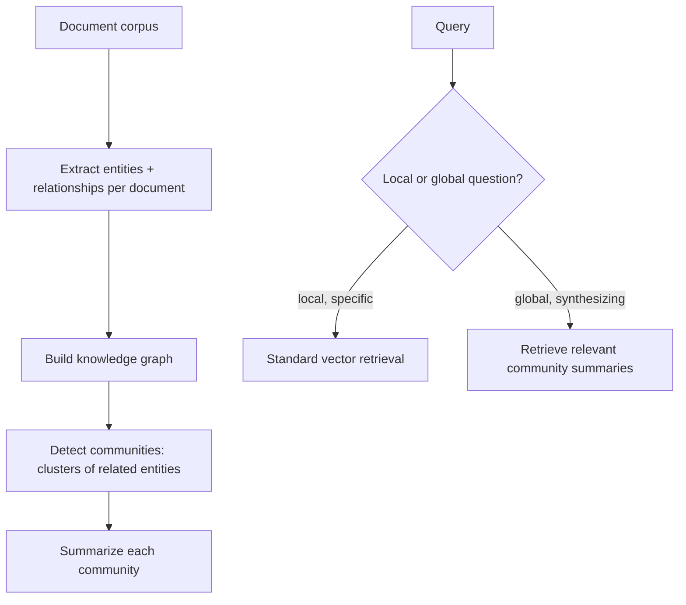

Yesterday's post gave an agent tools to query a knowledge graph directly. GraphRAG is a related but distinct pattern — using the graph structure to *improve retrieval itself*, particularly for questions that need synthesizing information spread across many documents rather than answered by any single retrieved chunk.

## The Problem Standard RAG Struggles With

March's RAG series retrieves chunks by similarity to a query — effective for questions answerable from one or a few localized passages, but weak for "summarize everything we know about our relationship with Acme Corp across all these documents," where the relevant information is scattered across dozens of documents with no single chunk containing the full picture.

## The GraphRAG Approach



GraphRAG builds a knowledge graph from the corpus (yesterday's extraction technique, applied at scale), then uses community detection (graph clustering algorithms that find densely-connected groups of entities) to identify natural topic clusters, and pre-generates a summary for each community — turning "synthesize everything about topic X" into "retrieve the relevant pre-computed community summaries" instead of trying to cram dozens of raw chunks into one context window.

## Implementing the Indexing Pipeline

```python
def build_graphrag_index(documents: list[str]) -> dict:
    all_entities, all_relationships = [], []
    for doc in documents:
        extracted = extract_graph_from_text(doc)  # yesterday's extraction
        all_entities.extend(extracted["entities"])
        all_relationships.extend(extracted["relationships"])

    graph = build_graph(all_entities, all_relationships)
    communities = detect_communities(graph)  # e.g. Leiden algorithm
    community_summaries = {
        community_id: summarize_community(graph, members)
        for community_id, members in communities.items()
    }
    return {"graph": graph, "community_summaries": community_summaries}
```

## Routing Between Local and Global Retrieval

```python
def graphrag_query(query: str, index: dict) -> str:
    query_type = classify_query_scope(query)  # "local" vs "global", a cheap classification step
    if query_type == "local":
        return standard_vector_search(query)  # March's RAG pattern — still the right tool for specific questions
    relevant_communities = rank_communities_by_relevance(query, index["community_summaries"])
    combined_context = "\n\n".join(index["community_summaries"][c] for c in relevant_communities[:5])
    return synthesize_answer(query, combined_context)
```

This routing decision directly extends August's model-routing pattern — not every query needs the more expensive graph-based path; classifying query scope upfront and routing local questions to standard RAG keeps the system efficient for the (typically more common) specific-fact queries.

## Cost Tradeoffs

Building community summaries is a real upfront indexing cost (many LLM calls to summarize each cluster), paid once per corpus update rather than per query — worth it specifically for corpora that see recurring "give me the big picture on X" queries; for a corpus that's mostly queried for specific facts, standard RAG's much lower indexing cost is the better default, echoing the cost-benefit discipline from throughout this roadmap.

## Updating the Graph and Summaries Incrementally

```python
async def incremental_graphrag_update(new_document: str, index: dict):
    new_facts = extract_graph_from_text(new_document)
    merge_into_graph(index["graph"], new_facts)
    affected_communities = find_communities_touching(index["graph"], new_facts)
    for community_id in affected_communities:
        index["community_summaries"][community_id] = summarize_community(index["graph"], community_id)
```

Full community detection and re-summarization on every document update doesn't scale — incrementally updating only the communities actually touched by new facts keeps ongoing maintenance cost bounded, the same incremental-processing principle from August's RAG-at-scale post.

## Evaluating GraphRAG Against Standard RAG

Build a golden set specifically containing both local (specific-fact) and global (synthesis) questions, and compare GraphRAG against standard RAG per category — the empirical validation should confirm GraphRAG's advantage specifically on the global-question category, since that's the precise gap it's designed to close, not a strict improvement across every query type.

---

*Part of the [Agentic Framework Deep Dives series]({{ site.baseurl }}/tags/deep-dive-series/) — next: [building a planner-executor agent architecture]({{ site.baseurl }}/posts/planner-executor-agent-architecture/), a different structural pattern from this month's memory focus.*
