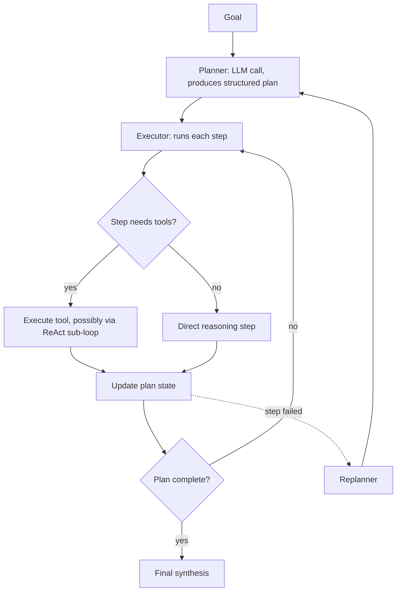

March's planning post introduced plan-and-execute conceptually. This post builds a complete, production-grade planner-executor architecture — a structural pattern distinct from pure ReAct that's worth having as a named, reusable architecture in your toolkit.

## The Architecture



The key structural difference from pure ReAct: planning and execution are separate, distinctly-prompted phases, rather than one continuous loop deciding both "what's next" and "how to do it" at every single step.

## Implementing the Planner

```python
class PlanStep(BaseModel):
    step_id: str
    description: str
    depends_on: list[str] = []
    requires_tools: bool

class Plan(BaseModel):
    goal: str
    steps: list[PlanStep]

def create_plan(goal: str) -> Plan:
    response = llm.chat([{
        "role": "user",
        "content": f"Create a plan for: {goal}\nBreak into concrete steps with dependencies. "
                    f"Return JSON matching the Plan schema."
    }], temperature=0.3)
    return Plan.model_validate_json(response.content)
```

## Implementing the Executor

```python
class PlanExecutor:
    def __init__(self, plan: Plan, tools: dict):
        self.plan = plan
        self.tools = tools
        self.completed = {}

    async def execute(self) -> dict:
        while len(self.completed) < len(self.plan.steps):
            ready_steps = [s for s in self.plan.steps if s.step_id not in self.completed
                           and all(d in self.completed for d in s.depends_on)]
            for step in ready_steps:
                result = await self._execute_step(step)
                if result["status"] == "failed":
                    return await self._handle_failure(step, result)
                self.completed[step.step_id] = result
        return self._synthesize_final(self.completed)

    async def _execute_step(self, step: PlanStep) -> dict:
        if step.requires_tools:
            return await run_react_loop(step.description, self.tools, context=self.completed)
        return await direct_reasoning_step(step.description, context=self.completed)
```

Note the executor delegates tool-requiring steps to a ReAct sub-loop — the two patterns aren't mutually exclusive; planner-executor provides the high-level structure, and ReAct handles the tactical, step-level tool use within each planned step, combining both patterns' strengths.

## Replanning on Failure

```python
async def _handle_failure(self, failed_step: PlanStep, result: dict) -> dict:
    replan_context = {"original_goal": self.plan.goal, "completed_steps": self.completed,
                       "failed_step": failed_step.description, "failure_reason": result["error"]}
    new_plan = create_replan(replan_context)
    self.plan = new_plan
    return await self.execute()  # continue with the revised plan
```

This directly implements March's replanning discipline — a failed step triggers a fresh planning call with full context about what's already been accomplished and what went wrong, rather than either giving up or blindly retrying the exact same failed approach.

## Comparing Planner-Executor to Pure ReAct

```python
architecture_tradeoffs = {
    "pure_react": {"strength": "flexible, adapts continuously", "weakness": "can wander on long-horizon tasks"},
    "planner_executor": {"strength": "explicit structure, parallelizable steps, easier to audit", "weakness": "less adaptive mid-execution"},
}
```

Planner-executor's explicit plan is also directly useful for the human-in-the-loop review pattern from April — a plan can be shown to a human for approval *before* execution begins, which pure ReAct's step-by-step improvisation doesn't offer in the same clean way.

## Evaluating Plan Quality Independently of Execution

```python
def evaluate_plan_quality(plan: Plan, golden_criteria: list[str]) -> dict:
    covers_criteria = all(any(criterion.lower() in step.description.lower() for step in plan.steps) for criterion in golden_criteria)
    reasonable_step_count = 2 <= len(plan.steps) <= 10
    return {"covers_requirements": covers_criteria, "reasonable_scope": reasonable_step_count}
```

Because planning is a distinct phase, it can be evaluated independently of execution quality — catching a poor plan before any (potentially expensive) execution begins, echoing this month's testable-subagent-composition principle applied specifically to the planning phase.

## When This Architecture Is Worth the Added Structure

Planner-executor earns its complexity for genuinely long-horizon, multi-step goals where explicit auditability and parallelization matter — for short, simple tasks, the overhead of a separate planning phase adds latency without a corresponding benefit, and pure ReAct remains the simpler, sufficient choice.

---

*Part of the [Agentic Framework Deep Dives series]({{ site.baseurl }}/tags/deep-dive-series/) — next: [reflection and self-critique loops]({{ site.baseurl }}/posts/reflection-self-critique-loops-agents/), a complementary pattern for improving execution quality.*
