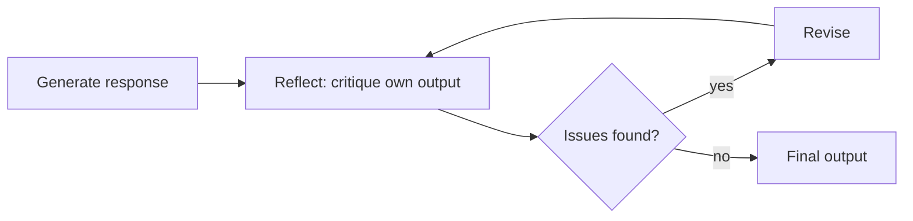

April's coding-agent self-review post used reflection for one specific use case. This post generalizes the pattern — reflection as a first-class architectural component usable at any point in an agent's reasoning, not just as a final code-review step.

## The Reflection Pattern, Generalized



The core mechanic is always the same: generate, critique with a deliberately different framing than the one that generated, and revise — the same "adversarial lens beats same-frame review" principle from April's coding-agent post, applicable to any output type, not just code.

## Implementing a General-Purpose Reflection Loop


```python
async def generate_with_reflection(task: str, max_iterations: int = 3) -> dict:
    output = await generate(task)
    for iteration in range(max_iterations):
        critique = await reflect(task, output)
        if critique["quality"] == "good":
            return {"output": output, "iterations": iteration + 1}
        output = await revise(task, output, critique["issues"])
    return {"output": output, "iterations": max_iterations, "note": "max iterations reached"}

async def reflect(task: str, output: str) -> dict:
    response = llm.chat([{
        "role": "user",
        "content": f"Task: {task}\nOutput: {output}\n\n"
                    f"Critique this as a skeptical reviewer. What's wrong or missing? "
                    f"Return JSON: {{quality: 'good'|'needs_work', issues: [...]}}"
    }], temperature=0.4)
    return json.loads(response.content)
```


## Why Reflection Works: The Asymmetry Between Generating and Critiquing

Generating a good response and recognizing flaws in a response are genuinely different cognitive tasks — a model that makes an error while generating (missing an edge case, an unclear explanation) will often correctly identify that same flaw when explicitly asked to critique, because critique reframes the task from "produce something good" to "find what's wrong," engaging a different pattern of reasoning.

## Structured Reflection Criteria, Not Open-Ended Critique

```python
def reflect_with_rubric(task: str, output: str, rubric: list[str]) -> dict:
    response = llm.chat([{
        "role": "user",
        "content": f"Task: {task}\nOutput: {output}\n\nCheck against each criterion:\n"
                    f"{chr(10).join(f'- {c}' for c in rubric)}\n"
                    f"Return JSON per criterion: met (bool), issue (if not met)."
    }])
    return json.loads(response.content)
```

An open-ended "find problems" prompt produces noisier, less consistent critique than a structured rubric — this directly reuses June's LLM-as-judge criteria-based approach as the reflection mechanism itself, since reflection is functionally a self-applied evaluation step.

## Reflection at Different Granularities

```python
reflection_granularities = {
    "final_output_only": "cheapest — one reflection pass after generation completes",
    "per_step": "reflect after each step in a planner-executor architecture (yesterday's post)",
    "continuous": "reflect after every tool call in a ReAct loop — most expensive, catches errors earliest",
}
```

Finer-grained reflection catches errors closer to their source (cheaper to fix a wrong assumption at step 2 than after 10 more steps built on it) but costs proportionally more in LLM calls — choosing granularity is a genuine cost-quality tradeoff, following June's cost-quality evaluation methodology to find the right point for your specific task's error patterns.

## Avoiding Reflection Loops That Never Converge

```python
async def bounded_reflection(task: str, max_iterations: int = 3, min_improvement: float = 0.05) -> dict:
    output = await generate(task)
    prev_score = score_output(output)
    for _ in range(max_iterations):
        critique = await reflect(task, output)
        if critique["quality"] == "good":
            break
        new_output = await revise(task, output, critique["issues"])
        new_score = score_output(new_output)
        if new_score - prev_score < min_improvement:
            break  # diminishing returns — stop even if not "perfect"
        output, prev_score = new_output, new_score
    return output
```

Capping iterations alone isn't sufficient — tracking whether each revision is actually improving (not just cycling between similarly-flawed alternatives) prevents burning budget on a reflection loop that's stopped making genuine progress, the same loop-detection discipline from March's guardrails applied to the reflection pattern specifically.

## Combining Reflection with This Month's Other Patterns

Reflection composes naturally with planner-executor (reflect on each completed step before marking it done) and with subagent composition (a dedicated review subagent, following October 17's pattern, applying reflection as its sole responsibility) — it's a technique to layer into existing architectures, not a replacement for them.

---

*Part of the [Agentic Framework Deep Dives series]({{ site.baseurl }}/tags/deep-dive-series/) — next: [Tree of Thoughts and beam search]({{ site.baseurl }}/posts/tree-of-thoughts-beam-search-reasoning/), exploring multiple reasoning paths rather than reflecting on one.*
