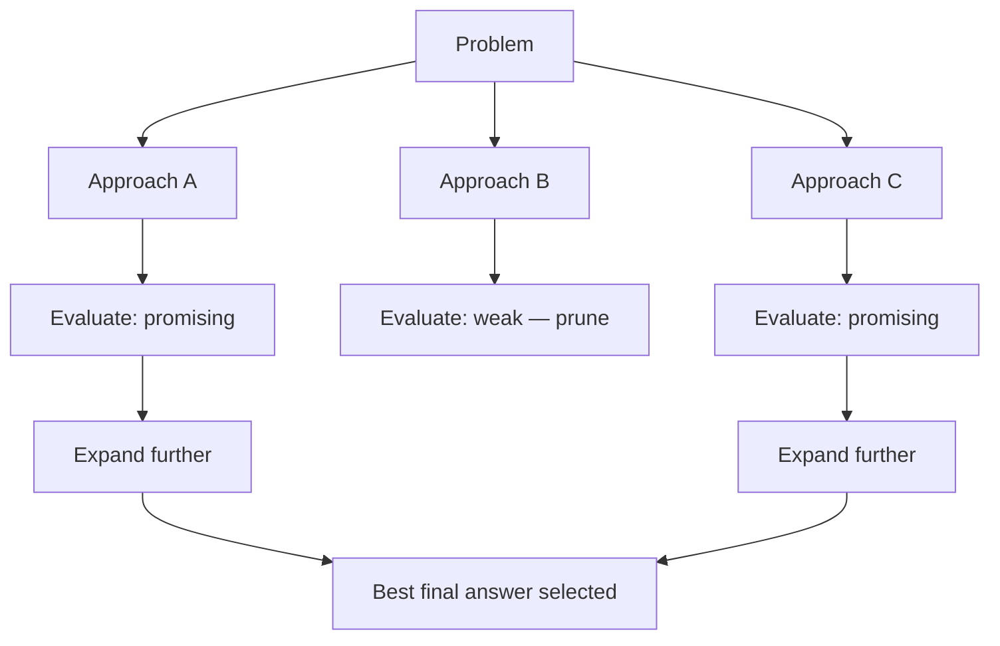

Every reasoning pattern so far in this roadmap — ReAct, chain-of-thought, planner-executor — follows a single path through the problem, only revising after the fact via reflection. Tree of Thoughts explores multiple reasoning paths *concurrently*, keeping the most promising ones and pruning the rest, closer to how a person might consider several approaches before committing to one.

## The Core Idea



At each step, instead of committing to one reasoning path, the agent generates several candidate next steps, evaluates each, keeps the most promising ones (a "beam"), and discards the rest — directly analogous to beam search in classical sequence generation, applied to reasoning steps instead of tokens.

## Implementing Tree of Thoughts

```python
async def tree_of_thoughts(problem: str, beam_width: int = 3, max_depth: int = 4) -> str:
    beam = [{"path": [], "state": problem}]
    for depth in range(max_depth):
        candidates = []
        for node in beam:
            next_steps = await generate_candidate_steps(node["state"], n=beam_width)
            candidates.extend([{"path": node["path"] + [step], "state": apply_step(node["state"], step)} for step in next_steps])

        scored = [(c, await evaluate_state(c["state"])) for c in candidates]
        scored.sort(key=lambda x: -x[1])
        beam = [c for c, score in scored[:beam_width]]  # keep only the top candidates

        if any(is_solution(c["state"]) for c in beam):
            return next(c for c in beam if is_solution(c["state"]))["state"]
    return max(beam, key=lambda c: evaluate_state_sync(c["state"]))["state"]
```

## The Evaluator: The Component That Makes or Breaks This

```python
async def evaluate_state(state: str) -> float:
    response = llm.chat([{
        "role": "user",
        "content": f"Rate how promising this partial solution is (0-10) for eventually solving the problem: {state}"
    }], temperature=0)
    return float(extract_number(response.content))
```

The evaluator's quality entirely determines whether beam search actually helps — a poor evaluator prunes genuinely promising paths and keeps weak ones, making the whole exercise worse than a single greedy pass. This is where June's evaluation discipline becomes load-bearing for the reasoning process itself, not just for measuring output after the fact.

## When Tree of Thoughts Earns Its Cost

This is expensive — beam width times depth times the cost of generating and evaluating each candidate, easily an order of magnitude more LLM calls than a single ReAct pass. It's worth that cost specifically for problems where the *first reasonable-looking approach* is often wrong in a way that's hard to detect until well into execution — combinatorial puzzles, certain classes of planning problems, and reasoning tasks with several plausible-looking but ultimately dead-end paths.

## Where Tree of Thoughts Underperforms

For most everyday agentic tasks (the customer support, document extraction, and research agents built throughout this roadmap), a single well-prompted ReAct pass with reflection (yesterday's post) reaches comparable quality at a fraction of the cost — Tree of Thoughts is a specialized tool for a specific class of hard reasoning problems, not a general-purpose upgrade to every agent.

## A Lighter-Weight Alternative: Self-Consistency

```python
async def self_consistency(problem: str, n_samples: int = 5) -> str:
    candidates = await asyncio.gather(*[generate_solution(problem, temperature=0.8) for _ in range(n_samples)])
    return most_common_answer(candidates)  # majority vote across independent attempts
```

Rather than tree-structured exploration, generating several independent full solutions at higher temperature and taking a majority vote captures some of the same "don't commit to a single potentially-flawed path" benefit at much lower engineering complexity — worth trying before reaching for full Tree of Thoughts, since it's simpler to implement and reason about.

## Evaluating Whether the Added Cost Is Worth It

```python
def compare_reasoning_strategies(problem_set: list[dict]) -> dict:
    results = {}
    for strategy in ["single_pass", "self_consistency", "tree_of_thoughts"]:
        accuracy = evaluate_on_task(strategy, problem_set)
        cost = measure_avg_cost(strategy, problem_set)
        results[strategy] = {"accuracy": accuracy, "cost": cost, "accuracy_per_dollar": accuracy / cost}
    return results
```

Run this comparison directly on your actual task distribution before committing to the added complexity and cost of tree-structured reasoning — the theoretical appeal of exploring multiple paths doesn't guarantee it's the right tradeoff for any specific problem without measuring it.

---

*Part of the [Agentic Framework Deep Dives series]({{ site.baseurl }}/tags/deep-dive-series/) — next: [building a multi-agent debate system]({{ site.baseurl }}/posts/multi-agent-debate-system/), another approach to exploring multiple perspectives before committing to an answer.*
