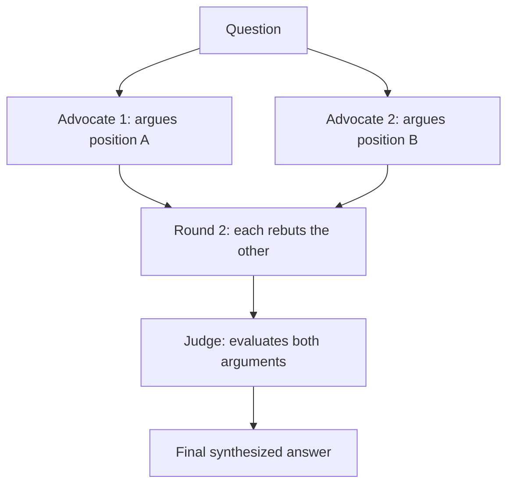

March's multi-agent post mentioned debate as a coordination pattern. This post builds one fully — two or more agents arguing different positions, with a judge synthesizing or selecting the strongest answer, a structured alternative to Tree of Thoughts' internal exploration.

## The Architecture



## Implementing the Debate Loop

```python
async def run_debate(question: str, positions: list[str], rounds: int = 2) -> dict:
    transcripts = {pos: [] for pos in positions}

    for round_num in range(rounds):
        for position in positions:
            opponent_arguments = [transcripts[p][-1] for p in positions if p != position and transcripts[p]]
            argument = await generate_argument(question, position, opponent_arguments, round_num)
            transcripts[position].append(argument)

    verdict = await judge_debate(question, transcripts)
    return {"transcripts": transcripts, "verdict": verdict}

async def generate_argument(question: str, position: str, opponent_args: list[str], round_num: int) -> str:
    prompt = f"Question: {question}\nYour position: {position}\n"
    if opponent_args:
        prompt += f"Opponent's argument: {opponent_args[-1]}\nRebut or strengthen your position.\n"
    response = llm.chat([{"role": "user", "content": prompt}], temperature=0.7)
    return response.content
```

## The Judge: A Specialized Evaluation Role

```python
async def judge_debate(question: str, transcripts: dict) -> dict:
    full_debate = format_debate_transcript(transcripts)
    response = llm.chat([{
        "role": "user",
        "content": f"Question: {question}\n\nDebate transcript:\n{full_debate}\n\n"
                    f"Evaluate both positions' argument quality and evidence. "
                    f"Return JSON: {{stronger_position, confidence, synthesized_answer, key_reasoning}}."
    }], temperature=0)
    return json.loads(response.content)
```

This is a specialized application of June's LLM-as-judge pattern — judging not a single response but a structured argument, with the same position-bias caution from June applying here too (randomize which position argues first across repeated runs to control for order effects).

## Why Debate Improves Accuracy on Certain Tasks

Debate works by forcing each position to withstand direct scrutiny — a weak argument that would pass unchallenged in a single-agent response gets specifically probed and rebutted by an adversarial counterpart, surfacing flaws a single generation pass might not self-identify even with reflection (yesterday's post), since the opposing agent is specifically incentivized to find weaknesses, unlike a self-critique that shares the same underlying biases as the original generation.

## Where Debate Is Worth the Cost

```python
debate_appropriate_for = {
    "genuinely_contested_questions": "where reasonable positions differ and evidence needs weighing",
    "high_stakes_decisions": "worth the multiplied cost for decisions where getting it right matters a lot",
    "known_single_pass_failure_modes": "tasks where a single agent demonstrably has a specific bias or blind spot debate can counteract",
}
```

Debate multiplies cost significantly — multiple agents, multiple rounds, a judge pass — and is overkill for straightforward factual questions with a single clearly correct answer, where debate just adds latency and cost without a corresponding quality gain worth measuring for.

## Debate vs Tree of Thoughts vs Self-Consistency

```python
technique_comparison = {
    "self_consistency": "cheapest — independent samples, majority vote, no interaction between attempts",
    "tree_of_thoughts": "explores multiple paths within one reasoning process, prunes weak branches",
    "debate": "explicitly adversarial — different perspectives directly challenge each other",
}
```

Debate is the right choice specifically when the value comes from adversarial scrutiny of *positions*, not just exploring more of the solution space — a subtly different mechanism than Tree of Thoughts' path-pruning, worth choosing deliberately rather than treating these as interchangeable "use more compute for better answers" techniques.

## Testing and Evaluating a Debate System

```python
def evaluate_debate_vs_single_pass(golden_set: list[dict]) -> dict:
    single_pass_accuracy = evaluate_on_task(single_agent_baseline, golden_set)
    debate_accuracy = evaluate_on_task(debate_system, golden_set)
    return {"improvement": debate_accuracy - single_pass_accuracy, "cost_multiplier": measure_cost_ratio(debate_system, single_agent_baseline)}
```

The same accuracy-per-dollar evaluation from Tree of Thoughts applies here directly — confirm debate's accuracy improvement on your specific task justifies its cost multiplier before adopting it as a production pattern rather than an interesting experiment.

---

*Part of the [Agentic Framework Deep Dives series]({{ site.baseurl }}/tags/deep-dive-series/) — next: [orchestrating agents across microservices]({{ site.baseurl }}/posts/orchestrating-agents-across-microservices/), a deployment-architecture concern.*
