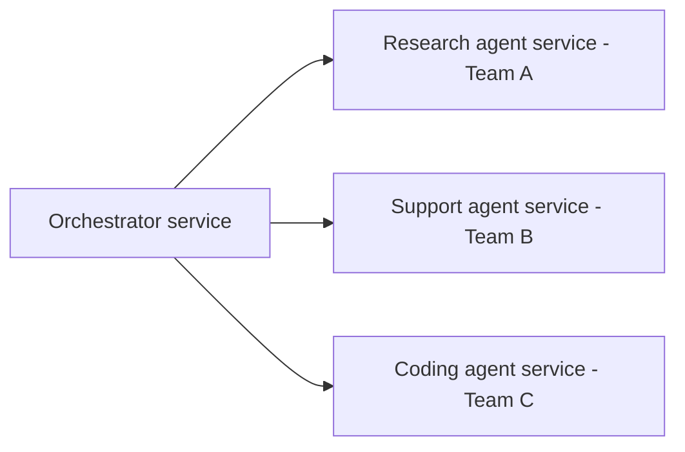

Every multi-agent pattern this month has assumed agents running within one process or one deployment. Real organizations often have agents owned by different teams, deployed as separate services — this post covers orchestrating across that boundary, extending A2A's cross-organizational patterns to the more common cross-team, same-organization case.

## Why Agents End Up as Separate Services



Different teams own different agent capabilities, each with its own deployment cadence, its own model choices, and its own scaling needs (August's infrastructure series) — forcing them into one monolithic deployment creates exactly the coordination bottleneck microservices architecture generally exists to avoid, and the same reasoning applies to agent services.

## A Service Contract for Agent-as-a-Service

```python
class AgentServiceRequest(BaseModel):
    task: str
    context: dict
    session_id: str
    caller_service: str
    timeout_seconds: int = 30

class AgentServiceResponse(BaseModel):
    result: str
    status: Literal["completed", "needs_clarification", "failed"]
    cost_usd: float
    trace_id: str
```

A stable, versioned request/response contract — echoing October 17's typed subagent contracts, now formalized as an actual network API — is what lets teams evolve their agent's internals independently as long as the contract holds, the standard microservices decoupling benefit applied to agents.

## Orchestrator Implementation

```python
async def orchestrate_across_services(goal: str) -> dict:
    plan = await create_plan(goal)  # October 22's planner-executor pattern
    results = {}
    for step in plan.steps:
        service = SERVICE_REGISTRY[step.required_capability]
        response = await call_agent_service(service, AgentServiceRequest(
            task=step.description, context=results, session_id=get_session_id(), caller_service="orchestrator",
        ))
        if response.status == "failed":
            return await handle_service_failure(step, response)
        results[step.step_id] = response.result
    return synthesize_final(results)
```

## Applying August's Infrastructure Patterns Per Agent Service

Every agent service in this architecture needs its own instance of August's operational concerns — its own health checks, its own autoscaling policy tuned to its specific load pattern, its own circuit breaker in the orchestrator's calling code, and its own cost attribution tag (August's cost-attribution post) since it's now a distinctly billable component of the larger system.

```python
async def call_agent_service(service: dict, request: AgentServiceRequest) -> AgentServiceResponse:
    return await circuit_breakers[service["name"]].call(
        lambda: http_client.post(service["endpoint"], json=request.dict(), timeout=request.timeout_seconds)
    )
```

## Distributed Tracing Across Agent Service Boundaries

```python
def propagate_trace_context(request: AgentServiceRequest, parent_trace_id: str) -> dict:
    return {**request.dict(), "trace_id": generate_child_trace_id(parent_trace_id)}
```

This directly extends June's trace-structuring discipline across service boundaries — a single user request touching three separate agent services needs one correlatable trace ID threading through all of them, or debugging a cross-service failure becomes a matter of manually correlating separate logs from separate teams, exactly the coordination cost this architecture should minimize, not add.

## Contract Testing Between Services

```python
def test_research_service_contract():
    response = call_agent_service(research_service_staging, AgentServiceRequest(task="test query", context={}, session_id="test"))
    AgentServiceResponse.model_validate(response.dict())  # verifies the contract, independent of response quality
```

Consumer-driven contract testing — verifying the *shape* of a service's response independent of its actual quality — catches a breaking API change in one team's agent service before it breaks the orchestrator, without requiring the orchestrator team to run the full quality evaluation suite for a service they don't own.

## Governance Across Team-Owned Agent Services

Extending September's governance posts — a shared registry of agent services (echoing August's model registry, one level up) with clear ownership, risk tier, and evaluation status per service gives the organization visibility into a distributed agent ecosystem the same way a service catalog does for traditional microservices.

## When to Split an Agent Into a Separate Service

```python
def should_be_separate_service(agent: dict) -> bool:
    return (
        agent["owning_team"] != "orchestrator_team"
        or agent["scaling_needs"] != "similar_to_orchestrator"
        or agent["deployment_cadence"] == "independent"
    )
```

---

*Part of the [Agentic Framework Deep Dives series]({{ site.baseurl }}/tags/deep-dive-series/) — next: [versioning prompts and agent configurations]({{ site.baseurl }}/posts/versioning-prompts-agent-configurations/), a practice every service in this architecture needs.*
