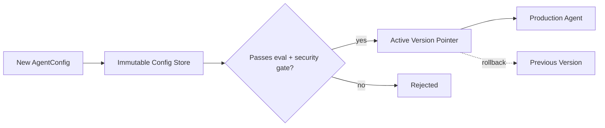

August's model registry tracked model versions. This post covers the parallel practice for prompts and agent configurations — system prompts, tool sets, and orchestration parameters change just as often as models do, and need the same version discipline.



Separating the immutable config store from the active-version pointer is what makes rollback instant — repointing to a previous version rather than reconstructing it, the same instant-rollback property as August's blue-green deployment pattern applied one layer up the stack.

## What Counts as an Agent Configuration

```python
@dataclass
class AgentConfig:
    version: str
    system_prompt: str
    tool_names: list[str]
    model: str
    temperature: float
    max_steps: int
    guardrail_settings: dict
    created_at: datetime
    created_by: str
```

Bundling every parameter that affects agent behavior into one versioned artifact — not just the prompt text — is what makes "what exact configuration produced this behavior" answerable, echoing August's model-lineage discussion extended to the full agent configuration, not just the model weights.

## Storing and Retrieving Versions

```python
def save_config_version(config: AgentConfig) -> str:
    config_id = f"{config.version}-{hashlib.sha256(serialize(config).encode()).hexdigest()[:8]}"
    config_store.save(config_id, config)
    return config_id

def get_active_config(agent_name: str, environment: str = "production") -> AgentConfig:
    return config_store.get(active_version_pointer[agent_name][environment])
```

Separating the config store (every version ever created, immutable) from the active-version pointer (which version is live per environment) mirrors August's model registry structure directly — this is the same pattern applied one layer up the stack.

## Diffing Configuration Versions

```python
def diff_configs(v1: AgentConfig, v2: AgentConfig) -> dict:
    return {
        "prompt_changed": v1.system_prompt != v2.system_prompt,
        "tools_added": set(v2.tool_names) - set(v1.tool_names),
        "tools_removed": set(v1.tool_names) - set(v2.tool_names),
        "params_changed": {k: (getattr(v1, k), getattr(v2, k)) for k in ["temperature", "max_steps"] if getattr(v1, k) != getattr(v2, k)},
    }
```

A structured diff — not just "the prompt text changed" — is what makes a PR review of a configuration change actually reviewable, particularly `tools_added`, which deserves the same September least-privilege scrutiny as any other access-granting change, not just a glance at prose differences.

## Wiring Into the CI Regression Gate

```python
def config_change_gate(new_config: AgentConfig, golden_set: list) -> dict:
    results = run_eval_suite(golden_set, build_agent(new_config))  # June's harness
    security_results = run_red_team_suite(build_agent(new_config), red_team_cases)  # September's suite
    return {"quality_passed": results["overall_pass_rate"] >= BASELINE, "security_passed": security_results["passed"]}
```

Every configuration change — not just prompt edits, but tool additions and parameter changes — should pass through the same evaluation and security gates from June and September before promotion, since a tool addition can introduce a security regression just as easily as a prompt change can introduce a quality one.

## Rollback

```python
def rollback_config(agent_name: str, environment: str, target_version: str):
    active_version_pointer[agent_name][environment] = target_version
    log_config_change(agent_name, environment, target_version, reason="rollback")
```

Because configurations are versioned and immutable, rollback is just repointing the active-version pointer — the same instant-rollback property as August's blue-green deployment pattern, applied to configuration rather than infrastructure.

## A/B Testing Configuration Changes

```python
def route_by_config_experiment(session_id: str, experiment: dict) -> AgentConfig:
    variant = "treatment" if hash(session_id) % 100 < experiment["treatment_pct"] else "control"
    return config_store.get(experiment[variant])
```

This directly reuses June's A/B testing infrastructure, now applied to full agent configurations rather than isolated prompt strings — a genuinely new tool addition or a changed `max_steps` limit can be tested against production traffic the same way a prompt wording change would be.

## Configuration as Code vs Configuration in a Database

Whether configurations live in version-controlled files (deployed via the CI/CD pipeline) or a runtime-editable database (like Langfuse's prompt management from June) is a real design choice — files give strong git-based audit trail and code review integration; a database gives faster non-engineering-team iteration. Many production systems use both: files for the initial version, database overrides for rapid runtime tuning, reconciled periodically back into version control.

## Documentation as Part of Every Version

```python
config_version_metadata = {
    "changelog": "why this change was made",
    "expected_impact": "what metric this should move, from the eval results",
    "rollback_plan": "what to do if the guardrail metrics regress",
}
```

---

*Part of the [Agentic Framework Deep Dives series]({{ site.baseurl }}/tags/deep-dive-series/) — next: [feature flags for agentic behavior]({{ site.baseurl }}/posts/feature-flags-agentic-behavior/), a complementary runtime control mechanism.*
