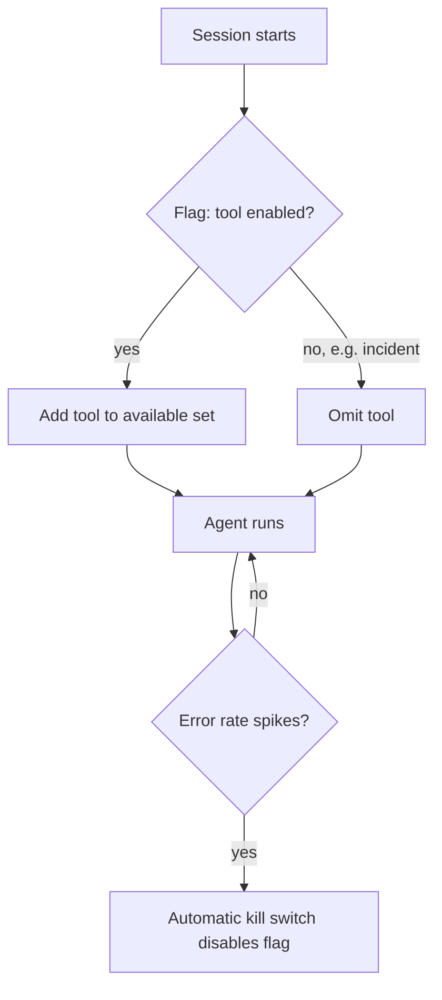

Yesterday's versioning system controls which configuration is active. Feature flags provide finer-grained, runtime-adjustable control within that — enabling or disabling specific agent capabilities without a full configuration version change or deployment.



The loop back from error-rate monitoring to the flag itself is the key idea — a kill switch is just a feature flag toggled programmatically based on live metrics rather than manually by an engineer, closing the loop between observability and mitigation.

## Why Agents Need Feature Flags Beyond Config Versioning

A full configuration version change goes through the CI gate from yesterday's post — appropriate for meaningful behavioral changes, too heavyweight for "temporarily disable this one tool because the third-party API it depends on is having issues" or "gradually roll out a new capability to 10% of sessions." Feature flags handle exactly this finer-grained, faster-to-toggle control.

## Flag-Gated Tool Availability

```python
def get_available_tools(user: dict, session: dict) -> dict:
    tools = BASE_TOOLS.copy()
    if feature_flags.is_enabled("new_calendar_integration_tool", context={"user_id": user["id"]}):
        tools["schedule_meeting"] = schedule_meeting_tool
    if not feature_flags.is_enabled("third_party_crm_tool", context={"team": user["team"]}):
        tools.pop("crm_lookup", None)  # disabled due to ongoing incident, per Sep's incident response
    return tools
```

This connects directly to September's incident response post — during an active incident with a third-party dependency, disabling the specific tool that depends on it via a feature flag is a fast, targeted mitigation, faster than a full configuration rollback and scoped precisely to the affected capability.

## Gradual Rollout of New Agent Capabilities

```python
def should_use_new_reasoning_strategy(session_id: str) -> bool:
    return feature_flags.is_enabled("tree_of_thoughts_reasoning", context={"session_id": session_id}, rollout_pct=10)
```

This is the canary rollout pattern from June and August, expressed as a feature flag rather than a full deployment mechanism — appropriate for testing a new internal capability (like October 24's Tree of Thoughts reasoning) on a small percentage of traffic before committing to it as the default, without a separate deployment pipeline for the experiment.

## Kill Switches for Guardrail Violations

```python
def check_and_apply_kill_switches(agent_metrics: dict):
    if agent_metrics["error_rate"] > EMERGENCY_THRESHOLD:
        feature_flags.disable("new_capability_x", reason="automatic kill switch: error rate spike")
        alert_on_call("Kill switch triggered for new_capability_x")
```

An automated kill switch — tied directly to the guardrail-metric monitoring from June and August's canary posts — is a feature flag toggled programmatically based on live metrics, not just manually by an engineer, closing the loop between observability and rapid mitigation.

## Per-Tenant and Per-User Flag Targeting

```python
def get_agent_capabilities(context: dict) -> dict:
    return {
        "advanced_reasoning": feature_flags.is_enabled("advanced_reasoning", context=context),
        "voice_output": feature_flags.is_enabled("voice_output", context=context) and context["tenant_tier"] == "premium",
    }
```

Beyond simple percentage rollouts, targeting flags by tenant, user tier, or team lets a platform team offer graduated capability access — a premium tier getting early access to a new capability, or a specific enterprise customer getting a capability disabled pending their own security review, echoing August's multi-team infrastructure posts.

## Testing With Feature Flags

```python
def test_agent_behavior_with_flag_variants():
    for flag_state in [True, False]:
        with feature_flags.override("new_calendar_integration_tool", flag_state):
            result = run_agent_test_case(scheduling_test_case)
            assert result.behaves_correctly_for_flag_state(flag_state)
```

Every flagged behavior needs test coverage for both states — a flag that's only ever tested in its "on" state during development can break silently when toggled off in production for the first time during an actual incident, exactly the scenario the kill switch above is meant to handle safely.

## Flag Sprawl and Cleanup

```python
def find_stale_flags(all_flags: list[dict], age_threshold_days: int = 90) -> list[str]:
    return [f["name"] for f in all_flags if f["fully_rolled_out"] and days_since(f["created_at"]) > age_threshold_days]
```

A flag that's been at 100% rollout for months without being cleaned up into the permanent configuration (removing the flag and its old code path) is technical debt — periodic review and removal of stale flags keeps the system's actual behavior legible, the same discipline any feature-flagged software system needs, applied here to agentic behavior specifically.

---

*Part of the [Agentic Framework Deep Dives series]({{ site.baseurl }}/tags/deep-dive-series/) — next: [building an agent marketplace or plugin registry]({{ site.baseurl }}/posts/agent-marketplace-plugin-registry/), for organizations with many reusable agent capabilities.*
