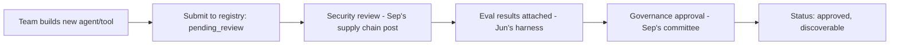

October's A2A discovery post touched on agent registries briefly. This post builds one fully — a searchable catalog of reusable agents, tools, and MCP servers, letting teams discover and compose existing capabilities rather than rebuilding them.

## What Belongs in the Registry

```python
@dataclass
class RegistryEntry:
    name: str
    type: Literal["agent", "tool", "mcp_server", "subagent"]
    description: str
    capabilities: list[str]
    owner_team: str
    risk_tier: str            # September's model risk management framework
    vetting_status: Literal["approved", "pending_review", "deprecated"]
    api_contract: dict         # October 26's service contract, if it's a network-accessible agent
    usage_examples: list[str]
    eval_results: dict | None  # June's evaluation results, if applicable
```

## Search and Discovery

```python
def search_registry(query: str, filters: dict) -> list[RegistryEntry]:
    candidates = registry_db.query(filters)  # e.g. {"vetting_status": "approved", "risk_tier": "low"}
    return rank_by_relevance(query, candidates)
```

A registry that's just a static list nobody can effectively search doesn't get used — semantic search over capability descriptions (the same embedding-based retrieval from March's RAG series, applied to registry entries) makes "find something that can summarize meeting audio" return the relevant subagent even if the query doesn't match its name exactly.

## Governance Integration: Only Vetted Entries Are Discoverable by Default

```python
def search_registry_default_scope(query: str) -> list[RegistryEntry]:
    return search_registry(query, filters={"vetting_status": "approved"})

def search_registry_including_pending(query: str, requesting_team: str) -> list[RegistryEntry]:
    if not has_elevated_search_permission(requesting_team):
        return search_registry_default_scope(query)
    return search_registry(query, filters={})  # includes pending/experimental entries
```

This directly implements September's supply-chain vetting as a search-time gate — an unvetted, pending-review entry shouldn't surface in a general search and get casually adopted by an unrelated team before its security review completes, echoing the MCP gateway's approved-server-only registry from October 16.

## Reuse Metrics and Recommendation

```python
def track_registry_usage(entry_name: str, using_team: str):
    usage_log.record({"entry": entry_name, "team": using_team, "timestamp": now()})

def most_reused_entries(category: str) -> list[dict]:
    return usage_log.aggregate_by_entry(filter={"type": category}, sort_by="usage_count", descending=True)
```

Surfacing "most-used" entries in a given category naturally promotes battle-tested, well-vetted capabilities over untested ones — a lightweight, organic quality signal that complements the formal vetting status without requiring a manual curation effort to maintain.

## Contribution and Review Workflow



This mirrors August's model registry deployment pipeline exactly, one layer up — a new agent or tool doesn't become broadly discoverable and reusable until it's cleared the same evaluation and governance gates every other production capability in this roadmap has gone through.

## Versioning Registry Entries

```python
def get_compatible_version(entry_name: str, required_contract_version: str) -> RegistryEntry:
    versions = registry_db.get_all_versions(entry_name)
    return next(v for v in versions if v.api_contract["version"] == required_contract_version)
```

Following yesterday's configuration versioning discipline — a consuming team should be able to pin to a specific version of a registry entry's contract, so an upstream team's breaking change doesn't silently break every downstream consumer without warning.

## Deprecation and Sunset Process

```python
def deprecate_entry(entry_name: str, replacement: str | None, sunset_date: date):
    registry_db.update(entry_name, vetting_status="deprecated", replacement=replacement, sunset_date=sunset_date)
    notify_all_consumers(entry_name, replacement, sunset_date)
```

Notifying every team currently using an entry (trackable via the usage log above) before it's actually removed — rather than silently breaking downstream consumers — is what makes a shared registry a trustworthy piece of internal infrastructure teams are willing to build on rather than avoid out of fear of unannounced breaking changes.

---

*Part of the [Agentic Framework Deep Dives series]({{ site.baseurl }}/tags/deep-dive-series/) — next: [comparing agentic frameworks on a real benchmark task]({{ site.baseurl }}/posts/comparing-frameworks-real-benchmark/), putting everything from April and this month to an empirical test.*
