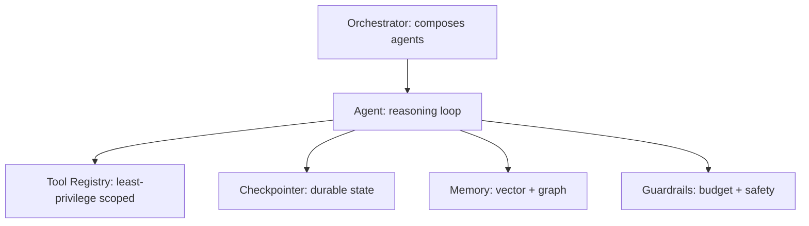

This closes out October by building a minimal but complete agent framework from scratch — synthesizing every deep-dive pattern this month into first principles, and demonstrating that the frameworks covered all month are conveniences over a comprehensible, buildable core, not irreducible magic.

## The Core Abstractions



## The Agent Class

```python
class Agent:
    def __init__(self, name: str, system_prompt: str, tools: dict, checkpointer, budget: AgentBudget):
        self.name = name
        self.system_prompt = system_prompt
        self.tools = tools  # September's least-privilege scoped tool set
        self.checkpointer = checkpointer  # October 1's durable checkpointing
        self.budget = budget  # March's guardrails

    async def run(self, goal: str, session_id: str) -> dict:
        state = await self.checkpointer.load(session_id) or {"messages": [{"role": "system", "content": self.system_prompt},
                                                                            {"role": "user", "content": goal}]}
        while True:
            self.budget.check(step_cost=0.01)
            response = await llm.chat(state["messages"], tools=list(self.tools.values()))
            state["messages"].append(response)
            await self.checkpointer.save(session_id, state)

            if not response.tool_calls:
                return {"final_answer": response.content}

            for call in response.tool_calls:
                result = await self._execute_tool_safely(call, session_id)
                state["messages"].append({"role": "tool", "content": format_observation(call.name, result)})
            await self.checkpointer.save(session_id, state)
```

## Safe Tool Execution with This Month's Discipline Built In

```python
    async def _execute_tool_safely(self, call, session_id: str) -> dict:
        if call.name not in self.tools:
            return {"error": "Tool not available in this agent's scope"}  # September's least privilege
        if scan_for_injection_attempts(str(call.arguments))["suspicious"]:  # September's injection defense
            log_security_event("suspicious_tool_arguments", call, session_id)
            return {"error": "Request flagged for review"}
        idempotency_key = generate_idempotency_key(session_id, call.name, call.arguments)  # October 18
        return await self.tools[call.name](idempotency_key=idempotency_key, **call.arguments)
```

## Composable Subagents (October 17's Pattern)

```python
class Orchestrator:
    def __init__(self, subagents: dict[str, Agent]):
        self.subagents = subagents

    async def run(self, goal: str) -> dict:
        plan = await create_plan(goal)  # October 22
        results = {}
        for step in plan.steps:
            agent = self.subagents[step.required_capability]
            results[step.step_id] = await agent.run(step.description, session_id=f"{goal}-{step.step_id}")
        return synthesize_final(results)
```

## Evaluation and Observability Wired In From the Start

```python
class InstrumentedAgent(Agent):
    async def run(self, goal: str, session_id: str) -> dict:
        with tracer.start_as_current_span(f"agent:{self.name}"):  # June's tracing
            result = await super().run(goal, session_id)
            log_llm_call_cost(self.name, result.get("usage"), feature=self.name)  # August's cost attribution
            return result
```

## What This Exercise Demonstrates

Every framework covered this month — LangGraph's graphs, CrewAI's crews, AutoGen's conversations, Temporal's durable workflows — is a different set of ergonomic defaults and abstractions layered over this same core: a loop, tools, state, and guardrails. Understanding this core is what makes evaluating a new framework (or a new version of an existing one) a matter of asking "how does this handle checkpointing, tool safety, and composition" rather than starting from zero each time.

## When to Actually Build Your Own Framework

For nearly every real project, adopting an existing framework (April and this month's deep dives) is the right call — mature tooling, community support, and less code to maintain. Building your own is worth it specifically when your requirements are genuinely unusual enough that every existing framework fights you more than it helps, and even then, this minimal core is a better starting point than reinventing the wheel from nothing.

## What's Next

November shifts from technical architecture to the business and platform layer — cloud AI platforms (Bedrock, Azure OpenAI, Vertex), cost modeling, and the organizational structures that make all of this month's technical work sustainable at a company level.

---

*Part of the [Agentic Framework Deep Dives series]({{ site.baseurl }}/tags/deep-dive-series/) — the final post in this series, leading into [Cloud AI Platforms & Business of AI]({{ site.baseurl }}/tags/cloud-business-series/) starting tomorrow.*
