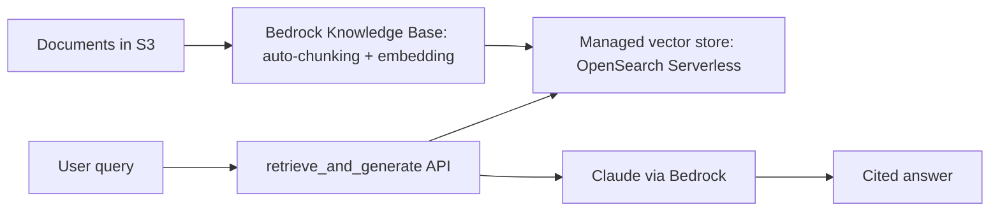

Yesterday's post introduced Bedrock Knowledge Bases at a high level. This post builds a complete RAG application on Bedrock end to end, comparing each managed component against the hand-built equivalent from March's RAG series.

## Architecture



## Setting Up the Knowledge Base

```python
import boto3

bedrock_agent = boto3.client("bedrock-agent")

kb = bedrock_agent.create_knowledge_base(
    name="support-docs-kb",
    roleArn=kb_execution_role_arn,
    knowledgeBaseConfiguration={
        "type": "VECTOR",
        "vectorKnowledgeBaseConfiguration": {"embeddingModelArn": "amazon.titan-embed-text-v2"},
    },
    storageConfiguration={"type": "OPENSEARCH_SERVERLESS", "opensearchServerlessConfiguration": oss_config},
)

bedrock_agent.create_data_source(
    knowledgeBaseId=kb["knowledgeBase"]["knowledgeBaseId"],
    dataSourceConfiguration={"type": "S3", "s3Configuration": {"bucketArn": "arn:aws:s3:::support-docs"}},
)
```

## Chunking Configuration: Less Control Than March's Hand-Built Pipeline

```python
chunking_config = {
    "chunkingStrategy": "SEMANTIC",  # or FIXED_SIZE, HIERARCHICAL
    "semanticChunkingConfiguration": {"maxTokens": 300, "bufferSize": 1, "breakpointPercentileThreshold": 95},
}
```

This is Bedrock's version of March's chunking-strategies post — fewer knobs than a fully hand-built pipeline, but genuinely competitive default strategies including semantic chunking (splitting at natural topic boundaries rather than fixed size). Worth benchmarking against a custom pipeline on your specific document types before assuming either is better.

## Ingestion and Sync

```python
bedrock_agent.start_ingestion_job(knowledgeBaseId=kb_id, dataSourceId=data_source_id)

def check_ingestion_status(job_id: str) -> str:
    status = bedrock_agent.get_ingestion_job(knowledgeBaseId=kb_id, ingestionJobId=job_id)
    return status["ingestionJob"]["status"]
```

Managed ingestion handles the incremental indexing pipeline from August's RAG-at-scale post automatically — new or changed S3 documents get re-ingested on a sync trigger, without hand-writing the idempotent processing loop that post covered.

## Querying with Retrieval-Only vs Retrieve-and-Generate

```python
# Retrieval only — for when you want to apply custom logic (rerank, filter) before generation
retrieval_only = bedrock_agent_runtime.retrieve(
    knowledgeBaseId=kb_id, retrievalQuery={"text": "refund policy for damaged items"},
)

# Full RAG — retrieval and generation combined in one call
full_rag = bedrock_agent_runtime.retrieve_and_generate(
    input={"text": "refund policy for damaged items"},
    retrieveAndGenerateConfiguration={"type": "KNOWLEDGE_BASE", "knowledgeBaseConfiguration": {"knowledgeBaseId": kb_id, "modelArn": model_arn}},
)
```

Using retrieval-only when you need March's hybrid search, reranking, or multimodal RAG patterns (July's series) layered on top — Bedrock's retrieval API gives you the raw retrieved chunks to apply custom logic to, while `retrieve_and_generate` is the fully managed, less customizable convenience path.

## Evaluating the Managed Pipeline

```python
def evaluate_bedrock_rag(golden_set: list[dict]) -> dict:
    results = []
    for example in golden_set:
        response = query_bedrock_rag(example["query"])
        results.append({
            "faithfulness": measure_faithfulness(response["output"], response["citations"]),
            "relevancy": measure_relevancy(response["output"], example["query"]),
        })
    return aggregate_report(results)
```

Apply March and June's full evaluation toolkit directly to the managed pipeline's output — a managed service doesn't exempt you from verifying quality; if anything, the reduced visibility into internals makes systematic evaluation more important, since you can't inspect and tune individual pipeline stages as easily as with a hand-built system.

## Cost and Control Tradeoff, Concretely

The managed Knowledge Base trades March's full pipeline control (custom chunking logic, custom reranking, choice of any embedding model) for meaningfully less operational burden — no vector store to provision and scale (August's series), no ingestion pipeline to build and monitor. For teams without dedicated RAG infrastructure expertise, or wanting to move fast on AWS-native infrastructure, this tradeoff is often worth it; for teams needing fine-grained retrieval quality tuning, the hand-built pipeline from March remains the stronger choice.

---

*Part of the [Cloud AI Platforms & Business of AI series]({{ site.baseurl }}/tags/cloud-business-series/) — next: [Azure OpenAI Service]({{ site.baseurl }}/posts/azure-openai-service-deployment-enterprise/), the equivalent managed platform on Azure.*
