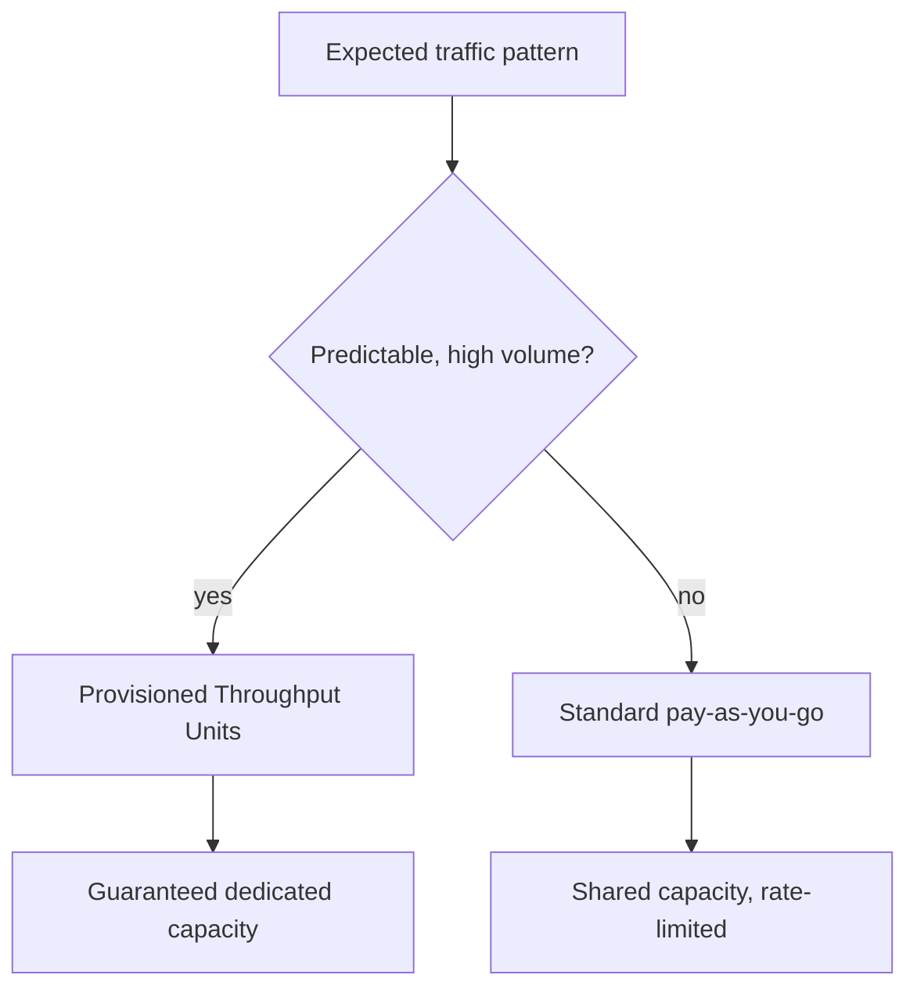

Azure OpenAI Service provides OpenAI's models through Microsoft's enterprise cloud infrastructure — the natural choice for organizations already standardized on Azure, and worth understanding for how it differs from calling OpenAI's API directly.



This deployment choice is the first decision Azure OpenAI asks you to make, and it directly parallels August's capacity-planning tradeoff between reserved and on-demand infrastructure — dedicated capacity for predictable load, shared capacity for variable load.

## Deployment Model: Provisioned Capacity vs Pay-as-You-Go

```python
deployment_types = {
    "standard": "pay-per-token, shared capacity, subject to rate limits — closest to calling OpenAI directly",
    "provisioned_throughput_units": "reserved, dedicated capacity for predictable high-volume workloads",
}
```

Provisioned Throughput Units (PTUs) are Azure OpenAI's distinctive offering — purchasing guaranteed, dedicated model capacity rather than sharing a pool with other Azure customers, directly relevant to August's capacity planning post for organizations with predictable, high-volume traffic that benefits from guaranteed throughput over pay-as-you-go's variable availability.

## Basic Usage

```python
from openai import AzureOpenAI

client = AzureOpenAI(
    azure_endpoint="https://my-resource.openai.azure.com/",
    api_key=get_secret("azure-openai-key"),  # September's secrets management
    api_version="2026-01-01-preview",
)

response = client.chat.completions.create(
    model="my-gpt4-deployment",  # your named deployment, not the raw model name
    messages=[{"role": "user", "content": "Summarize this document."}],
)
```

The `model` parameter refers to your own named deployment (which you configure to point at a specific underlying model version) rather than a raw model identifier — this indirection is what enables Azure's deployment-based version pinning, directly relevant to August's model registry and version-pinning discussion.

## Enterprise Identity Integration

```python
from azure.identity import DefaultAzureCredential
from openai import AzureOpenAI

credential = DefaultAzureCredential()
client = AzureOpenAI(
    azure_endpoint="https://my-resource.openai.azure.com/",
    azure_ad_token_provider=get_bearer_token_provider(credential, "https://cognitiveservices.azure.com/.default"),
)
```

Using Azure AD (Entra ID) authentication instead of a static API key directly reuses an organization's existing identity infrastructure — meaningfully stronger than key-based auth for the access-control discipline from September's post, since it integrates with existing conditional access policies, MFA requirements, and centralized identity lifecycle management already in place for other enterprise systems.

## Content Filtering

```python
try:
    response = client.chat.completions.create(model="my-gpt4-deployment", messages=messages)
except openai.BadRequestError as e:
    if e.code == "content_filter":
        handle_content_policy_violation(e)  # September's output filtering pattern, provider-enforced
```

Azure OpenAI applies Microsoft's own content filtering by default, on top of whatever application-level filtering you build per September's series — worth understanding this happens automatically and can be configured (within limits) at the resource level, which interacts with, but doesn't replace, your own guardrail layer.

## Private Networking

```python
# Configured via Azure networking, not client code — private endpoint means
# traffic never traverses the public internet between your VNet and the OpenAI resource
```

Azure Private Link support for OpenAI Service lets enterprise deployments keep all traffic within their virtual network — directly relevant to tomorrow's private-networking post, and a common requirement for regulated industries per September's compliance posts, particularly for HIPAA/financial services deployments wanting to minimize public internet exposure.

## Data Residency and Compliance

Azure OpenAI deployments are region-specific, letting an organization choose exactly where their data is processed — directly relevant to September's GDPR data residency discussion, and generally offering clearer regional data-handling commitments through Microsoft's enterprise agreements than a consumer-facing API tier might provide.

## Comparing Cost Structures

```python
def compare_azure_vs_direct_openai(volume: dict) -> dict:
    azure_ptu_cost = estimate_ptu_cost(volume["predictable_baseline"])
    direct_api_cost = volume["total_tokens"] * DIRECT_API_RATE
    return {"azure_ptu": azure_ptu_cost, "direct_pay_as_you_go": direct_api_cost}
```

For high, predictable volume, PTUs can be more cost-effective than pay-as-you-go token pricing; for variable or lower volume, standard deployment or direct API access is usually cheaper — run this comparison against your actual traffic pattern rather than assuming either option's superiority.

---

*Part of the [Cloud AI Platforms & Business of AI series]({{ site.baseurl }}/tags/cloud-business-series/) — next: [Azure AI Foundry for agentic applications]({{ site.baseurl }}/posts/azure-ai-foundry-agentic-applications/).*
