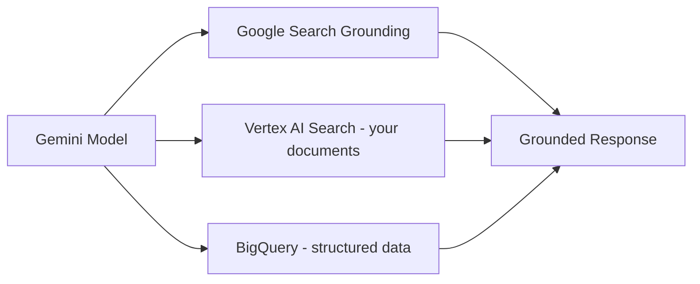

Completing the major-cloud survey: Google Vertex AI, GCP's unified AI platform — worth understanding for its distinctive grounding features and its position as the platform most tightly integrated with Google's own search and knowledge infrastructure.



Vertex's distinctive strength is having three genuinely different grounding sources available to the same model — live web search, a managed RAG pipeline over your own documents, and direct grounding against structured BigQuery data without a separate ETL step.

## Model Access

```python
import vertexai
from vertexai.generative_models import GenerativeModel

vertexai.init(project="my-project", location="us-central1")
model = GenerativeModel("gemini-2.5-pro")

response = model.generate_content("Summarize the quarterly report.")
```

Vertex AI hosts Google's own Gemini model family alongside a model garden of third-party and open-weight models (including some Anthropic and Meta models via partnership agreements) — a similar multi-provider positioning to Bedrock, with Google's own models as the most deeply integrated option.

## Grounding: Vertex's Distinctive Feature

```python
from vertexai.generative_models import Tool, grounding

grounded_model = GenerativeModel(
    "gemini-2.5-pro",
    tools=[Tool.from_google_search_retrieval(grounding.GoogleSearchRetrieval())],
)
response = grounded_model.generate_content("What were the major AI announcements this week?")
```

Native Google Search grounding lets the model retrieve current web information as part of generation — functionally similar to the RAG patterns from March, but backed by live Google Search rather than a custom-built knowledge base, uniquely useful for queries about current events or rapidly-changing information a static knowledge base wouldn't capture.

## Grounding on Your Own Data

```python
grounded_model = GenerativeModel(
    "gemini-2.5-pro",
    tools=[Tool.from_retrieval(grounding.Retrieval(source=grounding.VertexAISearch(datastore=my_datastore_id)))],
)
```

This is Vertex's equivalent of Bedrock's Knowledge Bases — a managed RAG pipeline over your own documents, indexed through Vertex AI Search, comparable in capability and tradeoffs to yesterday's Bedrock RAG post, with Google's search-ranking expertise underlying the retrieval layer specifically.

## Vertex AI Agent Builder

```python
from vertexai.preview import reasoning_engines

agent = reasoning_engines.LangchainAgent(
    model="gemini-2.5-pro",
    tools=[order_status_tool, refund_tool],
    system_instruction="You are a customer support agent.",
)

deployed_agent = reasoning_engines.ReasoningEngine.create(agent, requirements=["langchain", "google-cloud-aiplatform"])
```

Notably, Vertex's Agent Builder is explicitly built to deploy LangChain/LangGraph-based agents as a managed service — rather than defining a proprietary agent abstraction like Bedrock Agents or Azure's Agent Service, it takes April and October's framework-based agents and handles deployment, scaling, and monitoring around them, a meaningfully different integration philosophy worth factoring into a framework choice if you're already committed to a GCP deployment target.

## Vertex AI Model Evaluation

```python
from vertexai.evaluation import EvalTask

eval_task = EvalTask(dataset=golden_set_df, metrics=["groundedness", "fluency", "safety"])
result = eval_task.evaluate(model=grounded_model)
```

Comparable to June's evaluation series and Azure Foundry's built-in evaluators from yesterday — every major cloud platform now ships some version of this tooling, reinforcing that the underlying evaluation principles from June transfer across whichever specific implementation you use.

## BigQuery Integration for Structured Data Grounding

```python
grounded_model = GenerativeModel(
    "gemini-2.5-pro",
    tools=[Tool.from_retrieval(grounding.Retrieval(source=grounding.BigQuery(dataset="sales_data")))],
)
```

For organizations with substantial structured data already in BigQuery, direct grounding against it — without a separate ETL step into a vector store — is a genuine Vertex-specific advantage, relevant to teams whose "knowledge base" is really structured tabular data rather than the document-centric content March's RAG series assumed.

## Choosing Vertex AI

Vertex's strongest fit is for organizations already on GCP, wanting live web grounding, or with substantial existing BigQuery infrastructure to ground against directly — tomorrow's comparison post puts this alongside Bedrock and Azure OpenAI on the same criteria to make the three-way decision concrete.

---

*Part of the [Cloud AI Platforms & Business of AI series]({{ site.baseurl }}/tags/cloud-business-series/) — next: [comparing Bedrock, Azure OpenAI, and Vertex AI]({{ site.baseurl }}/posts/comparing-bedrock-azure-vertex/) directly.*
