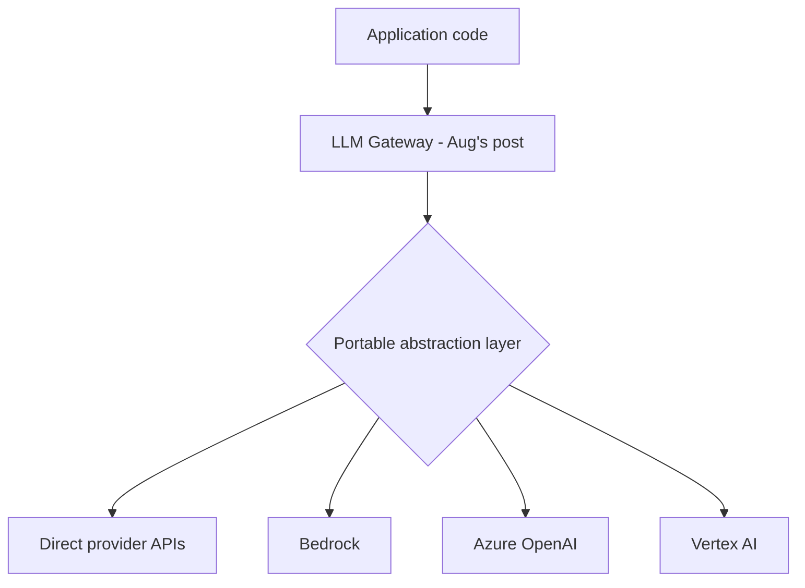

Yesterday's comparison flagged migration cost as the real lock-in driver. This post covers concretely designing for portability from the start — not necessarily running on multiple clouds simultaneously, but avoiding decisions that make a future switch prohibitively expensive.

## The Portability Layers



August's internal LLM gateway is, not coincidentally, also the primary lock-in mitigation — every application calls the gateway's stable internal API, and swapping which underlying platform serves a given request is a gateway-layer change, not an application-wide refactor.

## Designing the Abstraction Layer for Portability

```python
class ModelProvider(ABC):
    @abstractmethod
    async def generate(self, messages: list[dict], tools: list[dict] | None = None) -> dict: ...

class BedrockProvider(ModelProvider):
    async def generate(self, messages, tools=None):
        response = bedrock_client.converse(modelId=self.model_id, messages=translate_to_bedrock_format(messages))
        return translate_from_bedrock_format(response)

class AzureOpenAIProvider(ModelProvider):
    async def generate(self, messages, tools=None):
        response = await azure_client.chat.completions.create(model=self.deployment, messages=messages, tools=tools)
        return translate_from_openai_format(response)
```

A common interface with per-platform translation layers isolates platform-specific request/response shapes behind a stable internal contract — the same adapter pattern from any portable software architecture, applied specifically to the model-calling layer this roadmap has built throughout.

## What's Genuinely Hard to Make Portable

```python
lock_in_risk_by_feature = {
    "raw_model_calls": "low risk — translatable behind a thin adapter",
    "managed_rag_knowledge_bases": "high risk — chunking/retrieval logic is platform-specific and not portable",
    "managed_agents": "high risk — action group/tool definitions are platform-specific formats",
    "platform_specific_grounding": "very high risk — Vertex's live search grounding has no equivalent elsewhere",
}
```

Being honest about which capabilities are genuinely hard to make portable (managed RAG and agents) versus which are cheap to abstract (raw model calls) lets you make a deliberate choice — use the deeply-integrated managed feature where its benefit clearly outweighs the lock-in cost, and keep everything else portable by default.

## A Practical Portability Checklist

```python
def portability_review(architecture_decision: dict) -> dict:
    return {
        "uses_gateway_abstraction": architecture_decision.get("goes_through_gateway", False),
        "platform_specific_feature_used": architecture_decision.get("managed_feature") is not None,
        "documented_migration_path": architecture_decision.get("has_migration_plan", False),
        "estimated_switching_cost": estimate_switching_cost(architecture_decision),
    }
```

Running this review at design time — not after a migration becomes necessary — is what makes lock-in a deliberate, informed tradeoff rather than an accidental consequence of convenience decisions made without considering the exit cost.

## Cost of True Multi-Cloud vs Designed-for-Portability

```python
strategies = {
    "true_multi_cloud": "actively running on 2+ clouds simultaneously — real operational overhead, rarely worth it purely for AI workloads",
    "designed_for_portability": "single primary cloud, but abstracted so switching is feasible if needed — the pragmatic default",
    "deep_single_platform": "fully embracing one platform's managed features — fastest to build, highest switching cost",
}
```

For most organizations, actively running true multi-cloud purely to avoid AI vendor lock-in isn't worth the operational complexity it adds (August's infrastructure series already covers plenty of complexity without doubling the deployment target) — designed-for-portability, keeping the option open without exercising it, is the pragmatic middle ground for most teams.

## When Deep Platform Investment Is the Right Call

If a managed feature (Vertex's grounding, Bedrock's IAM-native security model) delivers genuine, hard-to-replicate value for your specific product, the lock-in cost may be entirely worth paying — this isn't an argument for portability at all costs, it's an argument for making the tradeoff consciously, with the switching cost estimated and accepted deliberately rather than discovered painfully during a later forced migration.

---

*Part of the [Cloud AI Platforms & Business of AI series]({{ site.baseurl }}/tags/cloud-business-series/) — next: [private networking for AI workloads]({{ site.baseurl }}/posts/private-networking-ai-workloads-vpc/), a security and compliance concern across any of these platforms.*
