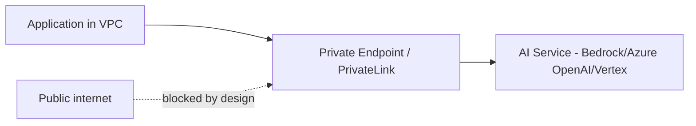

November 3's Azure post mentioned Private Link in passing. This post covers private networking for AI workloads across all three major clouds concretely — a common, often underestimated requirement for enterprise and regulated deployments.

## Why Public Internet Egress Is a Real Concern for AI Workloads

Every LLM API call from your application to a model provider or cloud AI service potentially traverses the public internet unless explicitly configured otherwise — for regulated data (September's HIPAA/GDPR posts), or simply as defense-in-depth, keeping this traffic within a private network is a common enterprise requirement, not a theoretical one.

## The Architecture



## AWS PrivateLink for Bedrock

```python
# Terraform, extending August's infrastructure-as-code series
"""
resource "aws_vpc_endpoint" "bedrock" {
  vpc_id            = aws_vpc.main.id
  service_name      = "com.amazonaws.us-east-1.bedrock-runtime"
  vpc_endpoint_type = "Interface"
  subnet_ids        = aws_subnet.private[*].id
  security_group_ids = [aws_security_group.bedrock_endpoint.id]
}
"""
```

Traffic to Bedrock from resources within the VPC routes through this private endpoint rather than the public internet — the application code itself doesn't change, only the network path, making this a purely infrastructure-layer security improvement with no application refactoring required.

## Azure Private Link for OpenAI Service

```python
"""
resource "azurerm_private_endpoint" "openai" {
  name                = "openai-private-endpoint"
  location            = azurerm_resource_group.main.location
  resource_group_name = azurerm_resource_group.main.name
  subnet_id           = azurerm_subnet.private.id
  private_service_connection {
    name                           = "openai-connection"
    private_connection_resource_id = azurerm_cognitive_account.openai.id
    subresource_names              = ["account"]
    is_manual_connection           = false
  }
}
"""
```

## VPC Service Controls for Vertex AI

```python
"""
resource "google_access_context_manager_service_perimeter" "vertex_perimeter" {
  parent = "accessPolicies/${var.access_policy_id}"
  spec {
    restricted_services = ["aiplatform.googleapis.com"]
  }
}
"""
```

GCP's VPC Service Controls take a slightly different approach — defining a security perimeter around specified services rather than a point-to-point private endpoint, worth understanding as GCP's distinctive model rather than assuming direct feature parity with AWS/Azure's endpoint-based approach.

## DNS Configuration: The Easy-to-Miss Step

```python
"""
resource "aws_route53_zone" "private_bedrock" {
  name = "bedrock-runtime.us-east-1.amazonaws.com"
  vpc { vpc_id = aws_vpc.main.id }
}
"""
```

Private endpoints require corresponding private DNS resolution — without it, application code resolving the service's standard hostname still routes to the public endpoint even with the private endpoint provisioned, a common configuration gap that silently defeats the whole point of the private networking setup.

## Verifying Private Connectivity Actually Works

```python
def verify_no_public_egress(vpc_flow_logs: list[dict], service_ips: set[str]) -> bool:
    public_traffic_to_service = [log for log in vpc_flow_logs if log["destination"] in service_ips and log["route"] == "internet_gateway"]
    return len(public_traffic_to_service) == 0
```

Don't just trust that the configuration is correct — verify via VPC flow logs (or equivalent) that traffic to the AI service is actually routing privately, the same "measure, don't assume" discipline from August's GPU sizing post, applied to network security configuration.

## On-Premises Connectivity for Hybrid Deployments

For organizations with on-premises infrastructure needing to reach cloud AI services privately, this extends through VPN or dedicated connections (AWS Direct Connect, Azure ExpressRoute, GCP Cloud Interconnect) to the VPC, then through the private endpoint from there — the same private-networking principle extended one hop further for hybrid architectures.

## Cost and Complexity Tradeoff

Private endpoints have real cost (typically hourly plus data processing charges) and add infrastructure complexity worth weighing against your actual compliance requirement — not every workload needs this; apply it deliberately where September's compliance posts or your organization's security policy genuinely require it, not as a default for every deployment.

---

*Part of the [Cloud AI Platforms & Business of AI series]({{ site.baseurl }}/tags/cloud-business-series/) — next: [managed vector databases compared]({{ site.baseurl }}/posts/managed-vector-databases-compared/), extending March's comparison with cloud-native managed options.*
